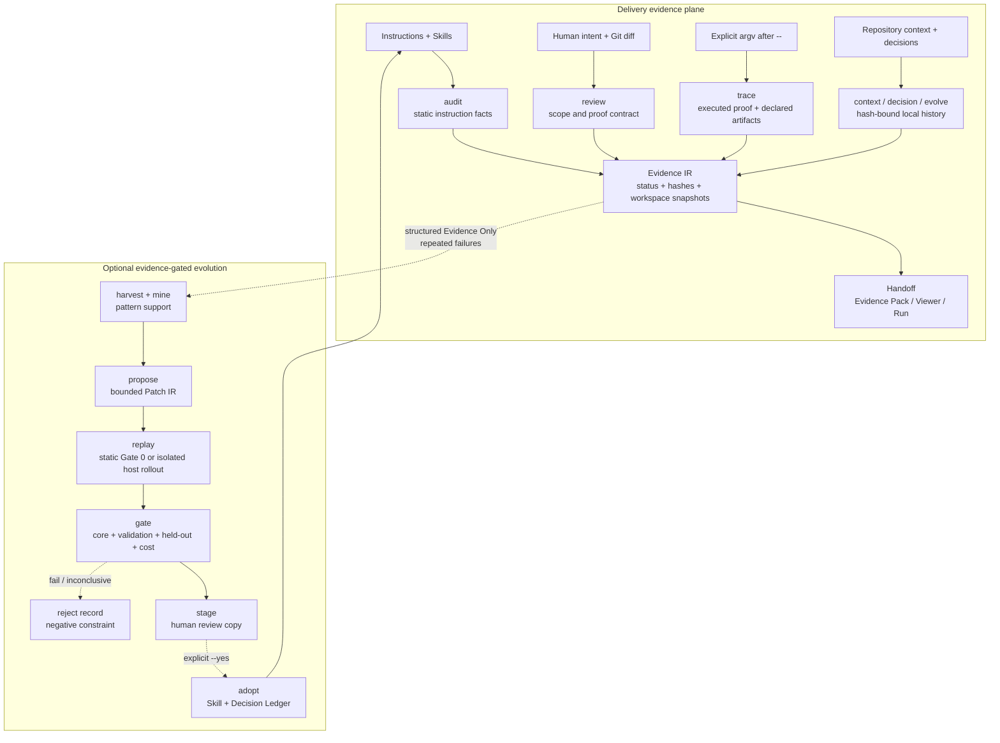

# Agent Engineering Toolkit

[](https://github.com/AdvancingTitans/agent-engineering-toolkit/actions/workflows/ci.yml)
[](https://github.com/AdvancingTitans/agent-engineering-toolkit/releases)
[](https://www.python.org/)
[](LICENSE)
[](docs/README.zh-CN.md)

**[English](README.md) · [简体中文](docs/README.zh-CN.md)**

> AET is the local evidence layer between an agent’s work and a claim that the work is ready.

**Agent Engineering Toolkit (AET)** makes coding-agent work inspectable before
it is trusted, and improvable only when the improvement is itself evidenced.
It records the instructions available to an agent, the human-approved change
boundary, explicit command execution, produced artifacts, and any verification
gap. Those records can travel with a delivery—or, when failures repeat, become
the input to a bounded Skill-improvement experiment.

This answers two different engineering questions with one evidence model:

| Question | AET answer |
| --- | --- |
| “Can we honestly say this agent delivery is ready?” | Audit instructions, review an approved diff, trace an explicit proof, and hand off the resulting evidence. |
| “Can this recurring agent failure improve the Skill safely?” | Mine structured failures, patch only marked Skill regions, replay baseline and candidate, gate the result, then require a human adoption decision. |

The important distinction is that AET is not a self-reporting layer. A natural
language answer never substitutes for a recorded command, artifact, snapshot,
or explicit `UNKNOWN` state.

## Why AET exists

Coding agents make it inexpensive to change a repository, but not necessarily
easy to answer the questions that matter at handoff: *Which instructions were
in scope? Was this command really run? Does the output still describe this
workspace? What is verified, and what remains unknown?*

Most teams solve fragments of this with chat transcripts, CI logs, prompt
edits, or manual checklists. AET gives those fragments a local, structured,
hash-bound form and keeps their meanings deliberately narrow. That makes the
system useful for ordinary delivery work today, without pretending that every
agent session should become training data tomorrow.

## Why AET

- **Evidence-first, not confidence-first.** `UNKNOWN` stays a verification gap;
  it is never discounted into a pass.
- **Smallest safe surface.** `audit` and `review` inspect; only `trace` executes
  the explicit argv after `--`.
- **Local by default.** Evidence collection, review, Experience Store, and
  federation do not require a hosted telemetry service or transcript archive.
- **Proof remains fresh-or-stale.** A successful command and a workspace that
  later changed are represented as separate facts.
- **Learning is constrained.** Candidate Skills are hash-bound, limited to
  marked editable blocks, validated independently, staged, and adopted only by
  an explicit human action.
- **Behavior can be observed.** Static Skill-document checks remain Gate 0;
  opt-in Scripted, Codex, and Claude Code runners can evaluate actual isolated
  task executions with deterministic scoring.

AET is **not** an agent runtime, a general autonomous coding framework, a
hosted monitoring product, or a system that auto-edits production Skills.

## Start here

```bash
# Install the v1.7 release wheel, then verify it.
uv tool install https://github.com/AdvancingTitans/agent-engineering-toolkit/releases/download/v1.7.0/agent_engineering_toolkit-1.7.0-py3-none-any.whl
aet --version

# Establish a baseline before an agent changes the repository.
aet init --output aet.toml
aet audit . --strict --format json --output .aet/evidence/audit.json
```

`aet audit` writes its JSON report even when it returns non-zero for a real
finding. Read that artifact first; a failed exit status means “the evidence
found a problem,” not “no audit JSON was produced.”

## Choose the smallest surface

| Question | Command | Result |
| --- | --- | --- |
| Are instructions, local references, and Skills usable? | `aet audit` | Markdown, JSON, or SARIF findings with evidence and remediation. |
| Is a diff inside the human-approved contract? | `aet review` | Intent, path-budget, and proof-declaration report. |
| Did an explicit command run and produce its declared report? | `aet trace -- <argv>` | Redacted execution record; optional captured artifact. |
| Can these records travel with a handoff or release? | `aet evidence pack` | Portable Evidence Pack and optional static Viewer. |
| Did a delivery become stale after review or proof? | `aet run` | Optional append-only delivery lifecycle. |
| What context and decisions were locally recorded? | `aet context`, `aet decision` | Hash-bound Context Manifest and Decision Ledger. |
| Why did this repository change? | `aet evolve` | Cited local/explicit-remote evolution report. |
| Which existing findings should be handled first? | `aet triage` | Explainable ordering; never a changed finding status. |
| Can repeated evidence failures improve a Skill safely? | `aet learn` | Evidence-only experience set, bounded candidate, Gate, and staged review copy. |

## Where AET fits

These tools are complementary. The comparison is about the job each one owns,
not a claim that one should replace the others.

| Tool category | Best used for | What AET adds or deliberately does not do |
| --- | --- | --- |
| Coding-agent runtime (Codex, Claude Code, Copilot) | Planning and executing the work in a repository. | AET does not replace the runtime; it records the local evidence needed to make its delivery claims reviewable. |
| CI, tests, linters, and security scanners | Checking code or a deployment against their own rules. | AET can trace an explicit check and bind its artifact to intent, workspace freshness, and a handoff; it does not replace the checker. |
| Skill authoring / governance system ([Yao Meta Skill](https://github.com/yaojingang/yao-meta-skill)) | Creating, packaging, compiling, evaluating, and governing reusable cross-platform Skill assets. | AET focuses on the evidence around a coding-agent delivery and on bounded improvement of an in-use Skill. Use Yao to engineer the Skill product; use AET to evidence and constrain work performed with it. |
| Skill optimizer ([SkillOpt](https://github.com/microsoft/SkillOpt)) | Training a Skill document from scored rollouts and held-out validation. | AET provides local engineering evidence semantics—intent boundaries, explicit command proof, artifact handling, freshness, and human adoption—rather than a general benchmark optimizer. |
| Transcript analytics / agent observability | Searching broad session history, dashboards, or fleet telemetry. | AET defaults to structured Evidence Only records and local storage; it intentionally does not ingest an unbounded transcript archive. |

### Choose AET when

- You need a credible handoff after an agent changed code: not just “tests passed,”
  but the command, exit status, declared artifact, approved scope, and freshness.
- You need to preserve the difference between **PASS**, **FAIL**, and
  **UNKNOWN** instead of collapsing uncertainty into a score.
- You want to improve a Skill from repeated engineering failures without letting
  an optimizer silently weaken safety semantics or overwrite production guidance.
- You need a local, portable evidence format that works alongside—not inside—an
  existing agent runtime and CI system.

### Do not choose AET as

- a replacement for writing tests, running CI, reviewing code, or securing a
  deployment;
- a substitute for an agent runtime or task planner;
- a promise that an Agent understood a file merely because it was discovered or
  attested as read; or
- an automatic self-modification daemon. `propose`, `gate`, `stage`, and
  `adopt` are intentionally separate actions.

## Architecture



The learning path is deliberately optional. AET does not treat every artifact
as training data; static text checks are not presented as observed behavior;
and a passing Gate does not modify a production Skill.

## How to use AET

Start with the job, not the biggest workflow:

| If you need to… | Start with | Add only if needed |
| --- | --- | --- |
| Check whether an Agent’s local guidance is usable | `aet audit` | `context` when you need a hash-bound record of discovered/read assets. |
| Deliver an Agent-authored change | `audit` + `review` + `trace` | `evidence pack` for a portable handoff; `run` when the delivery has multiple lifecycle steps. |
| Explain why a repository looks this way | `aet evolve plan` | `collect/build/report` after reviewing the collection plan. |
| Improve a recurring Skill failure | `learn harvest` + `mine` | `propose/replay/gate/stage`; use a real host runner only when explicitly configured. |

### Recipe: evidence-backed delivery

```bash
# 1. Audit instructions and review the approved diff. Neither runs tests.
aet audit . --strict --format json --output .aet/evidence/audit.json
aet review . --base main --intent aet.intent.json --format json --output .aet/evidence/review.json

# 2. Execute exactly one declared proof through Trace.
aet trace --proof unit-tests --intent aet.intent.json \
  --artifact reports/junit.xml --output .aet/evidence/trace.json -- \
  python -m unittest discover -s tests -v

# 3. Compile a portable handoff receipt.
aet evidence pack --audit .aet/evidence/audit.json \
  --review .aet/evidence/review.json --trace .aet/evidence/trace.json \
  --output .aet/evidence/evidence-pack.json
aet evidence viewer --pack .aet/evidence/evidence-pack.json \
  --output .aet/evidence/evidence-viewer.html
```

Only `trace` executes a generic command, and only the argv after `--`. AET
keeps proof success separate from freshness: a trace may be valid while a later
workspace change makes the delivery stale. `UNKNOWN` is a verification gap,
never a discounted pass.

## Evidence-Gated Evolution

This is AET’s v1.7 implementation of evidence-driven improvement. It can keep
the v1.6 static document contract gate as Gate 0, then explicitly run a
baseline and candidate Skill in isolated fixture copies through Scripted,
Codex, or Claude Code hosts. It is designed for repeated routing,
proof-handoff, or `UNKNOWN`-handling failures—not for silently editing arbitrary
code or policy.

```text
Evidence Only JSON → inspect → mine → bounded Patch IR → isolated replay
→ core + validation + held-out Gate → stage → human adopt or reject
```

### What is implemented today

| Phase | What is implemented |
| --- | --- |
| 0. Contract | Immutable/editable markers; candidate and task schemas; hard semantic gates. |
| 1. Experience store | Evidence-only `harvest`, `inspect`/`summarize`, deterministic mining and support counts. |
| 2. Rule proposal | Bounded editable-block Patch IR with hashes, diff, rationale, and source manifest. |
| 3. Static replay and Gate 0 | Temporary-copy document contract replay, candidate self-audit, and core/validation/held-out checks. |
| 4. Model assist | Opt-in explicit local adapter, timeout, bounded JSON interface, and rejected-candidate constraints. |
| 5. Local federation | `collect` and `--experience-store` merge de-identified packs without networking. |
| 6. Sleep | Local bounded loop, append-only `SKILL_EVOLUTION` event history, budgets, target-change check, and stage-only terminal action. |
| 7. Real-host evaluation | Isolated fixture workspaces, normalized command/final-answer events, deterministic behavioral scoring, repeated paired rollouts, and `PASS`/`FAIL`/`INCONCLUSIVE`/`INFRASTRUCTURE_ERROR` statistics. |

The real-host fixture is a proof-handoff smoke test, not a broad claim that
every task distribution is solved. For an adoption-grade observed Gate, bring
your own separated core, validation, and held-out tasks; configure sufficient
paired rollouts; and treat `INCONCLUSIVE` as a non-passing result.

```bash
# Phase 1: build and inspect a local Evidence Only experience set.
aet learn harvest --evidence .aet/evidence --output .aet/learn/experiences.json
aet learn inspect --experiences .aet/learn/experiences.json --output .aet/learn/inspection.json
aet learn mine --experiences .aet/learn/experiences.json --output .aet/learn/patterns.json

# Phase 2–3: propose and test only an editable Skill block.
aet learn propose --engine rules --patterns .aet/learn/patterns.json \
  --target skills/agent-engineering-toolkit/SKILL.md --output .aet/learn/candidates/CAND-001
aet learn replay --candidate .aet/learn/candidates/CAND-001 \
  --suite eval/core --suite eval/validation --suite eval/held-out \
  --output .aet/learn/replays/CAND-001.json
aet learn gate --candidate .aet/learn/candidates/CAND-001 --core eval/core \
  --validation eval/validation --held-out eval/held-out \
  --output .aet/learn/gates/CAND-001.json
aet learn viewer --gate .aet/learn/gates/CAND-001.json --output .aet/learn/CAND-001.html
aet learn stage --candidate .aet/learn/candidates/CAND-001 \
  --gate .aet/learn/gates/CAND-001.json --output .aet/learn/staged
```

The Gate rejects changed immutable bytes, edits outside named blocks, invalid
hashes, overlapping validation/held-out tasks, candidate audit failures,
regressions, token/command-surface budget breaches, and increased workflow
overuse. It reports a metric vector rather than one “trust” number.

`aet learn adopt --yes` is intentionally separate: it rechecks the target hash
and writes a local Decision Ledger record. `reject` preserves a reason. Neither
command commits or pushes.

### Real-host evaluation (opt-in)

The static runner is deliberately not an Agent-behavior claim. Use a real host
only when explicitly named; every baseline/candidate run receives an independent
fixture copy and writes private raw outputs plus public structured events,
before/after snapshots, scores, and hashes. `UNKNOWN` and host failures never
become a pass.

```bash
# Discover installed adapters without contacting a model.
aet learn runner list

# Run actual host behavior. Create a local `runner.json` containing
# `{"aet_argv": ["/absolute/path/to/aet"], "inherit_home": true}`;
# raw host output stays inside the rollout directory.
aet learn replay --candidate .aet/learn/candidates/CAND-001 \
  --suite eval/real-agent/core --runner codex --rollouts 3 \
  --runner-config runner.json --output .aet/learn/replays/CAND-001

# Only an adoptable profile can produce an observed PASS. A small sample is
# INCONCLUSIVE rather than a pass, and stage/adopt remain separate.
aet learn gate --candidate .aet/learn/candidates/CAND-001 \
  --core eval/real-agent/core --validation eval/real-agent/validation \
  --held-out eval/real-agent/held-out --runner codex --rollouts 6 \
  --statistics-profile adoptable --runner-config runner.json \
  --output .aet/learn/gates/CAND-001-observed.json
```

`runner.json` is local configuration, not a credential store. Codex and Claude
Code adapters report `network_isolation: PARTIAL`: an isolated workspace protects
the production checkout, but neither host CLI is claimed to provide OS-level
network denial or command allowlisting. A host startup/auth/model failure is an
`INFRASTRUCTURE_ERROR`, not an Agent failure. The included
`eval/real-agent/core` fixture is a real proof-handoff smoke test; expand and
rotate validation/held-out suites before using an observed Gate for adoption.

### Local cross-project learning and scheduled use

```bash
# Explicitly share only local, de-identified Evidence Only packs.
aet learn collect --experiences .aet/learn/experiences.json --store ~/.aet/experience
aet learn harvest --experience-store ~/.aet/experience --output .aet/learn/merged.json

# A scheduler may invoke this bounded, stage-only local loop.
aet learn sleep --evidence .aet/evidence --target skills/agent-engineering-toolkit/SKILL.md \
  --core eval/core --validation eval/validation --held-out eval/held-out \
  --max-candidates 1 --max-replays 2 --max-model-calls 1 --timeout-seconds 120 \
  --output .aet/learn/nightly
```

No transcript, shell output, environment variable, secret, remote upload,
automatic commit, push, or adoption is part of the default. See the exact
[evolution boundary](docs/evolution-boundary.md).

## Context, decisions, and history

```bash
# Context discovery records file bytes; --read is only an agent/host attestation.
aet context discover . --output .aet/context/manifest.json
aet context record --manifest .aet/context/manifest.json --read AGENTS.md
aet context verify --manifest .aet/context/manifest.json

# Decision records are local, source-backed, and verifiable later.
aet decision init --output .aet/decisions.json
aet decision add --ledger .aet/decisions.json --id DEC-0001 \
  --claim "Keep proof execution explicit." --evidence-state EVIDENCED \
  --source docs/evolution-boundary.md
aet decision verify --ledger .aet/decisions.json

# Repository archaeology is offline unless --remote github is explicit.
aet evolve plan . --question "Why was this release made?" --output .aet/evolve/plan.json
aet evolve collect . --question "Why was this release made?" --output .aet/evolve/run
aet evolve build --manifest .aet/evolve/run/source-manifest.json --output .aet/evolve/run
aet evolve report --graph .aet/evolve/run/object-graph.json --output .aet/evolve/run
```

## Installing the portable Skill

Copy the entire [`skills/agent-engineering-toolkit/`](skills/agent-engineering-toolkit/)
directory into the host’s Skill directory; do not copy only `SKILL.md` if you
want its referenced contracts too.

```bash
# From a source checkout of this repository (the wheel ships the CLI, not Skill assets):
git clone https://github.com/AdvancingTitans/agent-engineering-toolkit.git
cd agent-engineering-toolkit
cp -R skills/agent-engineering-toolkit ~/.codex/skills/
aet audit ~/.codex --format json --output ~/.aet/evidence/codex-audit.json
```

For a migrated Hermes installation, AET keeps a missing old Skill reference as
a `FAIL` but, when Hermes’s `.absorbed_into` metadata identifies a real local
replacement, includes that replacement in remediation. This is intentional:
the old instruction still needs repair, but the report explains the migration
instead of leaving an opaque path failure.

## Verification and limits

Run the project checks from a source checkout:

```bash
uv run --no-editable --reinstall-package agent-engineering-toolkit \
  python -m unittest discover -s tests -v
uv run --no-editable --reinstall-package agent-engineering-toolkit \
  aet audit . --strict --format json --output .aet/evidence/self-audit.json
uv build
```

AET verifies recorded bytes, explicit command exits, and declared artifact
handling. It does not prove a model understood an instruction, that a decision
is eternally correct, that an untraced command ran, or that a missing remote
record supports a claim. Read [the rule catalog](docs/rule-catalog.md) and
[security and retention boundary](docs/security-and-retention.md) before
relying on it in a regulated workflow.

## Contributing

See [CONTRIBUTING.md](CONTRIBUTING.md). Changes to evidence semantics require
tests, a clear contract update, and a human-reviewed intent boundary.
