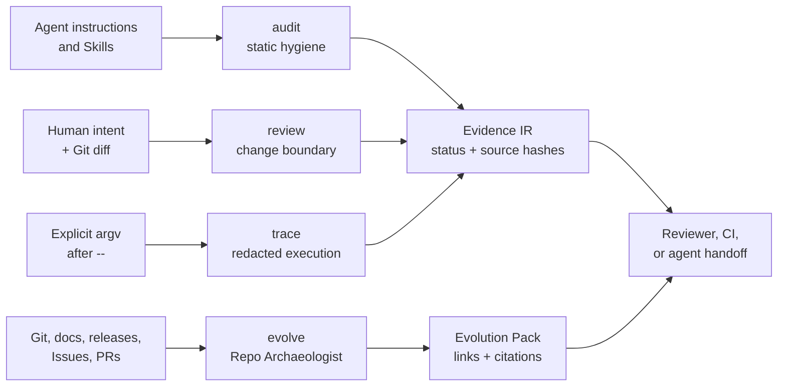

# Agent Engineering Toolkit

[](https://github.com/AdvancingTitans/agent-engineering-toolkit/actions/workflows/ci.yml)
[](https://github.com/AdvancingTitans/agent-engineering-toolkit/releases)
[](https://www.python.org/)
[](LICENSE)
[](docs/README.zh-CN.md)

**[English](README.md) · [简体中文](docs/README.zh-CN.md)**

> Coding agents move quickly. AET makes their engineering evidence move with them.

**Agent Engineering Toolkit (AET)** is an evidence-first, local CLI and portable
Agent Skill for coding-agent work. It checks the instructions an agent reads,
the change boundary a human approved, the command that actually ran, and the
repository history behind a decision—without turning missing proof into a
comforting score.

Use it before an agent changes a repository, at handoff or release time, or
when you need a cited answer to “why is this repository built this way?”

[Quick start](#quick-start) · [Capability surface](#capability-surface) · [Quality](#quality-and-current-results) · [Repo Archaeologist](#repo-archaeologist) · [Contributing](CONTRIBUTING.md)

## Why AET, and why now?

Coding agents can produce a clean diff while still following stale instructions,
going outside an approved scope, or presenting an unrun command as proof. Git
history can show *what* changed but rarely connects releases, documentation,
issues, and commits in a reviewable way.

AET is the small, deterministic layer between agent work and a claim of
readiness. It does not replace tests, security scanners, code review, or an
agent runtime. It gives those processes a portable receipt: what was inspected,
what was declared, what was explicitly executed, and what remains unknown.

## Capability surface

| Question | AET surface | What you receive |
| --- | --- | --- |
| Can this agent safely follow the repository instructions and Skills? | `aet audit` | Markdown, JSON, or SARIF findings with locations and fixes. |
| Is the diff inside the human-approved intent? | `aet review` | An intent-gate report for path budget, allowed paths, and declared proofs. |
| Did the command run against the reviewed workspace? | `aet trace` + `aet evidence pack` | A redacted execution record plus proof and workspace-snapshot bindings. |
| Why did the repository evolve this way? | `aet evolve` | An Evolution Pack, timeline, decision index, and cited report. |
| What should be fixed first? | `aet triage` | Transparent priority ordering; it never changes a finding status. |

### A Skill, not just another CLI

The portable Skill in [`skills/agent-engineering-toolkit/`](skills/agent-engineering-toolkit/)
teaches Codex, Claude Code, Cursor, Copilot-compatible hosts, and other
skill-aware agents to choose the smallest safe AET workflow: **audit, review,
evidence, or evolve**. The CLI remains the deterministic runtime and the JSON
artifacts remain portable when a host has no native Skill loader.

## Architecture



The four primary surfaces are independent. An offline `audit` does not fetch
GitHub data; `review` never executes a proof command; only `trace` executes
the exact argv placed after `--`; and `evolve --remote github` is explicit.
That separation keeps a useful report from quietly claiming more than its
evidence supports.

Every report uses a versioned Evidence IR envelope and keeps atomic statuses:
`PASS`, `FAIL`, `UNKNOWN`, and `NOT_APPLICABLE`. `UNKNOWN` is work left to
verify—not a discounted pass. Evidence levels distinguish a human declaration
(L0), local files (L1), executed commands (L2), local Git (L3), explicitly
retrieved remote data (L4), and human attestation (L5).

### Freshness is separate from proof success

Starting in v1.1.0, `audit`, `review`, and `trace` record a deterministic
`workspace_snapshot`: the Git HEAD and digests of tracked and untracked
working-tree state. When `aet evidence pack` is produced, AET compares the
supplied snapshots with the workspace at pack time.

- `EXACT_MATCH` means the reviewed, traced, and packed workspace match.
- `HEAD_MATCH_WORKTREE_DIFFERS` means the commit is unchanged but the working
  tree changed after at least one artifact was produced.
- `HEAD_DIFFERS` means the compared artifacts come from different commits.
- `UNKNOWN` means a Git snapshot could not be captured or an older report did
  not contain one.

This is intentionally a separate `snapshot_binding`. A successful proof stays
`PASS` even when the workspace later becomes stale; the Viewer marks delivery
as `STALE` rather than pretending the command was never executed.

## Quality and current results

AET deliberately reports a status matrix rather than a synthetic “agent trust
score.” Its only numeric model, `aet triage`, exposes its weights and is used
only to order remediation work.

| Release check | v1.1.0 result | How to reproduce |
| --- | --- | --- |
| Regression suite | 21 tests passed | `uv run --no-editable --reinstall-package agent-engineering-toolkit python -m unittest discover -s tests -v` |
| Strict self-audit | 0 `FAIL`, 0 `UNKNOWN` in the configured production Skill scope | `uv run --no-editable aet audit . --strict` |
| Intent review | Release diff must stay inside the reviewed contract | `uv run --no-editable aet review . --base v1.0.0 --intent aet.intent.json` |
| Distribution smoke | Wheel built and invoked in an isolated environment | `uv build` then install the wheel shown below |
| Delivery automation | CI on `main`, plus tag-driven GitHub Release workflow | [Actions](https://github.com/AdvancingTitans/agent-engineering-toolkit/actions) |

These checks prove the stated mechanics, not that every repository or every
agent decision is safe. See the [rule catalog](docs/rule-catalog.md) and
[security and retention boundary](docs/security-and-retention.md) for exactly
what AET does and does not claim.

## Quick start

### Install the released CLI

Install the published GitHub Release wheel with [uv](https://docs.astral.sh/uv/):

```bash
uv tool install https://github.com/AdvancingTitans/agent-engineering-toolkit/releases/download/v1.1.0/agent_engineering_toolkit-1.1.0-py3-none-any.whl
aet --version
```

Or try the current source checkout without installing it globally:

```bash
git clone https://github.com/AdvancingTitans/agent-engineering-toolkit.git
cd agent-engineering-toolkit
uv run --no-editable aet audit . --strict
```

### Run a first safe audit

```bash
aet init --output aet.toml
aet audit . --strict --format json --output .aet/evidence/audit.json
```

`aet.toml` makes scan inclusions and exclusions reviewable. Exclusions require
a reason; `init` writes a candidate and never overwrites an existing file.

### Add AET to an agent host

Copy the entire [`skills/agent-engineering-toolkit/`](skills/agent-engineering-toolkit/)
directory into your host's Skill directory. For example, a Codex installation
can use:

```bash
cp -R skills/agent-engineering-toolkit ~/.codex/skills/
```

Hosts without a native Skill loader can give the agent this `SKILL.md` as
instructions and make the `aet` executable available on `PATH`.

## How to use AET

### 1. Audit instructions before the agent works

```bash
aet audit . --strict --format sarif --output .aet/evidence/audit.sarif
```

Audit finds broken local references and command targets, stale absolute paths,
context bloat, duplicated directives, and malformed or incomplete Skills.

### 2. Review a diff against human intent

Write a small `aet.intent.json` that declares the approved paths, change
budget, and proofs. AET ships a [minimal example](examples/aet.intent.example.json).

```bash
cp examples/aet.intent.example.json aet.intent.json
aet review . --base main --format json --output .aet/evidence/review.json
```

Review proves the contract and scope are satisfied; it intentionally does not
run the declared commands.

### 3. Bind an executed proof and make a handoff pack

```bash
aet trace --proof unit-tests --intent aet.intent.json \
  --output .aet/evidence/trace.json -- \
  python -m unittest discover -s tests -v

aet evidence pack \
  --audit .aet/evidence/audit.json \
  --review .aet/evidence/review.json \
  --trace .aet/evidence/trace.json \
  --output .aet/evidence/evidence-pack.json

aet evidence viewer --pack .aet/evidence/evidence-pack.json \
  --output .aet/evidence/evidence-viewer.html
```

Trace is opt-in, requires `--`, records only the explicit command, and stores
redacted excerpts plus hashes. The static viewer needs no server or external
assets.

## Repo Archaeologist

`aet evolve` is for the question a changelog cannot answer alone: **what
changed, when, what source links it, and what is still unknown?**

```bash
aet evolve plan . --question "Why was this release made?" --output .aet/evolve/plan.json
aet evolve collect . --question "Why was this release made?" --output .aet/evolve/run
aet evolve build --manifest .aet/evolve/run/source-manifest.json --output .aet/evolve/run
aet evolve report --graph .aet/evolve/run/object-graph.json --output .aet/evolve/run
```

The default flow is local and offline: Git objects and repository documents.
When requested, `--remote github` adds explicitly retrieved Issues, pull
requests, and releases to the source manifest. A tag-to-commit relation may be
`DIRECT`; a textual `#123` mention without its target stays a `CANDIDATE`.
AET never turns that distinction into a story about private author intent.

Read the full [`evolve` contract](docs/evolve-contract.md).

## Why it is different

- **Evidence-first, not verdict-first.** Every finding keeps its location,
  remediation, source, and status; a missing check remains visible.
- **Local by default.** Static audit, review, triage, and local archaeology
  need no API key, LLM, or background service.
- **Explicit side effects.** Only Trace executes a generic command; remote
  GitHub collection is opt-in.
- **Useful across agent hosts.** The Skill guides an agent; canonical JSON,
  SARIF, and Markdown reports guide people, CI, and other tools.
- **History with epistemic boundaries.** Repo Archaeologist links evidence and
  exposes unanswered questions rather than guessing why someone made a change.

## Best fit

AET is especially useful for:

- engineers who let Codex, Claude Code, Cursor, Copilot, or similar agents
  modify repositories;
- maintainers who need a lightweight, reviewable release or handoff record;
- teams with long-lived `AGENTS.md`, `CLAUDE.md`, or reusable Skill libraries;
- developers onboarding to an unfamiliar repository and needing cited history.

It is not an agent runtime, an automatic prompt rewriter, a hosted security
platform, or a replacement for semantic tests and human review.

## Repository map

```text
src/aet/                         Deterministic CLI and evidence model
skills/agent-engineering-toolkit/ Portable cross-agent Skill and contracts
schemas/                         Versioned Evidence IR schema
tests/                           Regression tests and positive/negative fixtures
docs/                            Contracts, product rationale, security, Chinese README
examples/                        Copyable intent and workflow examples
.github/workflows/               CI and tag-driven GitHub Release automation
```

The core implementation is deliberately small: `discovery.py` finds context
assets, `rules.py` produces evidence-backed audit findings, `review.py`
compares intent to a Git diff, `evidence.py` records Trace and packs,
`evolve.py` builds the repository-evolution graph, and `reporters.py` writes
portable output.

## Documentation

| Topic | Start here |
| --- | --- |
| Chinese documentation | [docs/README.zh-CN.md](docs/README.zh-CN.md) |
| Rules and gate effects | [docs/rule-catalog.md](docs/rule-catalog.md) |
| Repo Archaeologist contract | [docs/evolve-contract.md](docs/evolve-contract.md) |
| Security, privacy, and retention | [docs/security-and-retention.md](docs/security-and-retention.md) |
| Product decisions and rationale | [docs/productization-plan.md](docs/productization-plan.md) |
| Version history | [CHANGELOG.md](CHANGELOG.md) |
| Contribution guide | [CONTRIBUTING.md](CONTRIBUTING.md) |

## Contributing

The most valuable contribution is a reproducible failure, a missing boundary,
or a real workflow that AET cannot yet represent. Please read
[CONTRIBUTING.md](CONTRIBUTING.md), use the Issue forms, and keep pull requests
small enough to review against an intent contract. We welcome first-time
contributors and real-world adoption examples.

## License

MIT. See [LICENSE](LICENSE).
