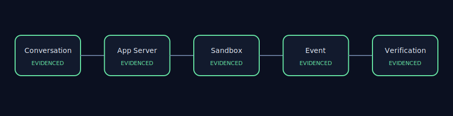
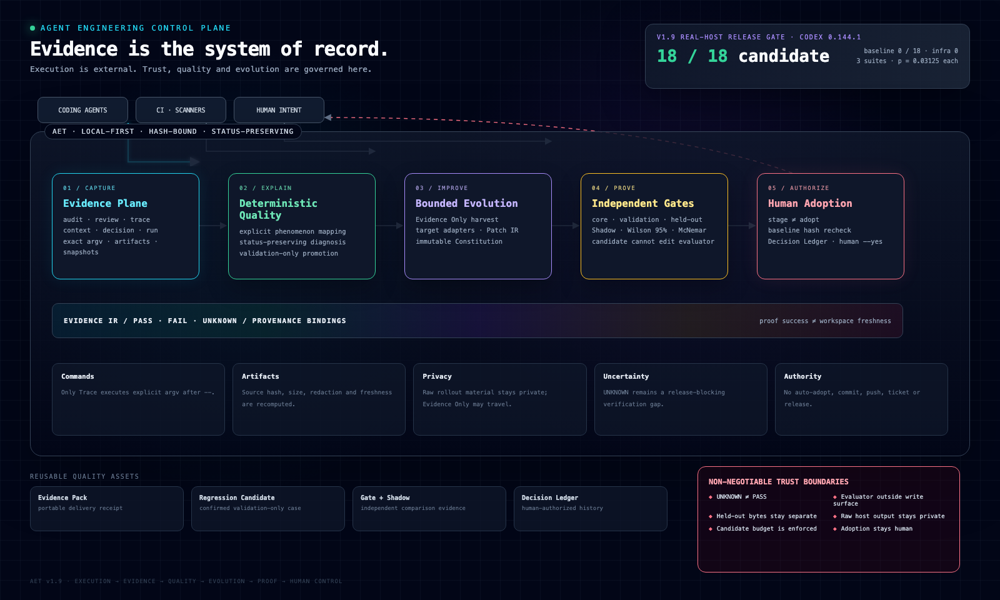
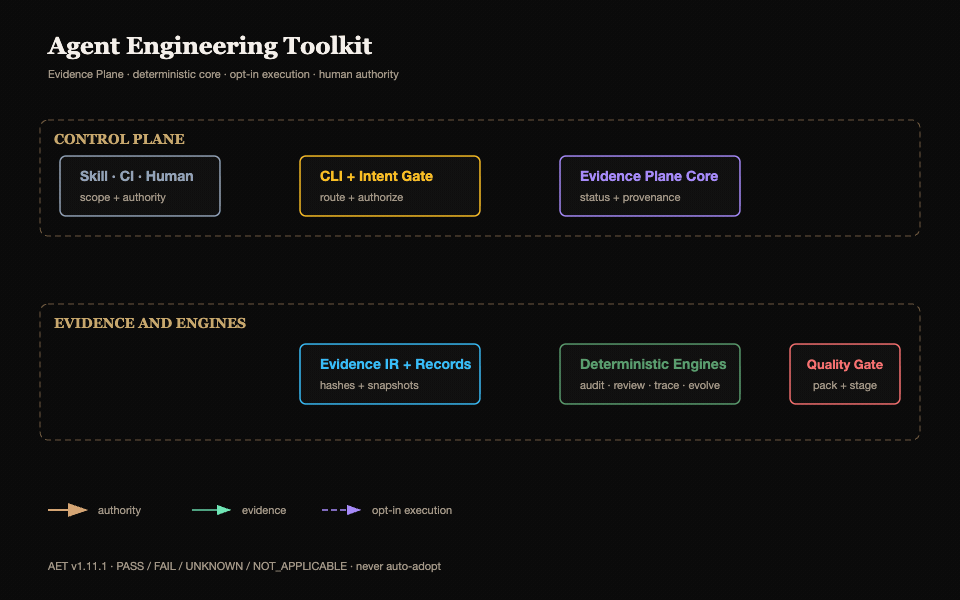

# Agent Engineering Toolkit

[](https://github.com/AdvancingTitans/agent-engineering-toolkit/actions/workflows/ci.yml)
[](https://github.com/AdvancingTitans/agent-engineering-toolkit/releases)
[](https://www.python.org/)
[](LICENSE)
[](docs/README.zh-CN.md)

**[English](README.md) · [简体中文](docs/README.zh-CN.md)**

> **Stop coding Agents from claiming “tests passed” without verifiable proof.**

An Agent can run a command and show a green log. That log stops proving the
current code as soon as the workspace changes. AET records the exact command,
exit status, declared artifacts, human intent and Git workspace snapshot, then
checks whether the evidence is still fresh before a handoff or release.

```text
Agent claim → exact execution evidence → live freshness check → human decision
```

AET is a local, MIT-licensed CLI and portable Skill for Codex, Claude Code,
Cursor and other coding Agents. It does not replace your Agent, tests or CI, and
it never turns missing evidence into a pass.

## Real-world Repository Audit Showcase

AET now ships three commit-locked audits of public Agent repositories. Each
case scans only a bounded local checkout, applies deterministic rules, and
produces evidence-backed engineering observations plus HTML and SVG views.
There is no project score or ranking.

| Case | What the bounded audit demonstrates | Generated report |
| --- | --- | --- |
| SWE-agent | Agent loop, tool interaction, trajectory and completion evidence | [English](repository-audit-showcase/reports/swe-agent/audit-result/en/audit-report.md) · [简体中文](repository-audit-showcase/reports/swe-agent/audit-result/zh-CN/audit-report.md) |
| Google ADK | Agent architecture, tool governance and evaluation feedback | [English](repository-audit-showcase/reports/google-adk/audit-result/en/audit-report.md) · [简体中文](repository-audit-showcase/reports/google-adk/audit-result/zh-CN/audit-report.md) |
| OpenHands | Application orchestration, runtime isolation and the external Agent-core boundary | [English](repository-audit-showcase/reports/openhands/audit-result/en/audit-report.md) · [简体中文](repository-audit-showcase/reports/openhands/audit-result/zh-CN/audit-report.md) |



Run a case against the matching locked local checkout:

```bash
aet audit swe-agent --repo /path/to/SWE-agent
aet audit google-adk --repo /path/to/adk-python
aet audit openhands --repo /path/to/OpenHands
```

Each run writes two shared machine artifacts plus five human-readable artifacts
for each of `en/` and `zh-CN/`: repository summaries, Markdown and HTML reports,
and two SVG diagrams. The 15-minute budget starts with the local checkout and AET
already installed. AET does not run upstream code or tests, install upstream
dependencies, copy source text into reports, or use an LLM to create or change
a Finding. `UNKNOWN` remains explicit, and generated reports require maintainer
review before publication. See the [scope and publication boundary](repository-audit-showcase/docs/scope-and-publication.md).

## Try the stale-proof demo

Install the current release and run the repository demo:

```bash
uv tool install https://github.com/AdvancingTitans/agent-engineering-toolkit/releases/download/v1.12.0/agent_engineering_toolkit-1.12.0-py3-none-any.whl
git clone https://github.com/AdvancingTitans/agent-engineering-toolkit.git
cd agent-engineering-toolkit
./examples/stale-proof-demo.sh
```

In about 60 seconds it records a real passing test, changes the workspace without
rerunning the test, and checks the same evidence again:

```text
freshness: EXACT_MATCH
# workspace changes
freshness: HEAD_MATCH_WORKTREE_DIFFERS
```

The command did pass historically. AET reports that the proof is now stale
instead of rewriting history or trusting an old green log. See the complete
[stale-proof case study](docs/case-studies/stale-proof.md).

## Start with one claim

Use only the smallest surface needed for the current task:

| Claim to verify | Command | Result |
| --- | --- | --- |
| “These Agent instructions and Skills are usable.” | `aet audit . --strict` | Source-backed findings |
| “This diff stayed inside the approved scope.” | `aet review . --base main --intent aet.intent.json` | Path and proof contract review |
| “This exact command ran on these exact bytes.” | `aet trace … -- <argv>` | Hash-bound Trace evidence |
| “The attached proof still matches the workspace.” | `aet evidence receipt --report <trace.json>` | Live freshness state |

AET is normally **off**. Use it for high-value PRs, multi-Agent handoffs,
releases, or security-sensitive changes where a claim needs portable proof.
Ordinary edits should keep using the project's normal tests and CI.

## Help build AET

The best first contributions do not require learning the whole control plane:

- reproduce a false positive or false negative with a small public fixture;
- dogfood AET on a public repository and contribute a sanitized case study;
- add a minimal integration recipe for Codex, Claude Code, Cursor or GitHub Actions.

Start with the [`good first issue`](https://github.com/AdvancingTitans/agent-engineering-toolkit/issues/1)
or read [CONTRIBUTING.md](CONTRIBUTING.md). The compatibility promise for 1.x is
documented in the [stability contract](docs/stability.md).

## The result, not the promise

The v1.9 release was gated with real Codex CLI `0.144.1` behavior on three
byte-separated suites. Each suite used six paired baseline/candidate rollouts.

| Real-host release gate | Baseline | Bounded candidate | Absolute gain | Infra failures | Exact paired p |
| --- | ---: | ---: | ---: | ---: | ---: |
| Core | 0 / 6 | **6 / 6** | +100 pp | 0 | 0.03125 |
| Validation | 0 / 6 | **6 / 6** | +100 pp | 0 | 0.03125 |
| Held-out | 0 / 6 | **6 / 6** | +100 pp | 0 | 0.03125 |
| **Continuous success** | **0 / 18** | **18 / 18** | **+100 pp** | **0** | — |

Every successful candidate rollout used exactly one authorized `aet trace`
command. The candidate remained inside a 676-character edit budget, could not
modify the Task suites or evaluator, and still required human adoption.

This is an AET release-gate case study—not a claim that one small task proves
general model superiority. It demonstrates the property AET is designed to
provide: **a governance asset can improve real Agent behavior under isolated,
statistical, provenance-bound and human-controlled evaluation.** The tracked
suites and producer are in [`eval/real-agent`](eval/real-agent) and
[the real-host workflow](.github/workflows/real-host-gate.yml).

It is also historical evidence for that bounded candidate, not a universal
prerequisite for every AET package release. Runtime and deterministic-evidence
changes use deterministic CI; a full paired Real Host Gate is reserved for
governance-asset adoption or a new claim about observed Agent behavior.

v1.11 removes avoidable cost without weakening that boundary. The changes are
directly enforced by tests and workflow contracts:

| Cost surface | v1.10 | v1.11 |
| --- | ---: | ---: |
| Universal release rollout constant | 3 suites × 6 pairs × 2 = 36 | None; risk/claim/power-bound Gate Plan |
| Invalid candidate before Host calls | Suites could still execute | **0 Host calls** |
| Exact completed observed replay | Re-executed | **0 repeated Host calls with explicit `--resume`** |
| Finalist Core/Validation in Tournament | Executed twice | **Reused once with exact binding** |
| CI pytest invocations | 3 | **1 full suite** |
| Release rebuild/retest | Separate build + repeated tests | **Promotes the exact CI Artifact** |
| Portable root Skill | 262 lines / 14,401 bytes | **99 lines / 5,926 bytes**, references loaded on demand |

The successful-candidate sample requirement is not blindly reduced. A planned
Gate may require more than 36 executions when the declared effect or risk needs
it; savings come from `NOT_APPLICABLE`, preflight, exact reuse, safe efficacy or
futility stopping, and removing duplicate engineering work.

## Why AET is different

Most Agent quality stacks start with a transcript or a score. AET starts with
the trust boundary.

| Engineering concern | A common shortcut | AET's contract |
| --- | --- | --- |
| Proof | The Agent says “tests passed.” | `trace` records the exact argv, exit code, logs, declared artifacts and proof binding. |
| Freshness | A passing log is treated as permanently valid. | Proof success and current workspace freshness are separate facts. |
| Uncertainty | Missing evidence is folded into a score. | `UNKNOWN` remains a first-class, release-blocking verification gap. |
| Diagnosis | A model guesses the root cause. | Explicit policies map observed phenomena to bounded owners and repair surfaces without rewriting source status. |
| Improvement | The candidate edits its prompt and judges itself. | Candidate writes, evaluator bytes, held-out suites, evidence semantics and adoption authority are separated. |
| Reliability | One successful run is enough. | any-success, all-success, Wilson 95% intervals and paired exact McNemar are reported together. |
| Privacy | Raw transcripts become the default data lake. | Raw rollout output stays private; only de-identified Evidence Only records may travel. |
| Authority | A passing optimizer deploys its own change. | Gate → stage → human review → explicit `adopt --yes`; never auto-commit, push or release. |

The design is deliberately asymmetric: the Agent may act, but it cannot grant
itself evidence, redefine `PASS`, replace the evaluator, or authorize adoption.

## Architecture



Editable, offline source: [English HTML](docs/assets/aet-architecture-en.html) ·
[Chinese HTML](docs/assets/aet-architecture-zh-cn.html).

### Animated architecture

This focused animation compresses the detailed control plane into its macro
evidence flow. It complements the full static diagram above rather than
replacing its delivery, provenance, quality, and governance detail.



[简体中文动画](docs/assets/aet-architecture-dark-luxury-zh-cn.gif) ·
[Semantic SVG source](docs/assets/aet-architecture-dark-luxury.svg)

Read the diagram from top to bottom: humans retain scope and adoption authority;
an external coding Agent works in the repository through the project's existing
tools; AET is the local control plane that records and evaluates the resulting
evidence. It is not another Agent runtime or a replacement for tests and CI.

The architecture then separates three flows that must not be collapsed into one
autonomous loop, plus independent local provenance records:

1. **Delivery evidence.** Audit, Review and Trace reports are projected into
   Evidence IR and may be compiled into an Evidence Pack. Component ingestion,
   finding status, proof binding and snapshot binding remain separate facts.
   An optional Run Manifest attaches existing artifacts through an explicit
   lifecycle; it does not execute them.
2. **Independent provenance.** Context Manifest, Decision Ledger and Evolve
   archaeology each have their own verification semantics. They are not hidden
   Evidence Pack inputs and are not interchangeable forms of memory.
3. **Quality regression staging.** Deterministic diagnosis preserves source
   status. Promotion requires a matching diagnosis and confirmed badcase, then
   writes only a canonical, validation-only staging bundle for human review;
   promotion is not adoption and never writes formal suites.
4. **Governance asset evolution.** Evidence Only records are filtered, stored,
   inspected and deterministically mined before an explicit target adapter
   builds Candidate IR v2. Target-specific replay and Gates precede staging.
   Shadow is an additional adoption brake for audit rules only.
5. **Human authority.** Stage rechecks exact Gate and candidate bindings;
   adoption rechecks the live baseline and requires explicit authorization.
   `sleep` can stop at Stage but cannot adopt, commit, push or release.
6. **Conditional evidence budget.** `gate-plan/v2` binds Claim, risk, power,
   Candidate, Runner, Scorer, Task and Fixture bytes before execution. Core
   retains the contract; Validation and Held-out use pre-registered directional
   paired objectives with alpha-spent sequential looks. Verified history is
   planning-only: fresh pairs alone can produce PASS.

The output is not merely a report. It is a growing set of reusable engineering
assets: Evidence Packs, regression candidates, diagnosis records, Gate and
Shadow evidence, rejection memory, Context Manifests, Run Manifests and
Decision Ledger entries.

## Product surfaces

Start with the smallest surface that answers the question.

| Question | Command | What it establishes |
| --- | --- | --- |
| Are the Agent's instructions and Skills structurally usable? | `aet audit` | Deterministic findings, source evidence, RulePack identity and remediation. |
| Is this diff inside the human-approved change contract? | `aet review` | Intent, path budget, proof declarations and optional Review Policy. |
| Did this exact proof command run and produce this artifact? | `aet trace -- <argv>` | Command, exit status, logs, artifacts, redaction and workspace snapshot. |
| Can the evidence travel with a handoff? | `aet evidence pack` | Portable Evidence Pack and optional static Viewer. |
| Did the repository change after the proof? | `aet run verify` | Fresh, stale or explicitly unknown lifecycle state. |
| What context and decisions were actually recorded? | `aet context`, `aet decision` | Hash-bound manifests and source-backed project memory. |
| Why did this repository evolve this way? | `aet evolve` | Cited local/explicit-remote archaeology, not invented author intent. |
| Which bounded route matches a structured failure? | `aet quality diagnose` | Status-preserving owner/action/repair mapping and review routing. |
| Can a confirmed failure become a regression asset? | `aet quality promote` | Validation-only Task v2 staging bundle; no production write. |
| Can recurring failures improve a governance asset? | `aet learn` | Evidence Only mining, target-specific replay/Gate, stage and human adoption. |
| How much observed evidence is required for this claim? | `aet learn plan` | A hash-bound risk, coverage, effect, power and stopping contract. |
| Can comparable historical Gates inform planning? | `aet learn history assess` | Drift-explicit sensitivity only; history never enters PASS. |

## Delivery workflow reference

### Activation and project fit

**AET is opt-in and should remain off for ordinary Agent work.** Installing the
CLI or portable Skill does not authorize an Agent to run it. Enable it for one
task only when the user explicitly asks for AET; do not carry that permission
into later tasks.

| Workload | Recommended AET level |
| --- | --- |
| Routine coding, prototypes, small changes, exploratory work | **Off** (default); use the project's normal tests and CI. |
| High-value PR or multi-Agent handoff where claims need portable proof | Run only the requested delivery surface: Audit, Review, Trace, or Evidence Pack. |
| Release, regulated, security-sensitive, or high-blast-radius Agent change | Use the relevant full delivery contract and fresh declared proofs. |
| Governance-asset optimization | Explicitly opt into `aet learn`; reserve real-host Gate/Shadow for adoption decisions. |

This boundary is also a cost boundary. Real-host evaluation is inherently
expensive because every fresh pair executes both baseline and candidate. The
v1.9 case study required **36 real Agent runs**, but 36 was a Release profile,
not a statistical law. v1.10 introduced exact Trace reuse and compact Receipts;
v1.11 turns the remaining safe reductions into explicit contracts:
`trace --reuse-if-fresh` skips execution only after exact command, proof,
artifact, validator, sealed-report, log and workspace verification; `evidence
receipt` provides a compact hash-bound index with a live freshness check;
observed replay resume/reuse is explicit and byte-bound; deterministic failures
stop before a Host call; Tournament/Sleep do not repeat the same Replay; and
Release promotes the exact CI-built Artifact. A Gate Plan freezes applicability,
suite objectives, coverage, alpha, power, effect assumption, sample bounds and
stopping looks before execution. Ordinary fixed-sample p-values may not be
repeatedly peeked. `FAIL`, infrastructure failure, safe mathematical futility,
and a pre-registered efficacy boundary may stop early. Reaching the maximum
without evidence remains `INCONCLUSIVE`. Historical evidence can only produce a
planning sensitivity report and never reduces the fresh-pair PASS statistic.

Install the current release:

```bash
uv tool install https://github.com/AdvancingTitans/agent-engineering-toolkit/releases/download/v1.12.0/agent_engineering_toolkit-1.12.0-py3-none-any.whl
aet --version
```

Create a reviewable contract, audit the instructions, review the diff, and run
the declared proof through Trace:

```bash
aet init --output aet.toml

aet audit . --strict --format json \
  --output .aet/evidence/audit.json

aet review . --base main --intent aet.intent.json --format json \
  --output .aet/evidence/review.json

aet trace --proof unit-tests --intent aet.intent.json \
  --artifact reports/pytest.txt \
  --output .aet/evidence/trace.json \
  -- python -m pytest -q

aet evidence pack \
  --audit .aet/evidence/audit.json \
  --review .aet/evidence/review.json \
  --trace .aet/evidence/trace.json \
  --output .aet/evidence/evidence-pack.json

# Explicitly reuse only an exact, fresh successful Trace; never auto-executes.
aet trace --reuse-if-fresh --proof unit-tests --intent aet.intent.json \
  --artifact reports/pytest.txt --output .aet/evidence/trace.json \
  -- python -m pytest -q

# Give an Agent a compact index while retaining canonical evidence on disk.
aet evidence receipt --report .aet/evidence/evidence-pack.json \
  --output .aet/evidence/receipt.json
```

`audit` and `review` never execute a declared proof. A non-zero Audit exit still
writes its report; inspect the finding before deciding what to fix. Trace is
opt-in, rejects unsafe artifact paths, independently redacts declared UTF-8
artifacts, and preserves a successful child exit separately from an artifact
verification gap.

## From badcase to regression asset

Quality is deterministic before it becomes generative:

```bash
aet quality diagnose \
  --report .aet/evidence/failure.json \
  --policy quality-mapping.json \
  --output .aet/quality/diagnosis.json

aet quality promote \
  --badcase confirmed-badcase.json \
  --diagnosis .aet/quality/diagnosis.json \
  --policy quality-mapping.json \
  --output .aet/quality/staged-regressions
```

Diagnosis is explicit policy lookup, not semantic RCA. Promotion is intentionally
narrow: the sample must be confirmed, reproducible, de-identified,
representative and non-duplicate. It writes a content-addressed validation
candidate and provenance sidecar—not a production Skill, test suite, ticket or
auto-fix.

## Evidence-gated evolution

AET can evolve six registered governance targets:

| Target | Candidate surface | Evaluator | Additional brake |
| --- | --- | --- | --- |
| Skill | Marked editable block | Static contract or real Codex/Claude behavior | Paired statistics + human adoption |
| Audit Rule | Declarative, non-executable detector selection | Core / validation / held-out / adversarial fixtures | Adoption-grade multi-repository Shadow |
| Audit Profile | Monotonic configuration | Target-specific policy suite | Cannot disable rules or lower severity |
| Review Policy | Bounded JSON Patch | Review-policy suite | Cannot expand scope or remove proof |
| Trace Validator | Allowlisted validator policy | Validator suite | Cannot weaken evidence semantics |
| Triage Policy | Ordering policy | Triage suite | May reorder; never hide or rewrite findings |

The standard loop is explicit and separable:

```bash
aet learn harvest --evidence .aet/evidence \
  --output .aet/learn/experiences.json
aet learn mine --experiences .aet/learn/experiences.json \
  --target-type skill --output .aet/learn/patterns.json
aet learn propose --engine rules --patterns .aet/learn/patterns.json \
  --target skills/agent-engineering-toolkit/SKILL.md \
  --output .aet/learn/candidates/CAND-001

aet learn gate --candidate .aet/learn/candidates/CAND-001 \
  --core eval/core --validation eval/validation --held-out eval/held-out \
  --output .aet/learn/gates/CAND-001.json

aet learn stage --candidate .aet/learn/candidates/CAND-001 \
  --gate .aet/learn/gates/CAND-001.json \
  --output .aet/learn/staged
```

`stage` is not adoption. `adopt --yes` rechecks immutable bytes and the target's
current hash. AET never schedules itself, uploads a transcript, opens a ticket,
commits, pushes or publishes a release.

### Real-host evaluation

Static replay checks document contracts; it is never presented as observed
Agent behavior. Real-host evaluation is deliberately exceptional: use it when
adopting the exact Skill/Prompt/governance candidate evaluated by the suites,
changing behavior that those suites actually cover, or publishing a new
observed-behavior claim. Do not run it for
ordinary runtime, evidence, packaging, documentation, or deterministic-policy
releases. Name a real runner when behavior matters:

```bash
aet learn runner list

aet learn replay --candidate .aet/learn/candidates/CAND-001 \
  --suite eval/real-agent/core --runner codex --rollouts 3 \
  --runner-config runner.json \
  --output .aet/learn/replays/CAND-001

aet learn plan --candidate .aet/learn/candidates/CAND-001 \
  --core eval/real-agent/core --validation eval/real-agent/validation \
  --held-out eval/real-agent/held-out --runner codex \
  --runner-config runner.json --risk-class R3 \
  --claim TRACE.ROUTING.EXACT-COMMAND --output .aet/learn/gate-plan.json

aet learn gate --candidate .aet/learn/candidates/CAND-001 \
  --core eval/real-agent/core --validation eval/real-agent/validation \
  --held-out eval/real-agent/held-out --runner codex \
  --runner-config runner.json --gate-plan .aet/learn/gate-plan.json \
  --output .aet/learn/gates/CAND-001.json
```

Core is a contract-retention check, not a claim of statistical
non-inferiority: every candidate Task must succeed and no new hard finding may
appear. Validation and Held-out use the pre-registered candidate-better,
one-sided exact paired objective plus MCID. The overall adoption Gate is an
intersection-union decision—all declared objectives must pass. Each sequential
look spends a fixed share of family alpha, so optional stopping cannot reuse the
legacy fixed-sample p-value.

Verified history is deliberately weaker:

```bash
aet learn history assess --registry gate-history.json \
  --gate-plan .aet/learn/gate-plan.json --suite validation \
  --output .aet/learn/history-assessment.json
```

The registry rejects unverified, duplicate or identity-drifted entries. Its
discounted effective sample and leave-one-release-out sensitivity are planning
metadata only; the planned maximum is never lowered and fresh pairs alone enter
the Gate statistic.

Host startup, authentication failure, timeout, empty structured events and
unsupported isolation remain `INFRASTRUCTURE_ERROR`, `UNKNOWN` or
`INCONCLUSIVE`; they never become a candidate pass. Raw outputs and normalized
events stay inside private rollout directories. Only derived Evidence Only
phenomena, scores and hashes are eligible for export.

### Release classification

Every tag carries a tracked `release-classification.json` contract binding its
base tag, complete changed-path digest, class, claims/adoptions, and any
behavior-sensitive `NOT_APPLICABLE` exceptions to deterministic proofs. The
GitHub Release workflow verifies that contract before accepting its explicit
class:

| Class | Real Host Gate | Release evidence |
| --- | --- | --- |
| `deterministic` | Must be omitted | `NOT_APPLICABLE` with a reason; CI binds full tests, suites, Audit, wheel and hashes to the release commit. |
| `governance-adoption` | Required | A successful workflow Run ID, commit, runner, candidate and suite bytes are all reverified before release. |

The dispatch choice cannot override the tag contract. The workflow also rejects
a Gate Run ID on a deterministic release, a governance-adoption release without
one, a Gate whose Candidate SHA or covered Suite IDs differ from its structured
claim binding, an unacknowledged sensitive path, or a stale Diff digest. Every Release
publishes the contract, its commit-bound verification, the exact CI candidate
Artifact manifest, and
`release-evidence.json`; governance releases additionally retain the verified
Real Host Gate manifest as a durable Release asset. Absence of a model Gate is
therefore reviewable `NOT_APPLICABLE`, never silently treated as `PASS`.

## Where AET fits

AET complements existing tools instead of pretending to replace them.

| Tool category | It owns | AET owns |
| --- | --- | --- |
| Codex, Claude Code, Copilot and other runtimes | Planning and executing repository work | Evidence and authority around the runtime's delivery claims |
| Tests, CI, linters and security scanners | Domain-specific checks | Exact execution proof, artifact binding, intent and freshness around those checks |
| LangSmith, Braintrust, DeepEval and observability stacks | Broad experiment, trace and fleet analytics | Local engineering evidence semantics and bounded governance-asset adoption |
| OPA and policy engines | General pre-authored policy enforcement | AET-specific monotonic policies and evidence-gated evolution |
| Skill authoring and optimization systems | Creating or training Skill content | Proving in-use behavior and constraining what may be evaluated, staged and adopted |
| Ticketing and business dashboards | Operational workflow and online outcome tracking | Structured local evidence that those systems may consume |

Choose AET when a coding-agent handoff needs more than “looks good,” when
`FAIL` and `UNKNOWN` must remain different, or when a recurring failure should
improve a governance asset without giving the candidate control of its own
evaluation.

Do not choose AET as an Agent runtime, general benchmark, LLM-Judge center,
automatic semantic RCA/Evidence Graph, clustering platform, Skill quality-YAML
standard, hosted transcript service, business dashboard or autonomous release
bot.

## Security and trust boundaries

- **Only Trace executes.** `audit`, `review`, quality diagnosis, Evidence Pack
  compilation and deterministic replay are read-only with respect to the proof
  command.
- **Trace evidence is independently checked.** The scorer binds the trusted
  wrapper, outer child argv, Trace argv, Intent proof command, artifacts, logs,
  redaction rules and before/after snapshots. Command-shaped text is not proof.
- **Fixtures are copied without following links.** Nested symlinks, special
  files, outside-root sources and post-copy hash drift are rejected.
- **Environment permission is explicit.** A Task names allowed environment
  variables; process runners also require `inherit_home: true` for `HOME`.
  Authorization to inherit a value never authorizes exporting it.
- **Network posture is truthful.** A runner that cannot enforce OS-level denial
  reports `PARTIAL`; an `enforced-deny` Task fails before execution.
- **Candidate authority is bounded.** Evaluator code, held-out cases,
  Constitution, evidence states and human adoption are immutable to the
  candidate.

These controls reduce the candidate's influence. They do not claim an
impossible-to-game evaluator, perfect sandbox, or proof that a model understood
every discovered instruction.

## Portable Skill and repository archaeology

The canonical tool-neutral Skill lives in
[`skills/agent-engineering-toolkit`](skills/agent-engineering-toolkit). The
wheel contains the CLI, not the Skill resources. From a source checkout, copy
the complete directory rather than only `SKILL.md`:

```bash
git clone https://github.com/AdvancingTitans/agent-engineering-toolkit.git
cd agent-engineering-toolkit
cp -R skills/agent-engineering-toolkit ~/.codex/skills/
```

Configure the host with an equivalent activation rule:

> AET is opt-in. Do not load or run it for ordinary tasks. Use it only when the
> user explicitly asks to use AET for the current task, and select the smallest
> requested surface.

To uninstall it from Codex, remove the complete
`~/.codex/skills/agent-engineering-toolkit` directory and start a new task so
the Skill catalog is reloaded. Removing the Skill does not uninstall the
separate `aet` CLI.

For source-backed project history, `aet evolve plan/collect/build/report`
collects local Git and documentation by default. GitHub access occurs only with
explicit `--remote github`. Missing remote evidence stays `UNKNOWN`; AET never
invents author intent from commit text alone.

## Verification

The release itself leaves runnable checks behind:

```bash
uv run --with pytest python -m pytest -q
uv run --with pytest python -m pytest tests/test_business_quality_flows.py -q
uv run --no-editable --reinstall-package agent-engineering-toolkit \
  aet audit . --strict --format json --output .aet/evidence/release-audit.json
uv build
uv run --isolated --with dist/agent_engineering_toolkit-1.12.0-py3-none-any.whl \
  aet --version
```

See [CHANGELOG.md](CHANGELOG.md), the
[evolution boundary](docs/evolution-boundary.md), and the
[v1.9 implementation plan](docs/superpowers/plans/2026-07-13-v1-9-quality-loop.md)
for the detailed contracts behind the architecture.

## Contributing

Issues and pull requests are welcome. Preserve the defining constraints:
deterministic checks before model judgment, explicit `UNKNOWN`, candidate and
evaluator separation, private raw evidence, target-specific Gates, and human
authority over adoption.

Released under the [MIT License](LICENSE).
