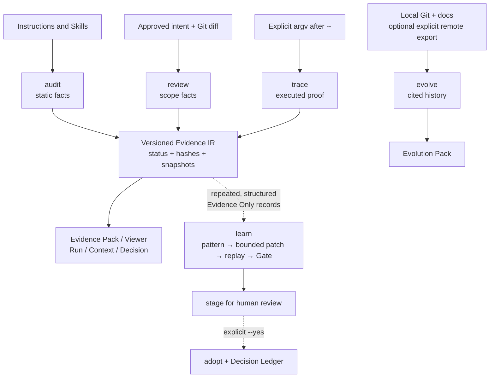

# Agent Engineering Toolkit

[](https://github.com/AdvancingTitans/agent-engineering-toolkit/actions/workflows/ci.yml)
[](https://github.com/AdvancingTitans/agent-engineering-toolkit/releases)
[](https://www.python.org/)
[](LICENSE)
[](docs/README.zh-CN.md)

**[English](README.md) · [简体中文](docs/README.zh-CN.md)**

> AET is the local evidence layer between an agent’s work and a claim that the work is ready.

Modern coding agents are becoming increasingly capable of writing code, but improving how they work is still largely a manual and heuristic process. Skills are rewritten after failures, prompts are refined through trial and error, and successful sessions are often forgotten while unsuccessful ones are difficult to explain.

**Agent Engineering Toolkit (AET) treats evidence—not prompts or model weights—as the optimization target for coding agents.**

Instead of asking an agent to reflect on what it *thinks* happened, AET records what actually happened:

- what instructions and Skills were available;
- what changes were approved by humans;
- what commands were explicitly executed;
- what evidence those commands produced;
- what remains unverified;
- and whether the collected evidence still matches the current repository.

These records become reusable engineering artifacts rather than disposable execution logs.

```text
Coding Session
        │
        ▼
Collect structured evidence
        │
        ▼
Understand recurring failures
        │
        ▼
Generate bounded Skill improvements
        │
        ▼
Replay + Validation Gate
        │
        ▼
Human Review & Adoption
        │
        ▼
Better Skill
        │
        ▼
Next Coding Session
```

Unlike conventional agent reflection, AET never allows unrestricted self-modification.

Every candidate improvement must remain inside explicitly editable regions, preserve immutable contracts, replay successfully in isolation, pass independent validation and held-out gates, and finally be adopted explicitly by a human.

Evidence therefore serves two purposes simultaneously:

- it explains **why** an agent can be trusted today;
- it determines **how** the agent is allowed to improve tomorrow.

As more coding sessions accumulate, AET transforms isolated execution records into an evidence-driven engineering feedback loop, enabling coding agents to become more reliable without changing the underlying model.

AET is **not** an agent runtime, an autonomous coding framework, or a prompt optimizer.

It is an evidence-driven self-evolution framework that makes coding agents continuously improvable through verifiable engineering evidence.

## Start here

```bash
# Install the v1.6 release wheel, then verify it.
uv tool install https://github.com/AdvancingTitans/agent-engineering-toolkit/releases/download/v1.6.0/agent_engineering_toolkit-1.6.0-py3-none-any.whl
aet --version

# Establish a baseline before an agent changes the repository.
aet init --output aet.toml
aet audit . --strict --format json --output .aet/evidence/audit.json
```

`aet audit` writes its JSON report even when it returns non-zero for a real
finding. Read that artifact first; a failed exit status means “the evidence
found a problem,” not “no audit JSON was produced.”

## Choose the smallest surface

| Question | Command | Result |
| --- | --- | --- |
| Are instructions, local references, and Skills usable? | `aet audit` | Markdown, JSON, or SARIF findings with evidence and remediation. |
| Is a diff inside the human-approved contract? | `aet review` | Intent, path-budget, and proof-declaration report. |
| Did an explicit command run and produce its declared report? | `aet trace -- <argv>` | Redacted execution record; optional captured artifact. |
| Can these records travel with a handoff or release? | `aet evidence pack` | Portable Evidence Pack and optional static Viewer. |
| Did a delivery become stale after review or proof? | `aet run` | Optional append-only delivery lifecycle. |
| What context and decisions were locally recorded? | `aet context`, `aet decision` | Hash-bound Context Manifest and Decision Ledger. |
| Why did this repository change? | `aet evolve` | Cited local/explicit-remote evolution report. |
| Which existing findings should be handled first? | `aet triage` | Explainable ordering; never a changed finding status. |
| Can repeated evidence failures improve a Skill safely? | `aet learn` | Evidence-only experience set, bounded candidate, Gate, and staged review copy. |

## Architecture



The dashed path is deliberately optional. AET does not treat every artifact as
training data, and a passed Gate does not modify the production Skill.

## A normal delivery

```bash
# 1. Audit instructions and review the approved diff. Neither runs tests.
aet audit . --strict --format json --output .aet/evidence/audit.json
aet review . --base main --intent aet.intent.json --format json --output .aet/evidence/review.json

# 2. Execute exactly one declared proof through Trace.
aet trace --proof unit-tests --intent aet.intent.json \
  --artifact reports/junit.xml --output .aet/evidence/trace.json -- \
  python -m unittest discover -s tests -v

# 3. Compile a portable handoff receipt.
aet evidence pack --audit .aet/evidence/audit.json \
  --review .aet/evidence/review.json --trace .aet/evidence/trace.json \
  --output .aet/evidence/evidence-pack.json
aet evidence viewer --pack .aet/evidence/evidence-pack.json \
  --output .aet/evidence/evidence-viewer.html
```

Only `trace` executes a generic command, and only the argv after `--`. AET
keeps proof success separate from freshness: a trace may be valid while a later
workspace change makes the delivery stale. `UNKNOWN` is a verification gap,
never a discounted pass.

## Evidence-Gated Evolution

This is AET’s v1.6 implementation of evidence-driven improvement. It is
designed for repeated routing, proof-handoff, or `UNKNOWN`-handling failures—not
for silently editing arbitrary code or policy.

```text
Evidence Only JSON → inspect → mine → bounded Patch IR → isolated replay
→ core + validation + held-out Gate → stage → human adopt or reject
```

### Phase 0–6, available now

| Phase | What is implemented |
| --- | --- |
| 0. Contract | Immutable/editable markers; candidate and task schemas; hard semantic gates. |
| 1. Experience store | Evidence-only `harvest`, `inspect`/`summarize`, deterministic mining and support counts. |
| 2. Rule proposal | Bounded editable-block Patch IR with hashes, diff, rationale, and source manifest. |
| 3. Replay and Gate | Temporary-copy replay, static Gate Viewer, candidate self-audit, core/validation/held-out checks. |
| 4. Model assist | Opt-in explicit local adapter, timeout, bounded JSON interface, and rejected-candidate constraints. |
| 5. Local federation | `collect` and `--experience-store` merge de-identified packs without networking. |
| 6. Sleep | Local bounded loop, append-only `SKILL_EVOLUTION` event history, budgets, target-change check, and stage-only terminal action. |

```bash
# Phase 1: build and inspect a local Evidence Only experience set.
aet learn harvest --evidence .aet/evidence --output .aet/learn/experiences.json
aet learn inspect --experiences .aet/learn/experiences.json --output .aet/learn/inspection.json
aet learn mine --experiences .aet/learn/experiences.json --output .aet/learn/patterns.json

# Phase 2–3: propose and test only an editable Skill block.
aet learn propose --engine rules --patterns .aet/learn/patterns.json \
  --target skills/agent-engineering-toolkit/SKILL.md --output .aet/learn/candidates/CAND-001
aet learn replay --candidate .aet/learn/candidates/CAND-001 \
  --suite eval/core --suite eval/validation --suite eval/held-out \
  --output .aet/learn/replays/CAND-001.json
aet learn gate --candidate .aet/learn/candidates/CAND-001 --core eval/core \
  --validation eval/validation --held-out eval/held-out \
  --output .aet/learn/gates/CAND-001.json
aet learn viewer --gate .aet/learn/gates/CAND-001.json --output .aet/learn/CAND-001.html
aet learn stage --candidate .aet/learn/candidates/CAND-001 \
  --gate .aet/learn/gates/CAND-001.json --output .aet/learn/staged
```

The Gate rejects changed immutable bytes, edits outside named blocks, invalid
hashes, overlapping validation/held-out tasks, candidate audit failures,
regressions, token/command-surface budget breaches, and increased workflow
overuse. It reports a metric vector rather than one “trust” number.

`aet learn adopt --yes` is intentionally separate: it rechecks the target hash
and writes a local Decision Ledger record. `reject` preserves a reason. Neither
command commits or pushes.

### Local cross-project learning and scheduled use

```bash
# Explicitly share only local, de-identified Evidence Only packs.
aet learn collect --experiences .aet/learn/experiences.json --store ~/.aet/experience
aet learn harvest --experience-store ~/.aet/experience --output .aet/learn/merged.json

# A scheduler may invoke this bounded, stage-only local loop.
aet learn sleep --evidence .aet/evidence --target skills/agent-engineering-toolkit/SKILL.md \
  --core eval/core --validation eval/validation --held-out eval/held-out \
  --max-candidates 1 --max-replays 2 --max-model-calls 1 --timeout-seconds 120 \
  --output .aet/learn/nightly
```

No transcript, shell output, environment variable, secret, remote upload,
automatic commit, push, or adoption is part of the default. See the exact
[evolution boundary](docs/evolution-boundary.md).

## Context, decisions, and history

```bash
# Context discovery records file bytes; --read is only an agent/host attestation.
aet context discover . --output .aet/context/manifest.json
aet context record --manifest .aet/context/manifest.json --read AGENTS.md
aet context verify --manifest .aet/context/manifest.json

# Decision records are local, source-backed, and verifiable later.
aet decision init --output .aet/decisions.json
aet decision add --ledger .aet/decisions.json --id DEC-0001 \
  --claim "Keep proof execution explicit." --evidence-state EVIDENCED \
  --source docs/evolution-boundary.md
aet decision verify --ledger .aet/decisions.json

# Repository archaeology is offline unless --remote github is explicit.
aet evolve plan . --question "Why was this release made?" --output .aet/evolve/plan.json
aet evolve collect . --question "Why was this release made?" --output .aet/evolve/run
aet evolve build --manifest .aet/evolve/run/source-manifest.json --output .aet/evolve/run
aet evolve report --graph .aet/evolve/run/object-graph.json --output .aet/evolve/run
```

## Installing the portable Skill

Copy the entire [`skills/agent-engineering-toolkit/`](skills/agent-engineering-toolkit/)
directory into the host’s Skill directory; do not copy only `SKILL.md` if you
want its referenced contracts too.

```bash
# From a source checkout of this repository (the wheel ships the CLI, not Skill assets):
git clone https://github.com/AdvancingTitans/agent-engineering-toolkit.git
cd agent-engineering-toolkit
cp -R skills/agent-engineering-toolkit ~/.codex/skills/
aet audit ~/.codex --format json --output ~/.aet/evidence/codex-audit.json
```

For a migrated Hermes installation, AET keeps a missing old Skill reference as
a `FAIL` but, when Hermes’s `.absorbed_into` metadata identifies a real local
replacement, includes that replacement in remediation. This is intentional:
the old instruction still needs repair, but the report explains the migration
instead of leaving an opaque path failure.

## Verification and limits

Run the project checks from a source checkout:

```bash
uv run --no-editable --reinstall-package agent-engineering-toolkit \
  python -m unittest discover -s tests -v
uv run --no-editable --reinstall-package agent-engineering-toolkit \
  aet audit . --strict --format json --output .aet/evidence/self-audit.json
uv build
```

AET verifies recorded bytes, explicit command exits, and declared artifact
handling. It does not prove a model understood an instruction, that a decision
is eternally correct, that an untraced command ran, or that a missing remote
record supports a claim. Read [the rule catalog](docs/rule-catalog.md) and
[security and retention boundary](docs/security-and-retention.md) before
relying on it in a regulated workflow.

## Contributing

See [CONTRIBUTING.md](CONTRIBUTING.md). Changes to evidence semantics require
tests, a clear contract update, and a human-reviewed intent boundary.
