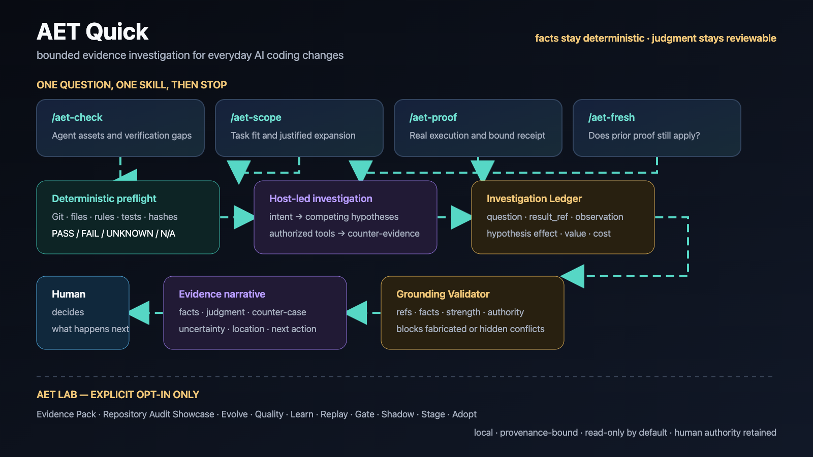

# Agent Engineering Toolkit

[](https://github.com/AdvancingTitans/agent-engineering-toolkit/actions/workflows/ci.yml)
[](https://github.com/AdvancingTitans/agent-engineering-toolkit/releases)
[](https://www.python.org/)
[](LICENSE)
[](docs/README.zh-CN.md)

**[English](README.md) · [简体中文](docs/README.zh-CN.md)**

> **AET makes AI coding review investigative without letting the model invent
> the evidence.**

An AI coding Agent says it fixed the task and ran the tests. AET helps answer
three concrete questions:

1. Did the change stay relevant to the user's task?
2. Did the claimed verification actually run on this workspace?
3. Does that proof still apply to the current code?

Tools produce reproducible facts. The host LLM may recover intent, form
competing hypotheses, call authorized tools, test counter-explanations, and
make a conditional engineering judgment. AET's deterministic Grounding API
validates the recorded references, permissions, evidence strength, and declared
budget usage before rendering. A human decides what happens next.

```text
deterministic facts → bounded LLM investigation → grounding validation → human decision
```

## Four Quick Skills

Each Skill answers one question, emits one bounded result, and stops.

| Skill | Use it when | Main result |
| --- | --- | --- |
| `/aet-check` | Agent instructions, Skills, or completion rules may be unsafe or unverifiable | Up to five evidence-backed engineering findings |
| `/aet-scope` | You need to know whether a diff fits the task, including necessary cross-module work | A disposition for each change group, with counter-explanation |
| `/aet-proof` | A command must be executed now and bound to the current workspace | One minimal JSON proof receipt |
| `/aet-fresh` | You need to know whether an older proof still applies | Exact, relevant-file, artifact, environment, or unknown freshness |

The portable host Skills live in
[`skills/aet-check`](skills/aet-check),
[`skills/aet-scope`](skills/aet-scope),
[`skills/aet-proof`](skills/aet-proof), and
[`skills/aet-fresh`](skills/aet-fresh). The deterministic runtime is:

```bash
aet quick check .
aet quick scope . --base main --intent aet.intent.json
aet quick proof --output .aet/proofs/auth.json \
  --relevant-path src/auth/session.py -- pytest tests/auth
aet quick fresh --proof .aet/proofs/auth.json
```

The legacy `aet audit`, `review`, `trace`, and `evidence receipt` commands
remain compatible throughout 1.x. They are advanced native vocabulary, not the
default Quick product surface.

## See it in 30 seconds

### Investigate scope without treating paths as guilt

```bash
aet quick scope . --base main --intent aet.intent.json --format json
```

If a payment file changes during an authentication fix, the preflight records a
path mismatch but does **not** declare it out of scope. The host investigates
direct calls, shared interfaces, tests, later authorization, and a reasonable
counter-hypothesis before choosing one of:

```text
IN_SCOPE
JUSTIFIED_EXPANSION
POSSIBLE_SCOPE_EXPANSION
OUT_OF_SCOPE
INSUFFICIENT_INTENT
```

### Record proof, then detect drift

```bash
aet quick proof --output .aet/proofs/auth.json \
  --relevant-path src/auth/session.py -- pytest tests/auth

# edit src/auth/session.py

aet quick fresh --proof .aet/proofs/auth.json
```

The historical command result remains unchanged. The current applicability
becomes `RELEVANT_FILES_CHANGED`, so AET recommends rerunning only the affected
proof instead of pretending the old green log still represents the code.

The repository also includes a runnable
[stale-proof demo](examples/stale-proof-demo.sh) and a
[case study](docs/case-studies/stale-proof.md).

## An everyday coding example

The following is an illustrative example, not a measured repository result.

You ask an Agent:

> Fix the intermittent login timeout. Do not change payment behavior and do
> not add a production dependency.

The Agent changes:

```text
src/auth/session.py
src/cache/session_cache.py
src/payment/order.py
tests/auth/test_session.py
```

Without AET, the review usually collapses into one of two weak shortcuts:
“everything outside `auth/` is out of scope,” or “the Agent says the shared
cache and payment edits were necessary.” `/aet-scope` instead treats each
change group as a hypothesis to investigate:

```text
src/auth/session.py          IN_SCOPE
src/cache/session_cache.py   JUSTIFIED_EXPANSION
src/payment/order.py         POSSIBLE_SCOPE_EXPANSION
tests/auth/test_session.py   IN_SCOPE
```

The cache result cites the direct login call path and the focused regression
test. The payment result records the counter-explanation—perhaps a shared
interface required synchronized work—and why the inspected references did not
support it. The result names the unresolved possibility of authorization in
another conversation and recommends splitting the payment cleanup or supplying
that authorization. Then `/aet-scope` stops; it does not run tests or edit code.

If you choose to verify the fix, `/aet-proof` records the real command and
workspace binding. If the Agent edits `session.py` afterward, `/aet-fresh`
changes applicability to `RELEVANT_FILES_CHANGED` without rewriting the
historical test exit code.

## What changes after adding AET

| Daily situation | Without AET | With AET Quick |
| --- | --- | --- |
| A fix crosses directories | A path rule over-rejects it, or the Agent's explanation is accepted on trust | Necessary shared work is investigated; unsupported expansion stays visible |
| “Tests passed” | A green sentence or old log is easy to reuse | argv, exit code, workspace, relevant files, artifacts, and environment bindings are recorded |
| Code changes after testing | The old result still looks green | Applicability changes to a precise Freshness state |
| LLM review | Facts, inference, counter-case, and advice blur together | Each layer is rendered separately and cites recorded evidence |
| Investigation grows | The Agent may keep reading and calling tools | Budgets and stop conditions return a bounded result |

| AET Quick can | AET Quick cannot |
| --- | --- |
| Record reproducible Git, command, hash, and Freshness facts | Prove that all code is correct |
| Investigate whether a change is necessary for the task | Declare scope violation from path mismatch alone |
| Execute and bind an explicitly requested verification command | Turn an unexecuted test into a pass |
| Preserve conflicts, missing facts, and `UNKNOWN` | Hide recorded counter-evidence or invent a holistic trust score |
| Recommend the smallest next action | Auto-fix, merge, push, publish, or enter AET Lab |

## Measured trade-offs, not a trust score

The opt-in [Quick investigation benchmark](eval/quick-investigation/README.md)
compares the four review modes required by the design across eight synthetic Scope
scenarios. The tracked
[v1.13.0 result](eval/quick-investigation/results/v1.13.0.json) used
`gpt-5.6-sol`, `medium` reasoning, two repetitions per scenario, and 16 Runs per
group:

| Mode | Effective recall | False discovery proportion | Mean tools | Mean time | Mean Tokens |
| --- | ---: | ---: | ---: | ---: | ---: |
| Pure rules | 60% | 50.0% | 0.00 | <0.001 s | 0 |
| One-shot LLM | 80% | 38.5% | 0.00 | 7.33 s | 21,702 |
| Investigated AET | 90% | 25.0% | 1.63 | 18.32 s | 64,147 |
| Grounding-aware investigation + Validator | 90% | 25.0% | 0.75 | 14.84 s | 38,831 |

The result makes the trade-off visible: bounded investigation found more of
the expected issues with a smaller share of incorrect emitted Claims in this
small suite, but cost
more time and Tokens than one-shot review. Grounding rejected zero claims in
this sample, so it did not improve the measured rates; its rejection paths are
proved separately by deterministic tests. Manual review time and user
understanding remain `UNKNOWN` because no timed human annotations were supplied.
These 64 Runs are one bounded Lab measurement produced by a repeatable Harness,
not a general accuracy claim or permission to release code. The two investigated
groups are different Agent configurations, so their cost difference must not be
attributed to the Validator alone. The published, privacy-reviewed normalized
Runs can be independently rescored; private Codex JSONL is not published.

## Architecture



The same checked architecture is available as an
[animated SVG](docs/assets/aet-quick-architecture-en.svg). Watch the
[9-second English introduction](docs/assets/aet-quick-intro-en.webm) or the
[Simplified Chinese introduction](docs/assets/aet-quick-intro-zh-CN.webm).
The [media manifest](docs/assets/aet-quick-media-manifest.json) binds the
bilingual diagrams and videos by content hash. It also records the VP9
properties measured during video generation; routine tests verify the bytes and
hashes but do not independently decode the videos.

The flow deliberately separates six responsibilities:

1. Four Quick Skills constrain the question and stop after their result.
2. The CLI records deterministic Git, file, rule, command, hash, and freshness facts.
3. The host LLM recovers intent, proposes competing hypotheses, and chooses authorized tools.
4. The Investigation Ledger binds each useful question, tool result, observation, hypothesis effect, decision value, and cost.
5. The Grounding Validator checks references, factual claims, support strength, permissions, and budget.
6. The narrative separates confirmed facts, engineering judgment, counter-explanation, uncertainty, location, and the smallest next action.

`AET Lab` remains below an explicit opt-in boundary. Quick never enters it
automatically.

## Why the LLM is constrained, not disabled

Pure path rules cannot tell whether a shared cache change is necessary for an
authentication fix. An unconstrained LLM can sound persuasive without proving
anything. AET uses both, with distinct authority:

| Capability | Deterministic runtime | Host LLM |
| --- | --- | --- |
| Git diff, hashes, exit code, artifact and freshness facts | Owns | Cannot rewrite |
| Intent recovery and competing hypotheses | Supplies sources | Owns, with provenance |
| Tool choice | Validates recorded policy and budget usage | Plans authorized calls |
| Engineering judgment | Validates grounding | Owns, conditionally |
| Merge, publish, adopt, or release authority | Never grants | Never grants |

Finding origin is explicit:

- `DETERMINISTIC_FINDING`: directly produced by a rule, command, or comparison.
- `INVESTIGATED_FINDING`: produced after a traceable tool investigation.
- `HYPOTHESIS`: a direction for further investigation; never a blocking result.

Only `/aet-proof` is an AET-executed command receipt. Other local or MCP tool
results enter the Ledger through the Agent host: their canonical payload hash
detects later mutation, but does not independently prove that an external host
performed the call. Hosts must preserve that provenance and run
`aet.investigation.validate_investigated_finding` before rendering; otherwise
the result remains `HYPOTHESIS`/`UNKNOWN`.

Evidence remains authoritative as `PASS`, `FAIL`, `UNKNOWN`, or
`NOT_APPLICABLE`. Semantic support is stored separately as `CONFIRMED`,
`SUPPORTED`, `SUPPORTED_WITH_LIMITS`, `CONFLICTED`, `UNSUPPORTED`, `UNKNOWN`,
or `NOT_APPLICABLE`. A semantic narrative cannot overwrite machine evidence.

## Command boundaries and budgets

| Quick Skill | Default boundary | Default budget |
| --- | --- | --- |
| `/aet-check` | Read Agent assets and relevant configuration; no project execution, history scan, remote access, or writes | 30 s, 3 rounds, ≤2 LLM, ≤6 tools, ≤1 expensive call, ≤5 findings |
| `/aet-scope` | Inspect intent and current diff; no code writes; at most one discriminating low-cost test | 45 s, 4 rounds, ≤2 LLM, ≤8 tools, ≤2 authorized remote reads, ≤1 expensive call |
| `/aet-proof` | Execute only explicit argv; the requested JSON receipt is the only default write | Command duration; ≤1 LLM only when locating the command |
| `/aet-fresh` | Compare the supplied proof; no execution, network, or writes | 3 s, 0 LLM by default |

The tracked [v1.13.0 local performance evidence](eval/quick-performance/results/v1.13.0.json)
retains 30 raw samples per deterministic command on this 253-tracked-file
repository: Check P95 0.622 s, Scope P95 0.059 s, and Fresh P95 0.037 s. The
[Harness and limits](eval/quick-performance/README.md) make this a reproducible
local acceptance check, not a cross-repository or model-service latency claim.

Investigation stops when a dominant explanation and reasonable counter-case
have been checked, new evidence would not change the action, two calls add no
decision value, the budget is exhausted, user authority is required, only the
user can supply a missing fact, or a tool is unavailable.

On exhaustion, AET returns a bounded result and names uninspected surfaces. It
does not silently escalate into a repository-wide audit.

The machine-readable contracts are documented in
[command boundaries](docs/command-boundaries.md),
[the investigation model](docs/investigation-model.md), and
[the Quick/Lab boundary](docs/quick-vs-lab-boundary.md).

## Language behavior

Language changes only the human narrative, never status tokens, evidence
references, hashes, or schema fields.

- When the user invokes a slash command and asks in Chinese, the host explains
  the result in natural Simplified Chinese while keeping code and necessary
  technical terms in English.
- Every other request uses English.

English and Chinese narratives must cite the same facts and `result_ref`
values. Switching language cannot trigger another investigation or strengthen
a conclusion.

## Minimal proof and freshness

`/aet-proof` records:

- exact redacted argv and its digest;
- cwd, start/end timestamps, exit code, and log digests;
- Git/worktree snapshot;
- declared relevant-file hashes;
- Python/platform identity and dependency lockfile hashes;
- declared artifact hashes;
- a bounded coverage statement.

`/aet-fresh` returns one of:

```text
EXACT_MATCH
RELEVANT_FILES_MATCH
HEAD_CHANGED_RELEVANT_FILES_MATCH
RELEVANT_FILES_CHANGED
ARTIFACT_CHANGED
ENVIRONMENT_CHANGED
UNKNOWN
```

Legacy Trace and canonical evidence reports remain readable. When old evidence
does not contain relevant-file or environment bindings, AET preserves the
uncertainty instead of inventing precision.

## Real-world Repository Audit Showcase

The Repository Audit Showcase remains a supported **AET Lab** case library,
not the default Quick workflow. It contains three commit-locked, static-only
audits of public Agent repositories:

| Case | Bounded audit surface | Evidence result | Reports |
| --- | --- | --- | --- |
| SWE-agent | Agent loop, tool interaction, trajectory, completion evidence | 4 `PASS`, 1 `UNKNOWN` | [English](repository-audit-showcase/reports/swe-agent/audit-result/en/audit-report.md) · [简体中文](repository-audit-showcase/reports/swe-agent/audit-result/zh-CN/audit-report.md) |
| Google ADK | Agent architecture, tool governance, evaluation feedback | 5 `PASS` | [English](repository-audit-showcase/reports/google-adk/audit-result/en/audit-report.md) · [简体中文](repository-audit-showcase/reports/google-adk/audit-result/zh-CN/audit-report.md) |
| OpenHands | Application orchestration, runtime isolation, external Agent-core boundary | 4 `PASS`, 1 `UNKNOWN` | [English](repository-audit-showcase/reports/openhands/audit-result/en/audit-report.md) · [简体中文](repository-audit-showcase/reports/openhands/audit-result/zh-CN/audit-report.md) |

```bash
aet audit swe-agent --repo /path/to/SWE-agent
aet audit google-adk --repo /path/to/adk-python
aet audit openhands --repo /path/to/OpenHands
```

Each run scans only the locked local checkout, runs no upstream code or tests,
installs no upstream dependencies, copies no source text into reports, and
does not allow an LLM to create or change a Showcase Finding. Each case writes
two shared machine artifacts and five reviewed human artifacts for each of
`en/` and `zh-CN/`. See the
[scope and publication boundary](repository-audit-showcase/docs/scope-and-publication.md).
These status counts describe the bounded evidence contract, not an overall
quality grade for the upstream repository.

## AET Quick and AET Lab

| Layer | Audience | Capabilities | Default |
| --- | --- | --- | --- |
| AET Quick | Developers using coding Agents day to day | Check, Scope, Proof, Fresh | Installed and invoked individually |
| Optional extensions | Teams needing project provenance | Context, Decision, Evolve | Explicit request |
| AET Lab | Agent engineers and Skill/platform authors | Evidence Pack, Showcase, Quality, Learn, Replay, Gate, Tournament, Shadow, Stage, Adopt, statistics | Explicit opt-in only |

Existing Lab commands and the canonical
[`agent-engineering-toolkit` compatibility Skill](skills/agent-engineering-toolkit)
remain available. Quick does not preload their references, run real-host
rollouts, create large HTML/SVG bundles, or perform governance-asset adoption.

## Security and authority

- Local and read-only by default.
- `/aet-proof` executes only argv explicitly placed after `--`.
- The explicit proof request authorizes its receipt, not unrelated writes.
- Credentials are never required for Quick and must not enter persisted evidence.
- Remote writes, `git push`, release publication, Issue closure, destructive shell actions, automatic repair, and automatic adoption are forbidden.
- Remote reads and project execution must match the selected Skill's policy and budget.
- Missing evidence remains `UNKNOWN`; there is no holistic trust score.
- A model-generated judgment is never the sole release gate.

Read [security and retention](docs/security-and-retention.md) and the
[stability contract](docs/stability.md) for the detailed boundary.

## Install and develop

Install the current Quick implementation from this source checkout:

```bash
uv tool install .
```

Install or copy only the Quick Skill folders supported by your Agent host.
Hosts without native Skill loading can load the relevant `SKILL.md` as task
instructions and call the same CLI.

For local development:

```bash
git clone https://github.com/AdvancingTitans/agent-engineering-toolkit.git
cd agent-engineering-toolkit
uv run --no-editable python -m unittest discover -s tests
```

AET uses Python 3.11+ and keeps the deterministic runtime dependency-light.
Contributions should add clean and failing fixtures, preserve evidence
provenance, and avoid broadening a Quick command beyond its question. See
[CONTRIBUTING.md](CONTRIBUTING.md).

## Advanced documentation

- [Rule catalog](docs/rule-catalog.md)
- [Evidence and delivery workflow](skills/agent-engineering-toolkit/references/delivery-workflow.md)
- [Repository Audit Showcase](skills/agent-engineering-toolkit/references/repository-audit-showcase.md)
- [Provenance workflows](skills/agent-engineering-toolkit/references/provenance-workflow.md)
- [Quality workflow](skills/agent-engineering-toolkit/references/quality-workflow.md)
- [Lab evolution workflow](skills/agent-engineering-toolkit/references/evolution-workflow.md)
- [Changelog](CHANGELOG.md)

## License

[MIT](LICENSE)
