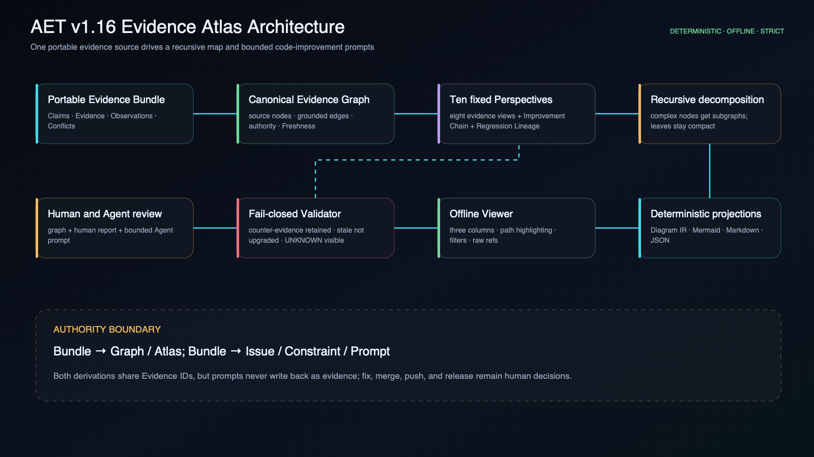
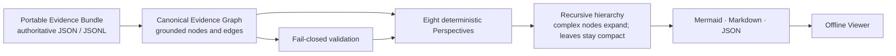
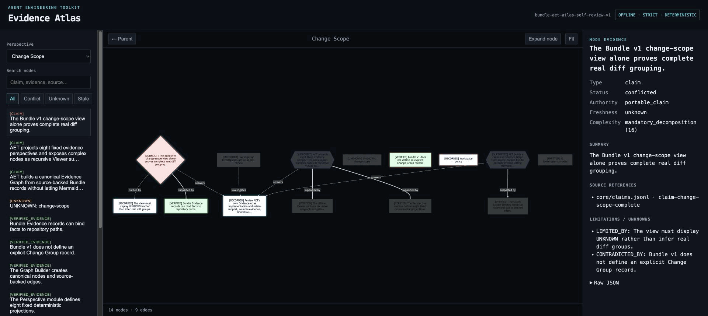
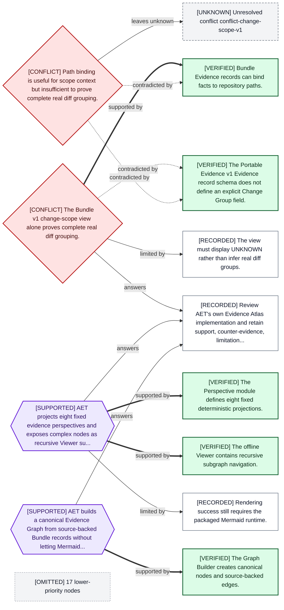
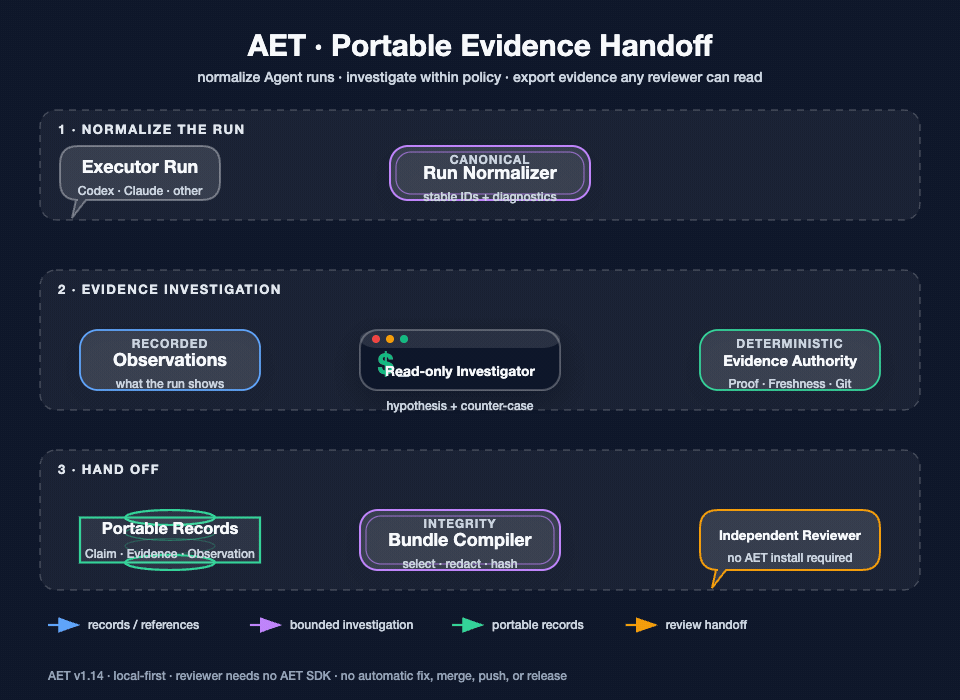
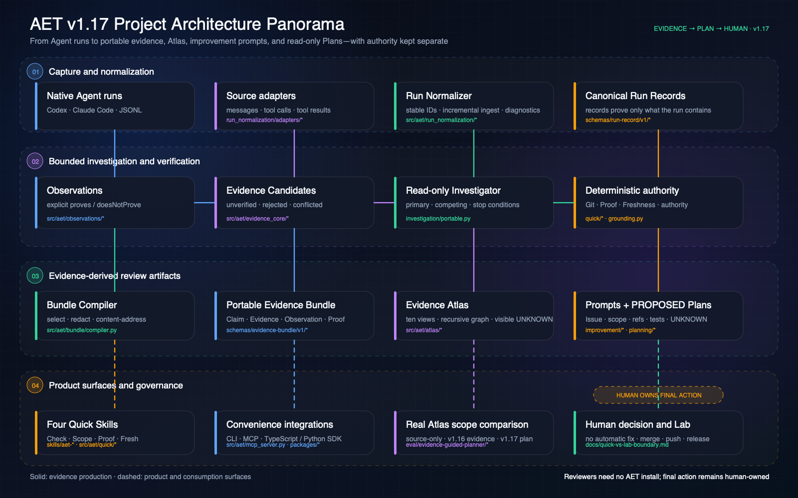

# Agent Engineering Toolkit

[](https://github.com/AdvancingTitans/agent-engineering-toolkit/actions/workflows/ci.yml)
[](https://github.com/AdvancingTitans/agent-engineering-toolkit/releases)
[](https://www.python.org/)
[](LICENSE)
[](docs/README.zh-CN.md)

**[English](README.md) · [简体中文](docs/README.zh-CN.md)**

> **AET turns AI coding work into portable, inspectable evidence—then lets
> humans and Agents investigate it without letting a model invent the facts.**

An AI coding Agent says it fixed the task and ran the tests. AET helps answer
five concrete questions:

1. Did the change stay relevant to the user's task?
2. Did the claimed verification actually run on this workspace?
3. Does that proof still apply to the current code?
4. Can another Agent review the same evidence without installing AET?
5. Can a human trace a conclusion, counter-evidence, and `UNKNOWN` through a
   readable investigation map?

Tools produce reproducible facts. The host LLM may recover intent, form
competing hypotheses, call authorized tools, test counter-explanations, and
make a conditional engineering judgment. AET's deterministic Grounding API
validates the recorded references, permissions, evidence strength, and declared
budget usage before rendering. AET can then export the result as a portable,
self-describing evidence handoff. A human decides what happens next.

```text
deterministic facts → bounded investigation → grounding validation
                    → portable evidence handoff → Evidence Atlas
                    → independent review → human decision
```

## Four Quick Skills

Each Skill answers one question, emits one bounded result, and stops.

| Skill | Use it when | Main result |
| --- | --- | --- |
| `/aet-check` | Agent instructions, Skills, or completion rules may be unsafe or unverifiable | Up to five evidence-backed engineering findings |
| `/aet-scope` | You need to know whether a diff fits the task, including necessary cross-module work | A disposition for each change group, with counter-explanation |
| `/aet-proof` | A command must be executed now and bound to the current workspace | One minimal JSON proof receipt |
| `/aet-fresh` | You need to know whether an older proof still applies | Exact, relevant-file, artifact, environment, or unknown freshness |

The portable host Skills live in
[`skills/aet-check`](skills/aet-check),
[`skills/aet-scope`](skills/aet-scope),
[`skills/aet-proof`](skills/aet-proof), and
[`skills/aet-fresh`](skills/aet-fresh). The deterministic runtime is:

```bash
aet quick check .
aet quick scope . --base main --intent aet.intent.json
aet quick proof --output .aet/proofs/auth.json \
  --relevant-path src/auth/session.py -- pytest tests/auth
aet quick fresh --proof .aet/proofs/auth.json
```

The legacy `aet audit`, `review`, `trace`, and `evidence receipt` commands
remain compatible throughout 1.x. They are advanced native vocabulary, not the
default Quick product surface.

## Cross-Agent portable evidence handoff

The four Quick Skills remain the daily entrypoints. v1.14.0 introduced a separate
handoff path for a reviewer that may be Codex, Claude Code, Hermes, a local
model, or another JSON-capable Agent—and must not be assumed to have AET
installed.

```text
native Agent run
  → Run Normalizer
  → Run Record
  → Observation / Evidence Candidate
  → read-only Investigator
  → bounded observations + explicit UNKNOWN
  → Portable Evidence Bundle
  → independent reviewer
```

The authority boundary is deliberate:

| Layer | What it establishes | What it does not establish |
| --- | --- | --- |
| Run Record | What the normalized execution record contains | That a recorded command ran in the current workspace |
| Observation | A traceable statement with `proves` and `does_not_prove` | Reproduced engineering proof |
| Evidence Candidate | A proposition that may deserve verification | Permission to promote its strength |
| Verified Evidence | Git, file, Proof, Freshness, artifact, or authority facts with bindings | The final review judgment |
| Portable Claim | The bounded investigation status, evidence, counter-evidence, and limitations | Merge, publish, or release authority |

The first-party normalizers support Codex and Claude Code run records, including
stable identity, content hashes, tool-call/result linking, diagnostics, partial
input, and incremental continuation:

```bash
aet run normalize --source codex \
  --input session.jsonl --output .aet/runs/session

aet investigate --request investigation-request.json \
  --run .aet/runs/session --output .aet/investigations/review.json

# Optional: inspect an explicit deterministic Proof and current Freshness.
aet investigate --request investigation-request.json \
  --run .aet/runs/session --workspace . --proof .aet/proof.json \
  --output .aet/investigations/verified-review.json

aet bundle create --investigation .aet/investigations/review.json \
  --output evidence-bundle
aet bundle validate evidence-bundle
```

The Investigator is read-only: it cannot execute arbitrary commands, write
source files, repair code, commit, push, merge, or publish. Run Observations
remain historical records. Only an explicitly supplied AET Proof that matches a
recorded command Candidate—and an authorized Freshness check—may create
Verified Evidence. It requires a primary hypothesis, a competing hypothesis,
disconfirming search, explicit tool/evidence budgets, and a bounded stop
condition.

A Bundle provides canonical JSON metadata, JSONL Core records, complete
Archive references, optional content-addressed Blobs, a deterministic Markdown
report, and a consumer guide:

```text
evidence-bundle/
├── manifest.json
├── index.json
├── core/{claims,evidence,observations}.jsonl
├── archive/{sources,diagnostics,conflicts,ledger}.jsonl
├── policy.json
├── consumer-guide.md
└── report.md
```

JSON and JSONL are authoritative; Markdown is a deterministic projection. A
reviewer can read these files directly with no Python package, Node package,
SDK, MCP server, or AET installation. Observations stay separate from Evidence,
counter-evidence remains visible, stale evidence keeps its historical result
but loses current applicability, and missing evidence remains `UNKNOWN`.

Structured reviewers may emit `portable-review-result/1.0`, then use the
optional reference validator:

```bash
aet bundle validate-review \
  --bundle evidence-bundle --review review-result.json
```

The validator checks Bundle identity, references, counter-evidence retention,
Freshness, and conclusion strength; it does not replace reviewer judgment.
Convenience integrations are optional:

```bash
aet mcp serve
```

```ts
import {
  loadBundle,
  queryClaims,
  validateBundle,
} from "@aet/evidence-bundle";
```

```python
from aet_bundle import load_bundle, query_claims, validate_bundle
```

The TypeScript and Python SDKs provide loading, querying, Blob resolution,
prompt-context rendering, and reference validation. MCP exposes the same
bounded normalization, investigation, Bundle lookup, and validation operations;
none of these convenience layers is required to consume a Bundle.

## Evidence Atlas: a recursive map of the evidence

v1.15.0 adds Evidence Atlas as a built-in, deterministic projection of a
Portable Evidence Bundle. It does not ask an LLM to draw a plausible diagram.
It builds a canonical Evidence Graph first, retains field-level source
references for authoritative nodes and edges, then derives eight fixed
Perspectives:

| Perspective | Question answered |
| --- | --- |
| Claim Chain | What supports, contradicts, or limits this conclusion? |
| Investigation Flow | How did the investigation reach its bounded finding? |
| Change Scope | Which changes are in scope, justified expansions, or still unknown? |
| Verification Coverage | What did a Proof establish—and what did it not establish? |
| Evidence Data Flow | How did records become observations, evidence, claims, and review material? |
| Integration and Sources | Which systems, permissions, and trust boundaries supplied the evidence? |
| Conflict and Unknown | What remains contradicted, unavailable, stale, or unresolved? |
| Freshness | When did evidence become applicable or stale, and why? |



The authority direction is one-way:


```mermaid
flowchart LR
    B["Portable Evidence Bundle<br/>authoritative JSON / JSONL"] --> G["Canonical Evidence Graph<br/>grounded nodes and edges"]
    G --> P["Eight deterministic Perspectives"]
    P --> H["Recursive hierarchy<br/>complex nodes expand; leaves stay compact"]
    H --> R["Mermaid · Markdown · JSON"]
    R --> V["Offline Viewer"]
    G --> X["Fail-closed validation"]
    X --> P
```

Mermaid, Markdown, and the Viewer are rebuildable projections. They create no
evidence, hide no counter-evidence, change no Freshness state, and grant no
fix, merge, push, or release authority. The default output is a sibling
sidecar, `<bundle>.atlas/`, because Bundle v1 manifests hash the exact files in
the Bundle root:

```text
evidence-bundle/          # authoritative Portable Evidence Bundle
evidence-bundle.atlas/
├── graph/
│   ├── graph.json
│   ├── nodes.jsonl
│   ├── edges.jsonl
│   ├── hierarchy.json
│   ├── diagnostics.jsonl
│   └── perspectives/{claim-chain,...}/
└── atlas/
    ├── index.html
    └── assets/           # local Mermaid runtime; no network required
```

Build, validate, query, compare, and open it with:

```bash
aet atlas build evidence-bundle --no-llm
# Optional: materialize only selected fixed Perspectives.
aet atlas build evidence-bundle --perspectives claim-chain,verification-coverage,conflicts
aet atlas validate evidence-bundle
aet atlas query evidence-bundle --perspective claim-chain \
  --root node:claim:CLM-0042 --format json
aet atlas explain evidence-bundle --node node:claim:CLM-0042
aet atlas diff previous-bundle current-bundle
aet atlas view evidence-bundle
```

Every node receives a deterministic complexity evaluation. Expandable nodes
get typed child diagrams; simple nodes remain leaves. Depth, nodes per diagram,
children per node, and total diagrams are bounded. Canonical node IDs prevent
tree duplication, cycles stop at reference nodes, and unchanged Perspectives
and unaffected recursive subgraphs are reused during incremental rebuilds.

### Dynamic Viewer example from AET itself

This is not a mockup. The repository hashes and reviews its own Graph Builder,
Perspective definitions, Viewer, and Bundle schema, builds
`bundle-aet-atlas-self-review-v1`, then records real offline Viewer states:



[Watch the 30-second Evidence Atlas walkthrough (MP4)](docs/assets/aet-evidence-atlas-intro-en.mp4)
· [Media hashes and capture identity](docs/assets/aet-evidence-atlas-media-manifest.json)

Reproduce the source Bundle and Atlas:

```bash
uv run python examples/evidence-atlas/build_example.py --output /tmp/aet-atlas-bundle
uv run aet atlas build /tmp/aet-atlas-bundle --max-nodes 14 --max-depth 4 --no-llm
uv run aet atlas validate /tmp/aet-atlas-bundle
uv run aet atlas view /tmp/aet-atlas-bundle
```

The real Claim Chain generated from that self-review deliberately keeps a
conflicted scope claim, its counter-evidence, and an unresolved node:

<!-- atlas-self-review-mermaid:start -->

```mermaid
flowchart LR
    %% Evidence Atlas
    N_0b51dce8fe915eda{"[CONFLICT] The Bundle v1 change-scope view alone proves complete real diff grouping."}
    N_6f91af1641ed1424{{"[SUPPORTED] AET projects eight fixed evidence perspectives and exposes complex nodes as recursive Viewer su..."}}
    N_8575658723b5d49d{{"[SUPPORTED] AET builds a canonical Evidence Graph from source-backed Bundle records without letting Mermaid..."}}
    N_5522d8dace1cb6e7{"[CONFLICT] Path binding is useful for scope context but insufficient to prove complete real diff grouping."}
    N_ac65699e766edc85["[UNKNOWN] Unresolved conflict conflict-change-scope-v1"]
    N_ef4722a060cacfda["[VERIFIED] Bundle Evidence records can bind facts to repository paths."]
    N_1ded0fae46344828["[VERIFIED] The Portable Evidence v1 Evidence record schema does not define an explicit Change Group field."]
    N_c075a66077dd6940["[VERIFIED] The Graph Builder creates canonical nodes and source-backed edges."]
    N_e824b2ad012b224e["[VERIFIED] The Perspective module defines eight fixed deterministic projections."]
    N_a42d56cfe9dff13d["[VERIFIED] The offline Viewer contains recursive subgraph navigation."]
    N_f797fb20a8448aa0["[RECORDED] Review AET's own Evidence Atlas implementation and retain support, counter-evidence, limitation..."]
    N_a17fb3165e6b0db5["[RECORDED] The view must display UNKNOWN rather than infer real diff groups."]
    N_6630b028247f1a08["[RECORDED] Rendering success still requires the packaged Mermaid runtime."]
    N_2eb930959384d64c["[OMITTED] 17 lower-priority nodes"]
    N_0b51dce8fe915eda -.->|"contradicted by"| N_1ded0fae46344828
    N_0b51dce8fe915eda -->|"limited by"| N_a17fb3165e6b0db5
    N_0b51dce8fe915eda ==>|"supported by"| N_ef4722a060cacfda
    N_5522d8dace1cb6e7 -.->|"contradicted by"| N_1ded0fae46344828
    N_5522d8dace1cb6e7 -->|"leaves unknown"| N_ac65699e766edc85
    N_5522d8dace1cb6e7 -.->|"contradicted by"| N_ef4722a060cacfda
    N_6f91af1641ed1424 -->|"limited by"| N_6630b028247f1a08
    N_6f91af1641ed1424 ==>|"supported by"| N_a42d56cfe9dff13d
    N_6f91af1641ed1424 ==>|"supported by"| N_e824b2ad012b224e
    N_8575658723b5d49d ==>|"supported by"| N_c075a66077dd6940
    N_0b51dce8fe915eda -->|"answers"| N_f797fb20a8448aa0
    N_6f91af1641ed1424 -->|"answers"| N_f797fb20a8448aa0
    N_8575658723b5d49d -->|"answers"| N_f797fb20a8448aa0
    classDef verified fill:#dcfce7,stroke:#166534,color:#052e16,stroke-width:2px
    classDef observation fill:#e0f2fe,stroke:#0369a1,color:#082f49
    classDef candidate fill:#fef3c7,stroke:#92400e,color:#451a03,stroke-dasharray:5 3
    classDef supported fill:#ede9fe,stroke:#6d28d9,color:#2e1065,stroke-width:2px
    classDef conflict fill:#fee2e2,stroke:#b91c1c,color:#450a0a,stroke-width:2px
    classDef unknown fill:#f3f4f6,stroke:#4b5563,color:#111827,stroke-dasharray:5 3
    classDef stale fill:#ffedd5,stroke:#c2410c,color:#431407,stroke-dasharray:3 3
    classDef authorization fill:#ecfccb,stroke:#3f6212,color:#1a2e05
    classDef omitted fill:#f3f4f6,stroke:#6b7280,color:#111827,stroke-dasharray:2 3
    classDef evidenceDefault fill:#ffffff,stroke:#475569,color:#0f172a
    class N_0b51dce8fe915eda conflict
    class N_6f91af1641ed1424 supported
    class N_8575658723b5d49d supported
    class N_5522d8dace1cb6e7 conflict
    class N_ac65699e766edc85 unknown
    class N_ef4722a060cacfda verified
    class N_1ded0fae46344828 verified
    class N_c075a66077dd6940 verified
    class N_e824b2ad012b224e verified
    class N_a42d56cfe9dff13d verified
    class N_f797fb20a8448aa0 evidenceDefault
    class N_a17fb3165e6b0db5 evidenceDefault
    class N_6630b028247f1a08 evidenceDefault
    class N_2eb930959384d64c omitted
```
<!-- atlas-self-review-mermaid:end -->

The complete generated diagram is tracked as
[`examples/evidence-atlas/aet-self-review-claim-chain.mmd`](examples/evidence-atlas/aet-self-review-claim-chain.mmd).
The Python and TypeScript SDKs expose graph build/load/query/trace/validate and
Mermaid rendering APIs; MCP adds eight read-only `aet_graph_*` tools with
bounded node/depth queries. The Viewer stays a static, offline consumer.

## See it in 30 seconds

### Investigate scope without treating paths as guilt

```bash
aet quick scope . --base main --intent aet.intent.json --format json
```

If a payment file changes during an authentication fix, the preflight records a
path mismatch but does **not** declare it out of scope. The host investigates
direct calls, shared interfaces, tests, later authorization, and a reasonable
counter-hypothesis before choosing one of:

```text
IN_SCOPE
JUSTIFIED_EXPANSION
POSSIBLE_SCOPE_EXPANSION
OUT_OF_SCOPE
INSUFFICIENT_INTENT
```

### Record proof, then detect drift

```bash
aet quick proof --output .aet/proofs/auth.json \
  --relevant-path src/auth/session.py -- pytest tests/auth

# edit src/auth/session.py

aet quick fresh --proof .aet/proofs/auth.json
```

The historical command result remains unchanged. The current applicability
becomes `RELEVANT_FILES_CHANGED`, so AET recommends rerunning only the affected
proof instead of pretending the old green log still represents the code.

The repository also includes a runnable
[stale-proof demo](examples/stale-proof-demo.sh) and a
[case study](docs/case-studies/stale-proof.md).

## An everyday coding example

The following is an illustrative example, not a measured repository result.

You ask an Agent:

> Fix the intermittent login timeout. Do not change payment behavior and do
> not add a production dependency.

The Agent changes:

```text
src/auth/session.py
src/cache/session_cache.py
src/payment/order.py
tests/auth/test_session.py
```

Without AET, the review usually collapses into one of two weak shortcuts:
“everything outside `auth/` is out of scope,” or “the Agent says the shared
cache and payment edits were necessary.” `/aet-scope` instead treats each
change group as a hypothesis to investigate:

```text
src/auth/session.py          IN_SCOPE
src/cache/session_cache.py   JUSTIFIED_EXPANSION
src/payment/order.py         POSSIBLE_SCOPE_EXPANSION
tests/auth/test_session.py   IN_SCOPE
```

The cache result cites the direct login call path and the focused regression
test. The payment result records the counter-explanation—perhaps a shared
interface required synchronized work—and why the inspected references did not
support it. The result names the unresolved possibility of authorization in
another conversation and recommends splitting the payment cleanup or supplying
that authorization. Then `/aet-scope` stops; it does not run tests or edit code.

If you choose to verify the fix, `/aet-proof` records the real command and
workspace binding. If the Agent edits `session.py` afterward, `/aet-fresh`
changes applicability to `RELEVANT_FILES_CHANGED` without rewriting the
historical test exit code.

## What changes after adding AET

| Daily situation | Without AET | With AET Quick |
| --- | --- | --- |
| A fix crosses directories | A path rule over-rejects it, or the Agent's explanation is accepted on trust | Necessary shared work is investigated; unsupported expansion stays visible |
| “Tests passed” | A green sentence or old log is easy to reuse | argv, exit code, workspace, relevant files, artifacts, and environment bindings are recorded |
| Code changes after testing | The old result still looks green | Applicability changes to a precise Freshness state |
| LLM review | Facts, inference, counter-case, and advice blur together | Each layer is rendered separately and cites recorded evidence |
| Investigation grows | The Agent may keep reading and calling tools | Budgets and stop conditions return a bounded result |

| AET Quick can | AET Quick cannot |
| --- | --- |
| Record reproducible Git, command, hash, and Freshness facts | Prove that all code is correct |
| Investigate whether a change is necessary for the task | Declare scope violation from path mismatch alone |
| Execute and bind an explicitly requested verification command | Turn an unexecuted test into a pass |
| Preserve conflicts, missing facts, and `UNKNOWN` | Hide recorded counter-evidence or invent a holistic trust score |
| Recommend the smallest next action | Auto-fix, merge, push, publish, or enter AET Lab |

## Measured trade-offs, not a trust score

### v1.14.0 portable consumption check

The tracked
[v1.14.0 result](eval/bundle-consumption/results/v1.14.0.json) gives three
prompt-only consumers the same ten deterministic synthetic Bundles without an
AET SDK:

| Consumer | Runtime and model | Scenarios | Applicable metric statuses | Not applicable |
| --- | --- | ---: | --- | ---: |
| Codex | Codex CLI 0.144.1 · `gpt-5.6-sol` | 10 | 62 `PASS` · 0 `FAIL` · 0 `UNKNOWN` | 38 |
| Hermes | Hermes Agent 0.17.0 · `kimi-k2.6` | 10 | 62 `PASS` · 0 `FAIL` · 0 `UNKNOWN` | 38 |
| Local structured consumer | Ollama 0.32.3 · `qwen3:8b` | 10 | 62 `PASS` · 0 `FAIL` · 0 `UNKNOWN` | 38 |

The ten scenarios cover self-report without Proof, stale tool output,
conflicting Evidence, missing authorization, truncation, content-identity
fallback, irrelevant Evidence, an old Bundle applied to a new commit, an
unknown Claim, and missing-evidence overreach. Each response is strict JSON,
covers every scenario exactly once, and is scored across ten independent
metrics. The 38 `NOT_APPLICABLE` outcomes are metrics without a relevant
denominator in that scenario—not hidden successes.

This is a bounded interoperability check on synthetic fixtures, not a general
model-accuracy claim. It calculates no aggregate or trust score and grants no
merge, release, or publication authority. The complete
[harness and limitations](eval/bundle-consumption/README.md) remain
independently inspectable.

### v1.13.0 Quick investigation trade-offs

The opt-in [Quick investigation benchmark](eval/quick-investigation/README.md)
compares the four review modes required by the design across eight synthetic Scope
scenarios. The tracked
[v1.13.0 result](eval/quick-investigation/results/v1.13.0.json) used
`gpt-5.6-sol`, `medium` reasoning, two repetitions per scenario, and 16 Runs per
group:

| Mode | Effective recall | False discovery proportion | Mean tools | Mean time | Mean Tokens |
| --- | ---: | ---: | ---: | ---: | ---: |
| Pure rules | 60% | 50.0% | 0.00 | <0.001 s | 0 |
| One-shot LLM | 80% | 38.5% | 0.00 | 7.33 s | 21,702 |
| Investigated AET | 90% | 25.0% | 1.63 | 18.32 s | 64,147 |
| Grounding-aware investigation + Validator | 90% | 25.0% | 0.75 | 14.84 s | 38,831 |

The comparison separates three effects:

1. Against one-shot review, the grounding-aware group gained 10 percentage
   points of effective recall and reduced false discovery proportion by 13.5
   points, at the cost of 0.75 tool calls, about 7.51 seconds, and 17,129
   Tokens per Run.
2. Against Investigated AET, it kept the same 90% recall and 25% false
   discovery proportion while using about 54% fewer tools, 19% less time, and
   39% fewer Tokens. This sampled efficiency belongs to the complete
   grounding-aware Agent configuration, not to the Validator alone.
3. The in-repository Validator is a deterministic acceptance boundary after
   investigation: it checks references, real test success, counter-explanation,
   authority, and budget. It rejected zero Claims in these 16 Runs, so this
   table demonstrates no Validator-driven accuracy gain; deterministic unit
   tests separately prove its rejection paths.

Grounding-aware investigation changes **how the LLM investigates and structures
a Claim**. The Validator decides **whether the recorded Claim meets the minimum
engineering contract for rendering**. The two investigated groups use different
prompts and structured-output requirements, so they are not a paired
Validator-only ablation.

Manual review time and user understanding remain `UNKNOWN` because no timed
human annotations were supplied. These 64 Runs cover eight synthetic Scope
scenarios: they are one bounded, independently rescorable Lab measurement, not
a general accuracy claim or permission to release code. Privacy-reviewed
normalized Runs are published; private Codex JSONL is not.

## Architecture: one workflow, separate authority



[Simplified Chinese GIF](docs/assets/aet-quick-workflow-zh-CN.gif) ·
[scalable SVG](docs/assets/aet-quick-workflow-en.svg) ·
[motion validation report](docs/assets/aet-quick-workflow-en.motion.json)

The animated workflow shows the new portable handoff:

1. A native executor run enters a source adapter and becomes canonical Run Records with stable IDs and diagnostics.
2. Recorded behavior becomes an Observation, never reproduced proof by default.
3. A read-only Investigator tests a primary and competing hypothesis within explicit policy and budget.
4. Git, Proof, Freshness, and authority facts remain owned by deterministic evidence components.
5. The Bundle Compiler selects, redacts, hashes, and links Claims, Evidence, Observations, diagnostics, and Blobs.
6. An independent reviewer consumes the resulting JSON, JSONL, or Markdown without installing AET.
7. Review remains advisory; a human still owns fix, merge, push, and release decisions.

### The current repository as a system



[Simplified Chinese panorama](docs/assets/aet-project-panorama-zh-CN.png) ·
[scalable SVG](docs/assets/aet-project-panorama-en.svg)

The static panorama answers how that workflow maps to this repository:

- **Solid arrows are the evidence-production path.** Native runs flow through
  normalization, Observation/Candidate extraction, bounded investigation,
  deterministic verification, Bundle compilation, and independent review.
- **Dashed arrows are product and consumption surfaces.** Four Quick Skills,
  CLI/MCP/SDK conveniences, measured consumers, and the human/Lab boundary use
  the same contracts without becoming evidence authorities.
- **Run records, observations, and verified evidence are different types.**
  `src/aet/run_normalization/*`, `src/aet/observations/*`, and
  `src/aet/evidence_core/*` enforce that distinction before compilation.
- **The exchange format is implementation-independent.**
  `schemas/evidence-bundle/v1/*` defines Index/Core/Archive records, integrity,
  Freshness, conflicts, diagnostics, and review references; an SDK is optional.
- **Quick remains the small daily surface.** `skills/aet-*` and
  `src/aet/quick/*` continue to expose Check, Scope, Proof, and Fresh. The
  portable path adds handoff, not an automatic transition into Lab.
- **Tests and measured consumers prove different things.** `tests/*` covers
  deterministic rejection paths; `eval/bundle-consumption/*` checks sampled
  interoperability. Neither becomes a trust score or action authority.

### 30-second product introduction

[Watch the English MP4](docs/assets/aet-product-intro-en.mp4) ·
[观看中文 MP4](docs/assets/aet-product-intro-zh-CN.mp4)

The six-scene video explains why a Run Record is not proof, keeps the four Quick
Skills visible, introduces Run Normalization, separates Observation from
Evidence, shows SDK-free Bundle consumption, and closes with the measured
Codex, Hermes, and Ollama/Qwen interoperability check. The
[portable workflow](docs/architecture/portable-evidence-workflow.md) provides
the detailed contract. The
[media manifest](docs/assets/aet-quick-media-manifest.json) binds the bilingual
GIFs, panoramas, and H.264 MP4 videos by SHA-256 and records their generated
dimensions, frame counts, frame rates, and durations.

## Why the LLM is constrained, not disabled

Pure path rules cannot tell whether a shared cache change is necessary for an
authentication fix. An unconstrained LLM can sound persuasive without proving
anything. AET uses both, with distinct authority:

| Capability | Deterministic runtime | Host LLM |
| --- | --- | --- |
| Git diff, hashes, exit code, artifact and freshness facts | Owns | Cannot rewrite |
| Intent recovery and competing hypotheses | Supplies sources | Owns, with provenance |
| Tool choice | Validates recorded policy and budget usage | Plans authorized calls |
| Engineering judgment | Validates grounding | Owns, conditionally |
| Merge, publish, adopt, or release authority | Never grants | Never grants |

Finding origin is explicit:

- `DETERMINISTIC_FINDING`: directly produced by a rule, command, or comparison.
- `INVESTIGATED_FINDING`: produced after a traceable tool investigation.
- `HYPOTHESIS`: a direction for further investigation; never a blocking result.

Only `/aet-proof` is an AET-executed command receipt. Other local or MCP tool
results enter the Ledger through the Agent host: their canonical payload hash
detects later mutation, but does not independently prove that an external host
performed the call. Hosts must preserve that provenance and run
`aet.investigation.validate_investigated_finding` before rendering; otherwise
the result remains `HYPOTHESIS`/`UNKNOWN`.

Evidence remains authoritative as `PASS`, `FAIL`, `UNKNOWN`, or
`NOT_APPLICABLE`. Semantic support is stored separately as `CONFIRMED`,
`SUPPORTED`, `SUPPORTED_WITH_LIMITS`, `CONFLICTED`, `UNSUPPORTED`, `UNKNOWN`,
or `NOT_APPLICABLE`. A semantic narrative cannot overwrite machine evidence.

## Command boundaries and budgets

| Quick Skill | Default boundary | Default budget |
| --- | --- | --- |
| `/aet-check` | Read Agent assets and relevant configuration; no project execution, history scan, remote access, or writes | 30 s, 3 rounds, ≤2 LLM, ≤6 tools, ≤1 expensive call, ≤5 findings |
| `/aet-scope` | Inspect intent and current diff; no code writes; at most one discriminating low-cost test | 45 s, 4 rounds, ≤2 LLM, ≤8 tools, ≤2 authorized remote reads, ≤1 expensive call |
| `/aet-proof` | Execute only explicit argv; the requested JSON receipt is the only default write | Command duration; ≤1 LLM only when locating the command |
| `/aet-fresh` | Compare the supplied proof; no execution, network, or writes | 3 s, 0 LLM by default |

The tracked [v1.13.0 local performance evidence](eval/quick-performance/results/v1.13.0.json)
retains 30 raw samples per deterministic command on this 253-tracked-file
repository: Check P95 0.622 s, Scope P95 0.059 s, and Fresh P95 0.037 s. The
[Harness and limits](eval/quick-performance/README.md) make this a reproducible
local acceptance check, not a cross-repository or model-service latency claim.

Investigation stops when a dominant explanation and reasonable counter-case
have been checked, new evidence would not change the action, two calls add no
decision value, the budget is exhausted, user authority is required, only the
user can supply a missing fact, or a tool is unavailable.

On exhaustion, AET returns a bounded result and names uninspected surfaces. It
does not silently escalate into a repository-wide audit.

The machine-readable contracts are documented in
[command boundaries](docs/command-boundaries.md),
[the investigation model](docs/investigation-model.md), and
[the Quick/Lab boundary](docs/quick-vs-lab-boundary.md).

## Language behavior

Language changes only the human narrative, never status tokens, evidence
references, hashes, or schema fields.

- When the user invokes a slash command and asks in Chinese, the host explains
  the result in natural Simplified Chinese while keeping code and necessary
  technical terms in English.
- Every other request uses English.

English and Chinese narratives must cite the same facts and `result_ref`
values. Switching language cannot trigger another investigation or strengthen
a conclusion.

## Minimal proof and freshness

`/aet-proof` records:

- exact redacted argv and its digest;
- cwd, start/end timestamps, exit code, and log digests;
- Git/worktree snapshot;
- declared relevant-file hashes;
- Python/platform identity and dependency lockfile hashes;
- declared artifact hashes;
- a bounded coverage statement.

`/aet-fresh` returns one of:

```text
EXACT_MATCH
RELEVANT_FILES_MATCH
HEAD_CHANGED_RELEVANT_FILES_MATCH
RELEVANT_FILES_CHANGED
ARTIFACT_CHANGED
ENVIRONMENT_CHANGED
UNKNOWN
```

Legacy Trace and canonical evidence reports remain readable. When old evidence
does not contain relevant-file or environment bindings, AET preserves the
uncertainty instead of inventing precision.

## Real-world Repository Audit Showcase

The Repository Audit Showcase remains a supported **AET Lab** case library,
not the default Quick workflow. It contains three commit-locked, static-only
audits of public Agent repositories:

| Case | Bounded audit surface | Evidence result | Reports |
| --- | --- | --- | --- |
| SWE-agent | Agent loop, tool interaction, trajectory, completion evidence | 4 `PASS`, 1 `UNKNOWN` | [English](repository-audit-showcase/reports/swe-agent/audit-result/en/audit-report.md) · [简体中文](repository-audit-showcase/reports/swe-agent/audit-result/zh-CN/audit-report.md) |
| Google ADK | Agent architecture, tool governance, evaluation feedback | 5 `PASS` | [English](repository-audit-showcase/reports/google-adk/audit-result/en/audit-report.md) · [简体中文](repository-audit-showcase/reports/google-adk/audit-result/zh-CN/audit-report.md) |
| OpenHands | Application orchestration, runtime isolation, external Agent-core boundary | 4 `PASS`, 1 `UNKNOWN` | [English](repository-audit-showcase/reports/openhands/audit-result/en/audit-report.md) · [简体中文](repository-audit-showcase/reports/openhands/audit-result/zh-CN/audit-report.md) |

```bash
aet audit swe-agent --repo /path/to/SWE-agent
aet audit google-adk --repo /path/to/adk-python
aet audit openhands --repo /path/to/OpenHands
```

Each run scans only the locked local checkout, runs no upstream code or tests,
installs no upstream dependencies, copies no source text into reports, and
does not allow an LLM to create or change a Showcase Finding. Each case writes
two shared machine artifacts and five reviewed human artifacts for each of
`en/` and `zh-CN/`. See the
[scope and publication boundary](repository-audit-showcase/docs/scope-and-publication.md).
These status counts describe the bounded evidence contract, not an overall
quality grade for the upstream repository.

## AET Quick and AET Lab

| Layer | Audience | Capabilities | Default |
| --- | --- | --- | --- |
| AET Quick | Developers using coding Agents day to day | Check, Scope, Proof, Fresh | Installed and invoked individually |
| Optional extensions | Teams needing project provenance | Context, Decision, Evolve | Explicit request |
| AET Lab | Agent engineers and Skill/platform authors | Evidence Pack, Showcase, Quality, Learn, Replay, Gate, Tournament, Shadow, Stage, Adopt, statistics | Explicit opt-in only |

Existing Lab commands and the canonical
[`agent-engineering-toolkit` compatibility Skill](skills/agent-engineering-toolkit)
remain available. Quick does not preload their references, run real-host
rollouts, create large HTML/SVG bundles, or perform governance-asset adoption.

## Security and authority

- Local and read-only by default.
- `/aet-proof` executes only argv explicitly placed after `--`.
- The explicit proof request authorizes its receipt, not unrelated writes.
- Credentials are never required for Quick and must not enter persisted evidence.
- Remote writes, `git push`, release publication, Issue closure, destructive shell actions, automatic repair, and automatic adoption are forbidden.
- Remote reads and project execution must match the selected Skill's policy and budget.
- Missing evidence remains `UNKNOWN`; there is no holistic trust score.
- A model-generated judgment is never the sole release gate.

Read [security and retention](docs/security-and-retention.md) and the
[stability contract](docs/stability.md) for the detailed boundary.

## Install and develop

Install the current Quick implementation from this source checkout:

```bash
uv tool install .
```

Install or copy only the Quick Skill folders supported by your Agent host.
Hosts without native Skill loading can load the relevant `SKILL.md` as task
instructions and call the same CLI.

For local development:

```bash
git clone https://github.com/AdvancingTitans/agent-engineering-toolkit.git
cd agent-engineering-toolkit
uv run --no-editable python -m unittest discover -s tests
```

AET uses Python 3.11+ and keeps the deterministic runtime dependency-light.
Contributions should add clean and failing fixtures, preserve evidence
provenance, and avoid broadening a Quick command beyond its question. See
[CONTRIBUTING.md](CONTRIBUTING.md).

## Advanced documentation

- [Evidence Atlas architecture](docs/architecture/evidence-atlas.md)
- [Portable Evidence Bundle v1](docs/protocols/portable-evidence-bundle-v1.md)
- [Portable evidence workflow](docs/architecture/portable-evidence-workflow.md)
- [Generic Agent consumption](docs/guides/generic-agent-consumption.md)
- [Portable Review Result v1](docs/protocols/review-result-v1.md)
- [Evidence Bundle threat model](docs/security/evidence-bundle-threat-model.md)
- [Rule catalog](docs/rule-catalog.md)
- [Evidence and delivery workflow](skills/agent-engineering-toolkit/references/delivery-workflow.md)
- [Repository Audit Showcase](skills/agent-engineering-toolkit/references/repository-audit-showcase.md)
- [Provenance workflows](skills/agent-engineering-toolkit/references/provenance-workflow.md)
- [Quality workflow](skills/agent-engineering-toolkit/references/quality-workflow.md)
- [Lab evolution workflow](skills/agent-engineering-toolkit/references/evolution-workflow.md)
- [Changelog](CHANGELOG.md)

## License

[MIT](LICENSE)
