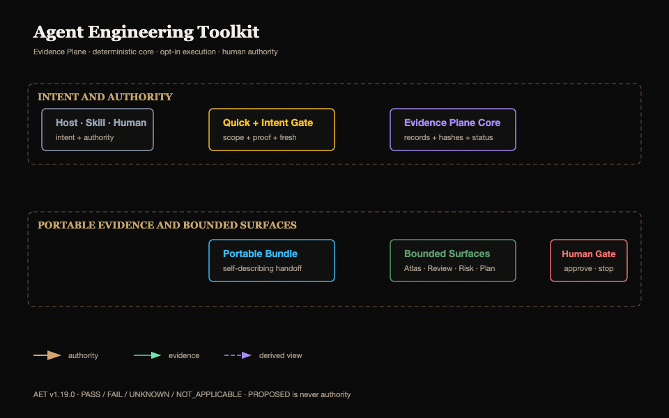
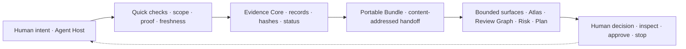
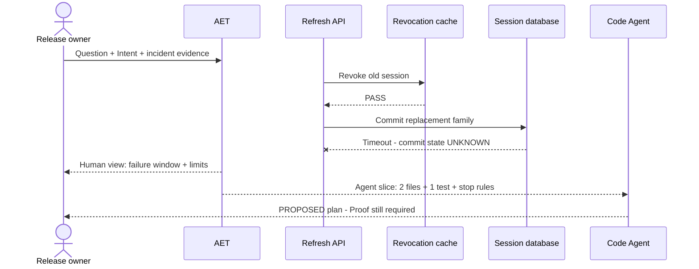

# Agent Engineering Toolkit

[简体中文](docs/README.zh-CN.md) · [Five-minute start](docs/start-here.md) · [Full reference](docs/reference/full-product-overview.md) · [v1.19.1 Release](https://github.com/AdvancingTitans/agent-engineering-toolkit/releases/tag/v1.19.1)

> **A coding Agent can say “done.” AET shows what happened, what was proved, what changed, and what must remain `UNKNOWN`.**

**AET is a local Evidence Plane for coding Agents.** It turns instructions,
Git state, command execution, artifacts, Agent runs, and review constraints into
hash-bound evidence that can be checked, sliced, and handed to another Agent.

It is not another coding Agent. AET does not replace tests or CI, infer missing
facts, or auto-edit, commit, push, merge, release, revoke access, or execute an
intervention.

```bash
uvx --from https://github.com/AdvancingTitans/agent-engineering-toolkit/releases/download/v1.19.1/agent_engineering_toolkit-1.19.1-py3-none-any.whl aet demo stale-proof
```

```text
1. Test command executed                    PASS
2. Proof matches the tested source          EXACT_MATCH
3. Source changed without rerunning tests   RELEVANT_FILES_CHANGED

The test passed, but that proof no longer applies to the current code.
Demo result: PASS
```

## See AET before installing it



[Static SVG](docs/assets/aet-architecture-dark-luxury.svg) ·
[High-resolution PNG](docs/assets/aet-architecture-dark-luxury.png) ·
[30-second English introduction](docs/assets/aet-product-intro-en.mp4) ·
[中文介绍视频](docs/assets/aet-product-intro-zh-CN.mp4)

The animation is a product map, not runtime telemetry. All diagrams and videos
are local repository assets with no tracking or external script.

## What AET now means


```mermaid
flowchart LR
    U["Human intent · Agent Host"]
    Q["Quick checks · scope · proof · freshness"]
    E["Evidence Core · records · hashes · status"]
    B["Portable Bundle · content-addressed handoff"]
    S["Bounded surfaces · Atlas · Review Graph · Risk · Plan"]
    H["Human decision · inspect · approve · stop"]
    U --> Q
    Q --> E
    E --> B
    B --> S
    S --> H
    H -.-> U
```

The authoritative states remain `PASS`, `FAIL`, `UNKNOWN`, and
`NOT_APPLICABLE`; advice stays `PROPOSED`. Freshness is reported separately as
`EXACT_MATCH`, `RELEVANT_FILES_MATCH`,
`HEAD_CHANGED_RELEVANT_FILES_MATCH`, `RELEVANT_FILES_CHANGED`,
`ARTIFACT_CHANGED`, `ENVIRONMENT_CHANGED`, or `UNKNOWN`.

## Four Quick Skills

| Question | Skill | CLI |
| --- | --- | --- |
| Are instructions and Skills usable? | `/aet-check` | `aet quick check .` |
| Is the diff inside approved intent? | `/aet-scope` | `aet quick scope . --base main --intent aet.intent.json` |
| Did this exact argv run on these files? | `/aet-proof` | `aet quick proof --output proof.json --relevant-path src/app.py -- python -m unittest` |
| Does recorded proof still apply? | `/aet-fresh` | `aet quick fresh --proof proof.json` |

Use one surface for one question. `/aet-plan` is a fifth, separate read-only
planning Skill; it never grants edit or verification authority.

## From evidence to action—without collapsing authority

| Surface | What it produces | What it refuses to claim |
| --- | --- | --- |
| Quick + Intent Gate | preflight, scope facts, Proof, Freshness | full correctness from exit code |
| Portable Evidence Bundle | cross-Agent JSON/JSONL + Markdown handoff | new facts during rendering |
| Evidence Atlas | canonical graph and 11 deterministic perspectives | a holistic trust score |
| Improvement + Planner | bounded issues and `PROPOSED` edit plan | implementation or completed verification |
| Review Graph | minimal root slice with code, evidence, scope, tests, and stop rules | fresh context after snapshot drift |
| Behavioural Risk Diagnosis | three observable factors and `PROPOSED` interventions | internal motive, overall risk score, or validated prediction |
| Learn + Repo Archaeologist | gated local evolution and cited repository history | automatic adoption or model training |

## v1.19: graph-first review and behavioural diagnosis

Review Graph applies the useful graph-first idea from
[`code-review-graph`](https://github.com/tirth8205/code-review-graph) to AET's
different problem: not only *which code is connected*, but also *which evidence,
scope, protected paths, verification commands, limitations, and stop conditions
must travel with the review*.

| Frozen AET review case | Bytes read first | Boundary |
| --- | ---: | --- |
| Minimum raw Bundle + Improvement + source material | 8,468 | complete but unbounded input shape |
| Legacy Agent Task + two Mermaid projections | 6,522 | readable, weaker snapshot binding |
| v1.19 Review Graph root slice | 6,505 | 12 nodes, 13 edges, hash-bound, one-hop expansion |

The root slice is **23.2% smaller than the equivalent raw minimum** and 17
bytes smaller than the legacy projection while adding code relations and a
freshness stop. This is one frozen Python case, not a universal token-savings or
model-quality claim. `code-review-graph` remains broader for multi-language,
incremental structural indexing; AET Review Graph is evidence- and
authority-first and currently indexes Python ASTs. See the
[method and limits](docs/review-graph.md) and the
[factual comparison](docs/comparisons/aet-vs-code-review-graph.md).

`aet risk diagnose` adds a local, deterministic Lab surface for observable goal
divergence, demonstrated harm-realization capability, and observed resistance
to a declared monitoring surface. It cites source records, keeps missing
coverage `UNKNOWN`, and never acts on its `PROPOSED` interventions. Forecast is
hard-disabled as research-only in this Release. See
[Behavioural Risk Diagnosis](docs/behavioural-risk-diagnosis.md).

## Evidence-Guided Planner

The v1.17 Planner remains a separate read-only `PROPOSED` surface built on
v1.16 evidence. It performs bounded localization, preserves `NEEDS_EVIDENCE`
and `UNKNOWN`, and does not guarantee every modification point. In one bounded
real case—not a general model-quality claim—production decision precision moved
from 44.44% to 100% (+55.56 points). See the
[Planner contract](docs/evidence-guided-planner.md).

## Case library

### Production-shaped auth release review

The production pain is simple: the incident ticket, logs, diff, and test result
are scattered. A human gets a confident Agent summary but cannot see the
failure window; the Agent rereads broad repository context and may touch
signing or config. AET implements one snapshot-bound review package, then
projects it differently for each consumer:

| Human asks | AET implements | Practical result |
| --- | --- | --- |
| “Why can refresh still return 401, what may change, and can we roll out?” | Bind Intent + incident Evidence + code relations + protected scope + Proof freshness | Human sees why rollout is `UNKNOWN`; Agent gets only 2 files, 1 test, Evidence IDs, and stop rules |


```mermaid
sequenceDiagram
    actor H as Release owner
    participant A as AET
    participant R as Refresh API
    participant C as Revocation cache
    participant D as Session database
    participant G as Code Agent
    H->>A: Question + Intent + incident evidence
    R->>C: Revoke old session
    C-->>R: PASS
    R->>D: Commit replacement family
    D--xR: Timeout - commit state UNKNOWN
    A-->>H: Human view: failure window + limits
    A-->>G: Agent slice: 2 files + 1 test + stop rules
    G-->>H: PROPOSED plan - Proof still required
```

This is what AET solves: the human no longer has to approve opaque prose, and
the Agent no longer needs a second full-context dump. Both outputs stay bound
to the same evidence and Git snapshot; drift stops the review. This is a frozen
representative production case, not a claimed customer incident. See the
[complete human/Agent output](docs/use-cases/production-auth-refresh-review.md).

| Case | Reproduce or inspect | Proven boundary |
| --- | --- | --- |
| Stale test proof | [60-second walkthrough](docs/use-cases/stale-proof.md) | historical PASS can become inapplicable |
| Scope drift | [Intent-bound case](docs/use-cases/scope-drift.md) | related multi-file work is not automatically drift |
| Cross-Agent handoff | [Portable Bundle](docs/use-cases/cross-agent-handoff.md) | consumer needs no AET installation |
| Evidence-grounded improvement | [Executable example](examples/evidence-grounded-improvement/README.md) | advice cannot promote its own evidence |
| Review Graph | [Root slice and fail-closed guide](docs/review-graph.md) | stale/tampered packages stop |
| Behavioural diagnosis | [Fixtures and policy](examples/risk/README.md) | diagnosis is not prediction |
| Planner | [Three bounded scenarios](examples/evidence-guided-planner/README.md) | plan remains `PROPOSED` |
| Auth refresh release | [Human view and Agent slice](docs/use-cases/production-auth-refresh-review.md) | dynamic explanation is not edit or rollout authority |

## Real-world Repository Audit Showcase

Commit-locked, static reports are available for
[SWE-agent](repository-audit-showcase/reports/swe-agent/audit-result/en/audit-report.md),
[OpenHands](repository-audit-showcase/reports/openhands/audit-result/en/audit-report.md),
and [Google ADK](repository-audit-showcase/reports/google-adk/audit-result/en/audit-report.md).
They are cited repository archaeology, not endorsements or live health claims.

## Install and integrate

| Path | Command | Current status |
| --- | --- | --- |
| Exact GitHub Release | `uv tool install https://github.com/AdvancingTitans/agent-engineering-toolkit/releases/download/v1.19.1/agent_engineering_toolkit-1.19.1-py3-none-any.whl` | v1.19.1 |
| Public PyPI | `uv tool install agent-engineering-toolkit` | v1.18.0; does not include v1.19 Review Graph/Risk |
| Agent Skills | `DISABLE_TELEMETRY=1 npx skills add AdvancingTitans/agent-engineering-toolkit` | external skills.sh CLI |

AET itself has no product telemetry, account, API key, model call, or cloud
service. Python 3.11+ and Git are required for Git-bound workflows.

Integrations: [Codex](docs/integrations/codex.md) ·
[Claude Code](docs/integrations/claude-code.md) ·
[Cursor](docs/integrations/cursor.md) ·
[GitHub Actions](docs/integrations/github-actions.md) ·
[MCP](docs/integrations/mcp.md) ·
[Python/TypeScript consumption](docs/protocols/portable-evidence-bundle-v1.md)

## Security, limits, and trust

- Read [status and authority](docs/reference/status-and-authority.md),
  [command boundaries](docs/command-boundaries.md), and [Security](SECURITY.md).
- AET is local and read-only by default; `trace`, Quick Proof, and explicit
  observed gates are the named execution boundaries.
- Secret redaction is defense in depth, not permission to retain raw private
  transcripts. Tampered, missing, stale, or ambiguous evidence fails closed.
- Use [Support](SUPPORT.md), [Contributing](CONTRIBUTING.md),
  [Roadmap](ROADMAP.md), and [Governance](GOVERNANCE.md) for project work.

MIT License.
