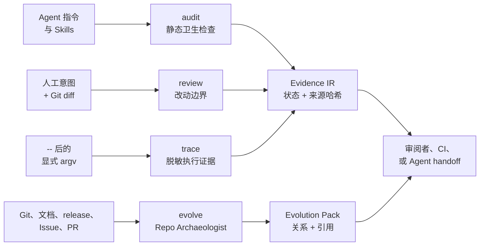

# Agent Engineering Toolkit（AET）

[](https://github.com/AdvancingTitans/agent-engineering-toolkit/actions/workflows/ci.yml)
[](https://github.com/AdvancingTitans/agent-engineering-toolkit/releases)
[](https://www.python.org/)
[](../LICENSE)
[](../README.md)

**[English](../README.md) · [简体中文](README.zh-CN.md)**

> Coding Agent 可以很快地改代码；AET 让它的工程证据也能随交付一起抵达。

**Agent Engineering Toolkit（AET）** 是面向 Coding Agent 的、证据优先的本地 CLI
与可移植 Agent Skill。它审查 Agent 读取的指令、人工批准的改动边界、实际运行过的
命令，以及支撑仓库演进结论的历史证据；它不会把缺失证据粉饰成一个看似安心的分数。

适合在 Agent 开工前、交付或发布时，以及回答“这个仓库为什么会演变成现在这样？”时使用。

[快速开始](#快速开始) · [能力面](#能力面) · [Context 与决策](#context-与决策本地来源记录而非-agent-memory) · [Run Manifest](#run-manifest可选的交付生命周期) · [质量与当前结果](#质量与当前结果) · [Repo Archaeologist](#repo-archaeologist) · [参与贡献](../CONTRIBUTING.md)

## 为什么需要 AET？

Coding Agent 即使给出看起来干净的 diff，也可能遵循了过期指令、超出批准范围，或把
从未运行的命令说成验证。Git 历史能告诉你“改了什么”，却常常无法把 release、文档、
Issue 和 commit 串成可审阅的因果证据。

AET 是 Agent 工作与“已经就绪”这个结论之间的一层小而确定的工程护栏。它不替代测试、
安全扫描、代码审查或 Agent runtime；它为这些流程提供可携带的凭据：检查了什么、
声明了什么、显式执行了什么，以及还有什么尚不可知。

## 能力面

| 用户问题 | AET 能力 | 产物 |
| --- | --- | --- |
| 这个 Agent 能安全地遵循当前指令和 Skill 吗？ | `aet audit` | 带位置和修复建议的 Markdown、JSON 或 SARIF。 |
| 这次 diff 是否在人工批准的意图范围内？ | `aet review` | 路径预算、允许路径和已声明 proof 的 Intent Gate 报告。 |
| 这条命令是在已审查的工作区运行的吗？ | `aet trace` + `aet evidence pack` | 脱敏执行记录，以及 proof / 工作区快照绑定。 |
| 这份交付证据正处于哪个阶段，是否已经过期？ | `aet run` | 可选、append-only 的 Run Manifest 与明确生命周期状态。 |
| 哪些本地指令/参考资料可用，哪些只是被声明为已读？ | `aet context` | 哈希绑定的 Context Manifest；读取声明是显式 attestation。 |
| 哪些项目决策有本地来源，哪条记录已替代它？ | `aet decision` | 带来源哈希、验证和 supersession 历史的 Decision Ledger。 |
| 仓库为什么这样演进？ | `aet evolve` | Evolution Pack、时间线、决策索引和带引用报告。 |
| 应先修什么？ | `aet triage` | 透明修复排序；不会改变 finding 状态。 |

### 它也是一个 Skill

[`skills/agent-engineering-toolkit/`](../skills/agent-engineering-toolkit/)
中的可移植 Skill 会引导 Codex、Claude Code、Cursor、Copilot 兼容宿主和其他
Skill-aware Agent，在 **audit / review / evidence / evolve** 中选择最小且安全的
工作流。CLI 是确定性 runtime；即使宿主没有原生 Skill loader，也可读取
`SKILL.md` 并消费 JSON 证据产物。

## 架构与说明



四个主能力相互独立：离线 `audit` 不会访问 GitHub；`review` 不会执行 proof；只有
`trace` 才会执行 `--` 后的精确 argv；`evolve --remote github` 必须显式指定。
这让报告不会悄悄宣称它没有能力证明的事实。

所有报告使用带版本的 Evidence IR envelope，保留原子状态：`PASS`、`FAIL`、
`UNKNOWN`、`NOT_APPLICABLE`。`UNKNOWN` 代表待验证工作，不是打折后的通过。证据等级
区分人工声明（L0）、本地文件（L1）、已执行命令（L2）、本地 Git（L3）、显式取得的
远端数据（L4）和人工背书（L5）。

### proof 成功与证据新鲜度分开表达

从 v1.1.0 起，`audit`、`review` 与 `trace` 都记录确定性的
`workspace_snapshot`：Git HEAD，以及已跟踪和未跟踪工作区状态的摘要。生成
`aet evidence pack` 时，AET 会将这些快照与打包时的工作区比较。

- `EXACT_MATCH`：审查、执行与打包对应同一工作区。
- `HEAD_MATCH_WORKTREE_DIFFERS`：commit 未变，但至少一份产物生成后工作区改变。
- `HEAD_DIFFERS`：被比较的产物来自不同 commit。
- `INTENT_CHANGED`、`CONFIG_CHANGED`、`UNTRACKED_SET_CHANGED`：分别明确
  指出意图、配置或未跟踪文件集合造成的新鲜度失效。
- `UNKNOWN`：无法捕获 Git 快照，或旧报告中没有快照。

这是独立的 `snapshot_binding`。即使工作区随后过期，已成功的 proof 仍是 `PASS`；
Viewer 会把交付标记为 `STALE`，而不会假装该命令从未执行。

### Run Manifest：可选的交付生命周期

v1.2.0 引入 `aet run`，用于需要明确关联独立证据产物的交付。它是本地、
append-only 的任务账本，不是 Agent runtime 或 workflow engine：不会选择命令、
重试工作、调用模型，也不会接管 Agent 宿主。

```text
INTENT_BOUND → AUDITED → REVIEWED → PROVEN → PACKED → CLOSED
                                      │
                              工作区或控制文件变化
                                      ↓
                                    STALE
```

仅在需要该生命周期时创建 Run，并在写出普通 JSON 产物时附带 `--run`。`aet run
status` 只读；`aet run verify` 会持久记录观察到的过期迁移，并在 `STALE` 时返回
非零退出码；`aet run close` 只接受仍然新鲜的 `PACKED` Run。

### Context 与决策：本地来源记录，而非 Agent Memory

v1.3.0 新增两份可选的本地 JSON 产物，用于记录任务中需要长期复核的工程事实；它们与
`audit`、`review`、`trace`、`run` 相互独立。

```bash
# 记录可发现的指令/Skill，再显式声明已读并加入一个本地参考资料。
aet context discover . --output .aet/context/manifest.json
aet context record --manifest .aet/context/manifest.json \
  --read AGENTS.md --reference docs/architecture.md
aet context verify --manifest .aet/context/manifest.json

# 保存一条有来源支撑的项目决策，并在之后检查来源是否仍一致。
aet decision init --output .aet/decisions.json
aet decision add --ledger .aet/decisions.json --id DEC-0001 \
  --claim "Keep proof execution explicit." --evidence-state EVIDENCED \
  --source docs/productization-plan.md
aet decision list --ledger .aet/decisions.json
aet decision verify --ledger .aet/decisions.json
```

`context discover` 是 L1：它只证明资产被发现，并记录当时的内容哈希。`context record
--read` 是 L5 `agent_attestation`：它只记录 Agent 或宿主声称读过某资产，不能证明模型
看见、理解或使用过它。`context verify` 会检查资产哈希和工作区快照，让已经变化的上下文
显式失效，而不是沿用旧声明。

Decision Ledger 是给维护者使用的、带来源的轻量项目记忆，不是通用 Agent Memory 或 RAG
系统。`EVIDENCED` 与 `INFERRED` 至少需要一份有 SHA-256 的本地文件来源；`ATTESTED` 与
`UNKNOWN` 会保留较弱的认知状态。仅当替代决策已是 `ACCEPTED` 时，才使用
`aet decision supersede --id DEC-0001 --by DEC-0002`。验证只能说明来源字节是否仍匹配，
不宣称某个决策永远正确。

## 质量与当前结果

AET 故意展示 status matrix，而不是“Agent 信任度总分”。唯一有权重的模型是
`aet triage`，它会公开因素和版本，并且只用于修复排序。

| Release 检查 | v1.3.0 实测结果 | 复现方式 |
| --- | --- | --- |
| 回归测试 | 27 项测试通过 | `uv run --no-editable --reinstall-package agent-engineering-toolkit python -m unittest discover -s tests -v` |
| 严格自审 | 在配置的 production Skill 范围内为 0 `FAIL`、0 `UNKNOWN` | `uv run --no-editable aet audit . --strict` |
| Intent Review | 发布 diff 必须在已审阅合同范围内 | `uv run --no-editable aet review . --base v1.1.0 --intent aet.intent.json` |
| 分发冒烟 | 成功构建 wheel，并在隔离环境中调用 | `uv build` 后安装上方 wheel |
| 自动交付 | `main` 上 CI，`v*` tag 触发 GitHub Release | [Actions](https://github.com/AdvancingTitans/agent-engineering-toolkit/actions) |

这些结果只证明已列出的机制和命令；它们不声称所有仓库或所有 Agent 决策都安全。
请参阅[规则目录](rule-catalog.md)与[安全、隐私和保留边界](security-and-retention.md)。

## 快速开始

### 安装已发布 CLI

使用 [uv](https://docs.astral.sh/uv/) 安装 GitHub Release wheel：

```bash
uv tool install https://github.com/AdvancingTitans/agent-engineering-toolkit/releases/download/v1.3.0/agent_engineering_toolkit-1.3.0-py3-none-any.whl
aet --version
```

也可以直接试用当前源码，不污染全局环境：

```bash
git clone https://github.com/AdvancingTitans/agent-engineering-toolkit.git
cd agent-engineering-toolkit
uv run --no-editable aet audit . --strict
```

### 第一次安全审计

```bash
aet init --output aet.toml
aet audit . --strict --format json --output .aet/evidence/audit.json
```

`aet.toml` 会把扫描包含范围和排除范围变为可审阅配置；排除项必须附原因，`init`
只写入候选文件，绝不覆盖已有配置。

### 将 AET 装入 Agent 宿主

将整个 [`skills/agent-engineering-toolkit/`](../skills/agent-engineering-toolkit/)
目录复制到宿主的 Skill 目录。例如 Codex 可使用：

```bash
cp -R skills/agent-engineering-toolkit ~/.codex/skills/
```

没有原生 Skill loader 的宿主，可将 `SKILL.md` 作为 Agent 指令，并确保 `aet` 位于
`PATH` 中。

## 如何使用

### 1. Agent 开工前审计指令

```bash
aet audit . --strict --format sarif --output .aet/evidence/audit.sarif
```

Audit 会发现本地引用或命令目标失效、绝对路径漂移、上下文膨胀、重复指令，以及格式
不完整的 Skill。

### 2. 用人工意图审查 diff

写一个声明批准路径、改动预算和 proof 的小型 `aet.intent.json`；仓库提供了
[最小示例](../examples/aet.intent.example.json)。

```bash
cp examples/aet.intent.example.json aet.intent.json
aet review . --base main --format json --output .aet/evidence/review.json
```

Review 只证明合同与范围满足，故意不执行其中声明的命令。

### 3. 绑定已执行 proof，生成 handoff 包

```bash
aet trace --proof unit-tests --intent aet.intent.json \
  --output .aet/evidence/trace.json -- \
  python -m unittest discover -s tests -v

aet evidence pack \
  --audit .aet/evidence/audit.json \
  --review .aet/evidence/review.json \
  --trace .aet/evidence/trace.json \
  --output .aet/evidence/evidence-pack.json

aet evidence viewer --pack .aet/evidence/evidence-pack.json \
  --output .aet/evidence/evidence-viewer.html
```

Trace 是 opt-in，要求 `--`，只记录显式命令；保存的是脱敏片段和内容哈希。静态 viewer
不需要服务器或外部资产。

### 4. 可选：记录交付生命周期

```bash
aet run init --intent aet.intent.json --output .aet/runs/release.json
aet audit . --format json --output .aet/evidence/audit.json --run .aet/runs/release.json
aet review . --base main --format json --output .aet/evidence/review.json --run .aet/runs/release.json
aet trace --proof unit-tests --intent aet.intent.json --output .aet/evidence/trace.json \
  --run .aet/runs/release.json -- python -m unittest discover -s tests -v
aet evidence pack --audit .aet/evidence/audit.json --review .aet/evidence/review.json \
  --trace .aet/evidence/trace.json --output .aet/evidence/evidence-pack.json \
  --run .aet/runs/release.json
aet run verify --run .aet/runs/release.json
aet run close --run .aet/runs/release.json
```

使用 Run 时请将 `.aet/` 加入 `.gitignore`；否则生成的证据本身会构成未跟踪工作区变化，
并被正确标记为 `STALE`。

## Repo Archaeologist

`aet evolve` 面向 changelog 单独回答不了的问题：**改了什么、何时改、哪个来源把它们
联系起来、还有哪些未知？**

```bash
aet evolve plan . --question "Why was this release made?" --output .aet/evolve/plan.json
aet evolve collect . --question "Why was this release made?" --output .aet/evolve/run
aet evolve build --manifest .aet/evolve/run/source-manifest.json --output .aet/evolve/run
aet evolve report --graph .aet/evolve/run/object-graph.json --output .aet/evolve/run
```

默认流程完全离线，只读取 Git 对象与仓库文档。按需指定 `--remote github` 后，才会把
显式取得的 Issue、PR、release 写进来源 manifest。tag → commit 可以是 `DIRECT`；只
出现文本 `#123` 而没有目标对象时仍是 `CANDIDATE`。AET 不会把这种不确定性改写为关于
作者私人意图的故事。

完整定义见 [`evolve` contract](evolve-contract.md)。

## 优势

- **证据优先，不是结论优先。** 每个 finding 保留位置、修复建议、来源和状态；缺失检查始终可见。
- **默认本地。** 静态 audit、review、triage 和本地考古不需要 API key、LLM 或后台服务。
- **副作用明确。** 只有 Trace 会执行通用命令；GitHub 收集必须 opt-in。
- **跨 Agent 可用。** Skill 指导 Agent，JSON、SARIF、Markdown 则服务于人、CI 与其他工具。
- **尊重认知边界。** Repo Archaeologist 连接证据并暴露未回答问题，而不是猜测变更动机。

## 最适合谁？

AET 特别适合：

- 使用 Codex、Claude Code、Cursor、Copilot 或类似 Agent 修改仓库的工程师；
- 需要轻量、可审阅 release 或 handoff 记录的维护者；
- 维护长期 `AGENTS.md`、`CLAUDE.md` 或可复用 Skill 库的团队；
- 想在陌生仓库上快速获得带引用历史解释的开发者。

它不是 Agent runtime、自动 prompt 重写器、托管安全平台，也不能替代语义测试和人工审查。

## 仓库结构与核心组成

```text
src/aet/                         确定性 CLI 与 Evidence 模型
skills/agent-engineering-toolkit/ 可移植跨 Agent Skill 和 contracts
schemas/                         版本化 Evidence IR schema
tests/                           回归测试及正/负 fixture
docs/                            合同、产品设计、安全说明、中文 README
examples/                        可复制的 intent 与 workflow 示例
.github/workflows/               CI 与 tag 驱动 GitHub Release 自动化
```

实现保持刻意精简：`discovery.py` 发现上下文资产，`rules.py` 产生带证据的 audit
finding，`review.py` 将 intent 与 Git diff 对照，`evidence.py` 记录 Trace 并打包，
`run.py` 记录生命周期，`context.py` 记录本地上下文来源，`decision.py` 记录带来源的项目
决策，`evolve.py` 构建仓库演进图，`reporters.py` 输出可携带报告。

## 文档与贡献

| 主题 | 入口 |
| --- | --- |
| 英文文档 | [README.md](../README.md) |
| 规则和 gate 影响 | [rule-catalog.md](rule-catalog.md) |
| Repo Archaeologist contract | [evolve-contract.md](evolve-contract.md) |
| 安全、隐私和保留 | [security-and-retention.md](security-and-retention.md) |
| 产品决策与设计依据 | [productization-plan.md](productization-plan.md) |
| 版本历史 | [CHANGELOG.md](../CHANGELOG.md) |
| 贡献指南 | [CONTRIBUTING.md](../CONTRIBUTING.md) |

最有价值的贡献是可复现的失败、缺失的边界，或 AET 尚不能表达的真实工作流。请阅读
[CONTRIBUTING.md](../CONTRIBUTING.md)，使用 Issue 表单，并让 PR 小到可以按 intent
contract 审阅。我们欢迎首次贡献者和真实使用案例。

## License

MIT，详见 [LICENSE](../LICENSE)。
