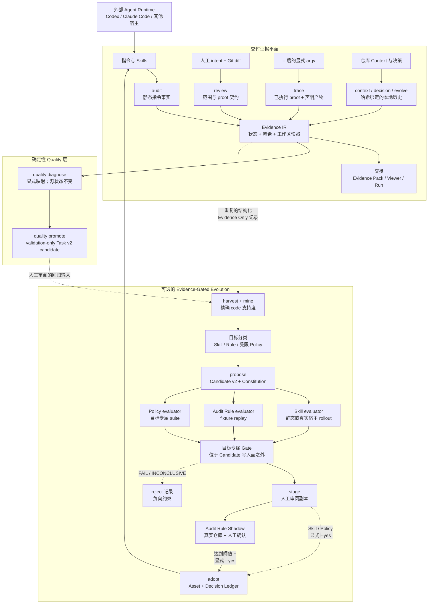

# Agent Engineering Toolkit（AET）

[](https://github.com/AdvancingTitans/agent-engineering-toolkit/actions/workflows/ci.yml)
[](https://github.com/AdvancingTitans/agent-engineering-toolkit/releases)
[](https://www.python.org/)
[](../LICENSE)
[](../README.md)

**[English](../README.md) · [简体中文](README.zh-CN.md)**

> AET 是位于外部 Agent 执行、交付声明、确定性质量检查与治理资产受控改进之间的
> evidence-driven Agent 工程质量与控制层。

**Agent Engineering Toolkit（AET）** 先让 Coding Agent 的工作可检查，再让质量改进在
改变治理资产之前可复核。它记录 Agent 可见的指令、人工批准的改动边界、显式执行的命令、产物
与验证缺口。这些记录既可以随一次交付交接，也可以在失败反复出现时成为受限 Skill、
Audit Rule 或 Policy 改进实验的输入。

它用同一套证据模型回答两个问题：

| 问题 | AET 的回答 |
| --- | --- |
| “这次 Agent 交付可以如实说已就绪吗？” | 审计指令、审查人工批准的 diff、Trace 显式 proof，并交接证据。 |
| “这是什么失败，能否成为回归候选？” | 用显式映射把结构化现象确定性路由到 owner/repair surface，只把已确认样本暂存为 validation candidate。 |
| “反复失败能否在声明边界内改进治理资产？” | 从可复现证据中挖掘模式，用 Candidate 写入面之外的 evaluator 回放，经过 Gate 后仍由人采纳。 |

关键在于：AET 不接受 Agent 的自我陈述替代事实。自然语言答复不能替代已记录的命令、产物、
快照或明确的 `UNKNOWN`。

## 为什么要做 AET

Coding Agent 让“改动仓库”变得很便宜，却没有自动回答交付时最关键的问题：*哪些指令在
范围内？命令是否真的跑过？产物是否仍对应当前工作区？哪些已验证，哪些仍未知？*

它也不会让治理能力自动变好。生产证据中可能反复出现 Audit 漏报、错误工作流或过弱策略；
如果直接让模型改 Skill 或 Rule，却没有位于 Candidate 写入面之外的 evaluator，只是把“能否相信 Agent”的问题
转移成“能否相信优化器”。AET 同时闭合两个环：为 Agent 工作提供证据，也为治理资产的
受限改动提供证据。

聊天记录、CI 日志、Prompt 修改和人工清单各自能解决一部分。AET 把它们沉淀为本地、结构化、
哈希绑定的工程事实，并保持语义克制：它今天服务于可信交付，而不是把每次 Agent 对话都当作
训练数据。

## 为什么是 AET

- **证据优先，而非置信度优先。** `UNKNOWN` 永远是验证缺口，不会被折算成通过。
- **最小安全能力面。** `audit`、`review` 只检查；只有 `trace` 执行 `--` 后显式 argv。
- **默认本地。** 证据、Experience Store 与跨项目汇集不要求托管遥测或完整 transcript。
- **proof 与 freshness 分离。** 命令曾成功和工作区后来变更是两个独立事实。
- **Quality 确定且保留状态。** Diagnosis 使用显式本地映射，不让模型猜根因，也不会把
  `FAIL`/`UNKNOWN` 改写成通过。
- **改进受约束。** Candidate 绑定 baseline、Patch IR、Constitution、目标专属 Gate、stage 与人工 adopt。
- **不同目标使用不同 evaluator。** Skill 使用静态或真实宿主行为回放；Audit Rule 使用确定性
  fixture 与真实仓库 Shadow；Policy 使用目标专属 suite，不用一个通用 LLM Judge 决定采用。
- **Candidate 权限受限。** Constitution、evaluator code、held-out、证据状态语义与人工采用
  要求都在 Candidate 写入面之外；这会降低 Candidate 影响，但不承诺 evaluator 无偏或不可能被利用。
- **Audit 演进有真实业务刹车。** Fixture Gate 通过后仍需 Candidate 绑定的 Shadow、人工确认
  新增 finding、零已确认误报，才允许采用。

AET **不是** Agent Runtime、通用 benchmark、LLM Judge 中心、自动 RCA/Evidence Graph 或语义
聚类系统、Skill quality YAML 标准、线上工单/指标平台，也不是自动修复/发布 Agent。

## 核心概念

| 概念 | 在 AET 中的含义 |
| --- | --- |
| **Evidence Plane** | `audit`、`review`、`trace`、`context`、`decision`、`evolve`、`run` 记录指令、Intent、执行、产物、freshness 与历史的窄事实。 |
| **Evidence Only** | 学习默认只使用结构化 deviation 与 hash，不默认保存完整 transcript、shell output、Secret 或无限遥测。 |
| **Deterministic Quality** | `quality diagnose` 应用显式 owner/repair mapping 且不改源状态；`quality promote` 只暂存已确认的 validation Task v2 candidate。 |
| **Evidence-Gated Asset Evolution** | 重复失败可以生成一个注册目标的受限 Candidate，再由 Candidate 无权修改的 evaluator 回放。 |
| **Evolution Constitution** | 跨目标不可变规则：`UNKNOWN` 不是 PASS、held-out 必须隔离、Candidate 不得修改 evaluator/证据语义、Adopt 必须人工授权。 |
| **Stage / Adopt** | Gate 通过只生成审阅副本；只有之后显式 `adopt --yes` 才能替换 hash 仍匹配的目标并写 Decision Ledger。 |
| **Shadow Audit** | Candidate RulePack 与正式 Audit 并行运行，只产生私有比较证据，不改变正式 finding 或退出码。 |

## 快速开始

```bash
uv tool install https://github.com/AdvancingTitans/agent-engineering-toolkit/releases/download/v1.9.0/agent_engineering_toolkit-1.9.0-py3-none-any.whl
aet --version

aet init --output aet.toml
aet audit . --strict --format json --output .aet/evidence/audit.json
```

即使发现真实问题，`aet audit` 也会先写出 JSON 再以非零退出码结束。非零表示“证据发现
问题”，不是“没有生成审计 JSON”；应先阅读该产物。

## 选择最小能力面

| 你要确认什么？ | 命令 | 产物 |
| --- | --- | --- |
| 指令、本地引用和 Skill 是否可用？ | `aet audit` | Markdown / JSON / SARIF finding、RulePack identity、证据与 remediation；可选 Profile 和 Candidate Shadow。 |
| diff 是否在人工批准边界内？ | `aet review` | Intent、路径预算、proof 声明与可选更严格 Review Policy。 |
| 显式命令是否运行并生成已声明报告？ | `aet trace -- <argv>` | 脱敏执行记录、本轮新鲜 Artifact 与可选安全 Validator 结果。 |
| 如何随 handoff 或 release 交付证据？ | `aet evidence pack` | Portable Evidence Pack 与静态 Viewer。 |
| 审查/测试后工作区是否过期？ | `aet run` | 可选的 append-only 交付生命周期。 |
| 哪些 Context 与决策有本地来源？ | `aet context`、`aet decision` | 哈希绑定的 Context Manifest 与 Decision Ledger。 |
| 仓库为什么这样演进？ | `aet evolve` | 可引用的本地/显式远端演进报告。 |
| 现有 finding 应先修哪个？ | `aet triage` | 默认或 Policy 驱动的可解释排序；绝不改变 finding 原状态。 |
| 哪个显式 owner/repair route 对应此失败？ | `aet quality diagnose` | 保留源状态的确定性诊断与人工复核路由。 |
| 一个已确认失败能否成为回归候选？ | `aet quality promote` | validation-only Task v2 暂存包，不写正式 suite 或生产资产。 |
| 重复证据问题能否安全改进受限资产？ | `aet learn` | Evidence Only 经验、目标专属候选与 Gate、可选 Shadow、staged 副本。 |

## AET 在工具链中的位置

这些工具可以组合使用；下表说明的是各自负责的问题，不是“谁替代谁”的排序。

| 工具类别 | 更适合解决什么 | AET 增加什么，或刻意不做什么 |
| --- | --- | --- |
| Coding Agent Runtime（Codex、Claude Code、Copilot） | 在仓库中规划与执行实际工作。 | AET 不替代 Runtime；它记录 Runtime 的交付结论所需的本地证据。 |
| CI、测试、Lint 与安全扫描 | 用各自的规则检查代码或部署。 | AET 可 Trace 显式检查，并将其产物绑定到 intent、工作区 freshness 与 handoff；不替代检查器。 |
| Skill 工程/治理系统（[Yao Meta Skill](https://github.com/yaojingang/yao-meta-skill)） | 创建、打包、编译、评估并治理可复用的跨平台 Skill 资产。 | AET 聚焦交付证据，以及在用 Skill/Audit 资产的目标专属门禁改进。用 Yao 工程化 Skill 产品；用 AET 证明发生了什么、约束什么可以演进。 |
| Skill 优化器（[SkillOpt](https://github.com/microsoft/SkillOpt)） | 根据有分数的 rollout 与 held-out validation 训练 Skill 文档。 | AET 提供本地工程证据语义：intent 边界、显式命令 proof、artifact、freshness 与人工 adopt；它不是通用 benchmark 优化器。 |
| Transcript 分析 / Agent 可观测平台 | 搜索大规模历史会话、看仪表盘或管理 fleet telemetry。 | AET 默认只保存结构化 Evidence Only 记录，不会摄取无限增长的 transcript 档案。 |
| Policy Engine（如 OPA） | 在多系统中执行广泛、预先定义的 Policy 语言。 | AET 不替代通用 Policy Engine；只允许六类 AET 资产通过单调、白名单操作与证据 Gate 演进。 |
| Evaluation Framework / LLM Judge | 在广泛任务集上衡量模型或 Agent 能力。 | AET 用命令、Artifact、Diff、Fixture 与显式状态验证工程声明；模型可以提案，但不能决定 Gate。 |
| RCA、可观测、聚类、工单与业务指标平台 | Fleet 级诊断、语义分组、运营流转与线上结果跟踪。 | AET 可保存结构化证据与显式路由字段，但不推断因果责任、不运行 Evidence Graph/语义聚类、不创建工单，也不托管业务看板。 |

### 适合使用 AET 的场景

- Agent 改完代码后，需要可信 handoff：不仅是“测试通过”，还要有命令、退出码、声明产物、
  批准范围与 freshness。
- 需要保留 **PASS**、**FAIL**、**UNKNOWN** 的差异，而不是把不确定性压缩成一个分数。
- Agent 行为问题需要改进 Skill，并希望通过可选 Codex/Claude Code 真实 rollout 验证，而不是把
  文本命中误称为行为改善。
- Audit 漏报、误报、状态/严重性/位置错误、Remediation 不完整、重复 finding、非确定性、
  性能退化或 Policy Exception 需要最小可复现 Fixture，并形成可审计 Rule Candidate。
- 不同仓库需要更严格的 Audit Profile 或 Review Policy，但 Candidate 不能禁用规则、降低
  Severity、扩大范围或删除 proof 要求。
- JUnit、SARIF、Coverage 或 JSON 产物需要确定性断言，并绑定到本轮 Trace 新建或修改的
  显式 Artifact。
- Finding 优先级应随关键路径变化，但不得隐藏 finding 或重写原始状态。
- 已经在用 Agent Runtime 和 CI，需要一个本地、可移植的证据层与它们协作。

### AET 不替代什么

- 测试、CI、代码审查或部署安全；
- Agent Runtime 或任务规划器；
- 仅因为文件被发现或被声明“已读”，就断言模型理解/使用了该文件；
- 自动自我修改服务。`propose`、`gate`、`stage`、`adopt` 被有意拆开。
- 通用 Agent benchmark、LLM Judge 打分中心、自动 RCA/语义聚类服务、Skill quality YAML
  约定、工单系统或线上业务指标平台；
- 生成或执行任意 Python Audit Plugin；Audit Rule Candidate 只能选择白名单中的非可执行 Detector。
- 因为仓库测试覆盖 Shadow 阈值逻辑，就声称某个 Rule 已积累真实多仓库 Shadow 证据。

## 架构


可编辑 Mermaid 源：[简体中文](assets/aet-architecture-zh-cn.mmd) ·
[English](assets/aet-architecture-en.mmd)。

<details>
<summary>文本版 Mermaid 备用图</summary>



</details>

Quality 与学习支路都是可选的：AET 不会把每份证据都当成训练数据；静态文本检查不会被描述为
已观测 Agent 行为；Diagnosis 不是语义 RCA；Gate 通过也不会修改生产资产。Audit Rule 还必须
满足真实仓库 Shadow 门禁。

## 如何使用 AET

先按工作选择入口，而不是直接启动最重的工作流：

| 如果你需要… | 先使用 | 仅在需要时再增加 |
| --- | --- | --- |
| 检查 Agent 本地指引是否可用 | `aet audit` | 需要发现/已读资产的哈希记录时使用 `context`。 |
| 交付 Agent 生成的改动 | `audit` + `review` + `trace` | 需要可移植交接时使用 `evidence pack`；多生命周期步骤时使用 `run`。 |
| 解释仓库为何形成当前结构 | `aet evolve plan` | 审查收集计划后再执行 `collect/build/report`。 |
| 改进反复出现的 Agent 行为 | `learn harvest` + `mine --target-type skill` | `propose/replay/gate/stage`；只有显式配置时才使用真实宿主 Runner。 |
| 改进 Audit 漏报或误报 | `aet audit feedback record` | 按 `audit-rule` 挖掘，运行四分区 Fixture，再积累 Candidate 绑定的 Shadow。 |
| 收紧 Audit、Review、Trace、Triage Policy | `learn target list` | 提供受限 JSON Patch，运行目标专属 Suite，Stage 后再显式 Adopt。 |

### 配方：有证据的交付

```bash
# audit 与 review 不执行测试。
aet audit . --strict --format json --output .aet/evidence/audit.json
aet review . --base main --intent aet.intent.json --format json --output .aet/evidence/review.json

# 只有 Trace 可执行 -- 后的精确 argv。
aet trace --proof unit-tests --intent aet.intent.json \
  --artifact reports/junit.xml --output .aet/evidence/trace.json -- \
  python -m unittest discover -s tests -v

aet evidence pack --audit .aet/evidence/audit.json \
  --review .aet/evidence/review.json --trace .aet/evidence/trace.json \
  --output .aet/evidence/evidence-pack.json
aet evidence viewer --pack .aet/evidence/evidence-pack.json \
  --output .aet/evidence/evidence-viewer.html
```

proof 成功与 freshness 分开表达：命令可能确实成功，但之后工作区变化会让交付变为
STALE。`UNKNOWN` 是待验证缺口，绝不是打折后的通过。

## Deterministic Quality：诊断与回归候选

Quality 从结构化证据开始，而不是让模型自由回答“根因是什么”。用户提供精确的
`quality-mapping/v1`，每个已知 phenomenon code 显式绑定 owner、action、受限 repair
surface、confidence 与 review facts：

```bash
aet quality diagnose --report .aet/evidence/report.json \
  --policy quality-mapping.json --output .aet/quality/diagnosis.json

aet quality promote --badcase confirmed-badcase.json \
  --diagnosis .aet/quality/diagnosis.json --policy quality-mapping.json \
  --output .aet/quality/staged-regressions
```

Diagnosis 保留输入 `FAIL`/`UNKNOWN`；未映射现象仍未解决或进入人工复核。Promotion 要求已确认
badcase、当前匹配的 diagnosis/policy、validation target 与真实 fixture tree，只暂存 canonical
Task v2 bundle 和 quality sidecar。它不会写 core/held-out/adversarial 正式 suite，不推断因果
责任、不做语义聚类、不修改 Skill/Prompt、不实现修复，也不创建工单。

Task v2 可声明工具调用顺序、参数约束、proof ID、artifact、必需/禁用 claim、网络状态、命令/
改动预算和允许路径。重复真实运行报告 any-success、all-success、成功率与 95% Wilson 区间，
baseline/candidate 配对比较使用精确 McNemar 统计。基础设施失败与 Agent 失败分开；六次运行只
描述这六次样本及其 suite，不代表普遍能力。

## Evidence-Gated Asset Evolution

v1.9 把该 Quality 层连接到多目标 Evidence-Gated Asset Evolution，但 Candidate 仍不能修改 evaluator：

```text
Evidence Only JSON → inspect → mine → 目标分类 → Candidate v2
→ 目标专属回放 → 受限 Gate → stage → 人工 adopt/reject
```

| Target | 候选边界 | Evaluator 与采用边界 |
| --- | --- | --- |
| `skill` | 只改命名 editable block | 静态合同或显式启用的 Scripted/Codex/Claude Code 配对 rollout；只有它评估 Agent 行为。 |
| `audit-rule` | 固定 detector allowlist 上的非可执行 RulePack | 70 个分区任务、22 个复用 fixture；还需 20 runs / 5 repos / 3 dates 的候选绑定 Shadow。 |
| `audit-profile` | 严重性、敏感路径和已预先批准的 exclusion | 不能禁用规则、降低 severity 或通过演进新增 exclusion。 |
| `review-policy` | 只能增加敏感路径和 proof 要求、收紧预算 | 不替代 Intent Contract。 |
| `trace-validator` | JUnit/SARIF/coverage/JSON 安全断言 | 只能验证 Trace 本轮新建或变更、且显式声明的 artifact。 |
| `triage-policy` | 权重和 critical path | 只能改排序，不能隐藏 finding 或改状态。 |

`aet learn target list` 是支持目标的事实来源。当前自动 Audit Rule proposal 只覆盖可复现的
`package.json` script target 漏报；四类 Policy 需要用户提供受限 JSON Patch，不能宣称六类
目标都能由模型自动生成。

```bash
aet learn target list
aet audit feedback record --report .aet/evidence/audit.json \
  --finding AET-PKG-001 --outcome false-negative \
  --reason-code MISSING_PACKAGE_SCRIPT --fixture <minimal-fixture> \
  --output .aet/feedback/AFB-001.json

aet learn gate --target-type audit-rule --candidate <candidate-dir> \
  --core tests/evolution/audit/core/suite.json \
  --validation tests/evolution/audit/validation/suite.json \
  --held-out tests/evolution/audit/held_out/suite.json \
  --adversarial tests/evolution/audit/adversarial/suite.json \
  --output .aet/learn/gates/CAND-001.json

aet audit . --shadow-rulepack <candidate.rulepack.json> \
  --shadow-output .aet/shadow/run.json
aet learn shadow --reports .aet/shadow \
  --confirmations .aet/shadow/confirmations.json \
  --output .aet/shadow/aggregate.json
```

Shadow 不影响正式 finding 或退出码。Audit Rule 即使 fixture Gate 通过，也必须等同一
Candidate 的 Shadow aggregate 满足样本量、全部新增 finding 被确认且零已确认误报，之后才可
由人运行 `adopt --yes --shadow-aggregate ...`。仓库测试使用合成 aggregate 验证门禁本身，
不宣称已积累真实的跨仓库、多日期 Shadow 业务样本。

四类受限 Policy 通过普通命令进入运行时，不会建立另一套隐藏执行面：

```bash
aet audit . --profile audit-profile.json
aet review . --policy review-policy.json
aet trace --artifact report.xml --validator-policy validator.json \
  --validate-artifact report.xml -- <argv>
aet triage --report audit.json --policy triage-policy.json
```

真实宿主 fixture 是 proof-handoff 的 smoke test，不代表已经覆盖任意任务分布。要得到可用于
adopt 的已观测 Gate，需提供彼此隔离的 core、validation 与 held-out 任务，配置足够的配对
rollout，并将 `INCONCLUSIVE` 视为未通过。

```bash
# Phase 1：只处理结构化 AET JSON。
aet learn harvest --evidence .aet/evidence --output .aet/learn/experiences.json
aet learn inspect --experiences .aet/learn/experiences.json --output .aet/learn/inspection.json
aet learn mine --experiences .aet/learn/experiences.json --output .aet/learn/patterns.json

# Phase 2–3：候选只能改带标记的 editable block。
aet learn propose --engine rules --patterns .aet/learn/patterns.json \
  --target skills/agent-engineering-toolkit/SKILL.md --output .aet/learn/candidates/CAND-001
aet learn replay --candidate .aet/learn/candidates/CAND-001 \
  --suite eval/core --suite eval/validation --suite eval/held-out \
  --output .aet/learn/replays/CAND-001.json
aet learn gate --candidate .aet/learn/candidates/CAND-001 --core eval/core \
  --validation eval/validation --held-out eval/held-out \
  --output .aet/learn/gates/CAND-001.json
aet learn viewer --gate .aet/learn/gates/CAND-001.json --output .aet/learn/CAND-001.html
aet learn stage --candidate .aet/learn/candidates/CAND-001 \
  --gate .aet/learn/gates/CAND-001.json --output .aet/learn/staged
```

Gate 会拒绝 immutable 字节变化、editable block 外修改、哈希异常、validation 与
held-out 重叠、候选自审计失败、回归、token/命令面预算超限和 workflow overuse 上升。
输出是指标向量，不是单一“信任分”。

`aet learn adopt --yes` 故意与 stage 分离：它会复核目标哈希，并写入本地 Decision
Ledger。`reject` 会留下拒绝理由；两者都不 commit 或 push。

### 真实 Agent 回放（显式启用）

静态 runner 只验证 Skill 文本合同，绝不冒充真实 Agent 行为。显式指定
`--runner scripted|codex|claude-code` 后，AET 会为 baseline/candidate 的每次
rollout 创建独立 fixture 副本，记录命令、Trace、工作区快照和最终答复；Gate 由这些
结构化事实而非 LLM Judge 判分。

```bash
aet learn runner list
aet learn replay --candidate .aet/learn/candidates/CAND-001 \
  --suite eval/real-agent/core --runner codex --rollouts 3 \
  --runner-config runner.json --output .aet/learn/replays/CAND-001
```

`runner.json` 由用户在本地创建，例如包含
`{"aet_argv":["/absolute/path/to/python","-m","aet.cli"],"inherit_home":true}`。每个
Task v2 还必须显式允许宿主需要的环境变量名，例如 `PATH`、`HOME`、`OPENAI_API_KEY`。
对 Codex、Claude Code 等 process adapter，环境继承取 Task policy 与 runner 配置的
交集：`OPENAI_API_KEY` 等凭据必须由 Task 白名单授权；`HOME` 则必须同时由 Task 白名单
授权且 `inherit_home: true`。配置为 true 不能扩大 Task 权限，配置为 false 时即使 Task
列出 `HOME` 也不会传入。scripted adapter 不使用 `inherit_home` 或 runner config 中的环境
权限，只传入 Task `environment_allowlist` 明确列出的变量。原始值只保留在私有 rollout 中，
不会进入 Evidence Only 经验库。
小样本是 `INCONCLUSIVE`，认证/模型/
启动失败是 `INFRASTRUCTURE_ERROR`；两者都不能 stage。Codex/Claude 的工作区隔离保护生产
仓库，但当前不宣称其提供 OS 级禁网或命令白名单，因此报告为 `PARTIAL`。scripted adapter
同样是 `PARTIAL`；任何要求 `enforced-deny` 的 Task 在 partial adapter 上都会于执行前拒绝。
Fixture 使用 no-follow 文件描述符复制，根或嵌套链接及特殊文件会在宿主执行前 fail closed。
Trace 评分只识别 runner 注入的 `./.aet-rollout/bin/aet trace` 结构化 argv。评分器会排除
Trace JSON 自身后独立重算 Git workspace snapshot，拒绝 `UNKNOWN` 或不匹配的 snapshot。
每个声明 artifact 与 stdout/stderr log 都必须指向 workspace 内真实、非链接文件，source
hash、size、固定派生日志路径与 `CREATED`/`CHANGED` freshness 必须一致。Artifact inline
content 会按声明 redaction pattern 独立重算；outer child argv、Trace argv 与 intent proof
command 必须完全相同，proof `evidence` 必须为数组。

进程型 adapter 会执行一次配置的 `<runner> --version`，规范化并缓存真实输出，再把
`runner_name` 与 `runner_version` 绑定到 raw rollout manifest、observed replay 和
observed Gate。空白或 `unknown` 输出会直接导致 runner validation 失败；Release 校验也会
拒绝任何不匹配的 runner provenance。

发布使用手动 `.github/workflows/real-host-gate.yml` producer。该 workflow 固定安装
`@openai/codex@0.144.1` 并核验输出恰为 `codex-cli 0.144.1`，随后对隔离的 core、validation、
held-out 任务分别运行六次 Codex rollout；只有满足 observed PASS 契约后，才生成绑定 commit、
version、Candidate、raw gate 以及每个 task/fixture 文件的 artifact。Release workflow 会校验
artifact 所属 workflow run 与 commit，并在 tag 上重构所有绑定。仓库实现并测试了该机制，
本文不声称 v1.9.0 的外部真实宿主 gate 已经运行或通过。

### 跨项目本地经验与定时执行

```bash
# 只显式汇集本地、去标识的 Evidence Only 包。
aet learn collect --experiences .aet/learn/experiences.json --store ~/.aet/experience
aet learn harvest --experience-store ~/.aet/experience --output .aet/learn/merged.json

# scheduler 可以调用，但必须保留明确预算和 stage-only 终点。
aet learn sleep --evidence .aet/evidence --target skills/agent-engineering-toolkit/SKILL.md \
  --core eval/core --validation eval/validation --held-out eval/held-out \
  --max-candidates 1 --max-replays 2 --max-model-calls 1 --timeout-seconds 120 \
  --output .aet/learn/nightly
```

默认不会读取 transcript、shell output、环境变量、secret，也不会上传、自动 commit、
push 或 adopt。精确边界见 [evolution boundary](evolution-boundary.md)。

## Context、决策与历史

```bash
aet context discover . --output .aet/context/manifest.json
aet context record --manifest .aet/context/manifest.json --read AGENTS.md
aet context verify --manifest .aet/context/manifest.json

aet decision init --output .aet/decisions.json
aet decision add --ledger .aet/decisions.json --id DEC-0001 \
  --claim "Keep proof execution explicit." --evidence-state EVIDENCED \
  --source docs/evolution-boundary.md
aet decision verify --ledger .aet/decisions.json

aet evolve plan . --question "Why was this release made?" --output .aet/evolve/plan.json
aet evolve collect . --question "Why was this release made?" --output .aet/evolve/run
aet evolve build --manifest .aet/evolve/run/source-manifest.json --output .aet/evolve/run
aet evolve report --graph .aet/evolve/run/object-graph.json --output .aet/evolve/run
```

`context record --read` 只是 Agent/宿主“已读”的 attestation，不能证明模型理解或使用了
内容；`decision verify` 只验证记录的来源字节是否仍匹配，不宣称决策永远正确。
`evolve` 默认离线，只有显式 `--remote github` 才处理远端导出。

## 安装可移植 Skill 与 Hermes 迁移

请复制完整目录，而不是只复制 `SKILL.md`：

```bash
# 请从本仓库的 source checkout 执行（wheel 只包含 CLI，不携带 Skill 资源）：
git clone https://github.com/AdvancingTitans/agent-engineering-toolkit.git
cd agent-engineering-toolkit
cp -R skills/agent-engineering-toolkit ~/.codex/skills/
aet audit ~/.codex --format json --output ~/.aet/evidence/codex-audit.json
```

若 Hermes 的旧 Skill 路径已经被吸收到新的 `software-delivery-workflow`，AET 仍会把
旧引用保留为 `FAIL`，但在发现真实的 `.absorbed_into` 迁移元数据时，会给出本机替代
路径。这样既不掩盖失效指令，也不会只留下难以行动的路径错误。

## 验证与边界

在源码 checkout 中运行：

```bash
uv run --with pytest python -m pytest -q
uv run --with pytest python -m pytest tests/test_business_quality_flows.py -q
uv run --no-editable --reinstall-package agent-engineering-toolkit \
  aet audit . --strict --format json --output .aet/evidence/self-audit.json
uv build
```

AET 能验证记录的字节、显式命令退出码和声明产物处理；它不能证明模型理解指令、决策
永远正确、未 Trace 的命令运行过，也不能从缺失远端数据推断结论。使用前请阅读
[规则目录](rule-catalog.md)与[安全、隐私和保留边界](security-and-retention.md)。

## 贡献

见 [CONTRIBUTING.md](../CONTRIBUTING.md)。涉及证据语义的变更必须有测试、清晰的契约
更新与人工审阅的 intent 边界。
