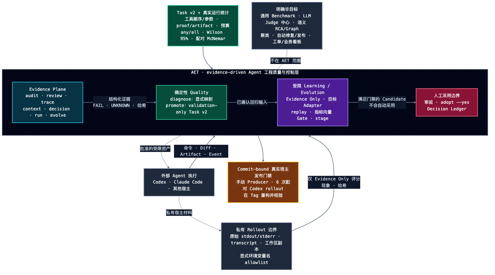

# Agent Engineering Toolkit（AET）

[](https://github.com/AdvancingTitans/agent-engineering-toolkit/actions/workflows/ci.yml)
[](https://github.com/AdvancingTitans/agent-engineering-toolkit/releases)
[](https://www.python.org/)
[](../LICENSE)
[](../README.md)

**[English](../README.md) · [简体中文](README.zh-CN.md)**

> **不要再相信 Coding Agent 口头说“测试通过”，让它提交可复核证据。**

Agent 可以运行命令并展示一份绿色日志。但只要 Workspace 随后发生变化，这份日志就
不再能证明当前代码。AET 记录精确命令、退出状态、声明的 Artifact、人的 Intent 和
Git Workspace Snapshot，并在 Handoff 或 Release 前重新检查 Evidence 是否仍然 Fresh。

```text
Agent Claim → 精确执行证据 → 实时 Freshness 检查 → Human Decision
```

AET 是一个本地、MIT License 的 CLI 和 Portable Skill，可用于 Codex、Claude Code、
Cursor 及其他 Coding Agent。它不替代 Agent、测试或 CI，也不会把缺失证据解释成通过。

## 运行 Stale Proof Demo

安装当前 Release，然后运行仓库中的 Demo：

```bash
uv tool install https://github.com/AdvancingTitans/agent-engineering-toolkit/releases/download/v1.11.1/agent_engineering_toolkit-1.11.1-py3-none-any.whl
git clone https://github.com/AdvancingTitans/agent-engineering-toolkit.git
cd agent-engineering-toolkit
./examples/stale-proof-demo.sh
```

大约 60 秒内，它会记录一次真实通过的测试，在不重新执行测试的情况下修改 Workspace，
然后再次检查同一份 Evidence：

```text
freshness: EXACT_MATCH
# Workspace 发生变化
freshness: HEAD_MATCH_WORKTREE_DIFFERS
```

历史命令确实通过了；AET 报告的是 Evidence 已经 Stale，而不是改写历史或继续相信旧日志。
完整过程参见 [Stale Proof Case Study](case-studies/stale-proof.md)。

## 从一个 Claim 开始

每个任务只启用能回答当前问题的最小能力面：

| 需要验证的 Claim | Command | 结果 |
| --- | --- | --- |
| “这些 Agent 指令与 Skills 可用。” | `aet audit . --strict` | 带 Source Evidence 的 Findings |
| “这个 Diff 没超出批准范围。” | `aet review . --base main --intent aet.intent.json` | Path 与 Proof Contract Review |
| “这条命令在这些代码字节上运行过。” | `aet trace … -- <argv>` | Hash-bound Trace Evidence |
| “附带的 Proof 仍匹配当前 Workspace。” | `aet evidence receipt --report <trace.json>` | 实时 Freshness State |

AET 默认应保持 **Off**。只在高价值 PR、多 Agent Handoff、Release 或安全敏感变更中，
当某个 Claim 需要 Portable Proof 时启用。普通修改继续使用项目原有测试与 CI。

## 参与建设 AET

最合适的第一份贡献不要求先理解整个 Control Plane：

- 用一个小型公开 Fixture 复现 False Positive 或 False Negative；
- 在公开仓库 Dogfood AET，并贡献脱敏 Case Study；
- 为 Codex、Claude Code、Cursor 或 GitHub Actions 添加最小 Integration Recipe。

可以从 [`good first issue`](https://github.com/AdvancingTitans/agent-engineering-toolkit/issues/1)
开始，或阅读 [CONTRIBUTING](../CONTRIBUTING.md)。AET 1.x 的兼容承诺见
[Stability Contract](stability.md)。

## 先看结果，而不是口号

v1.9 Release 使用真实 Codex CLI `0.144.1`，在三个字节隔离的 Suite 上执行发布门禁；
每套均包含 6 组 baseline/candidate 配对 rollout。

| 真实宿主发布门禁 | Baseline | 受限 Candidate | 绝对提升 | Infra 失败 | 精确配对 p |
| --- | ---: | ---: | ---: | ---: | ---: |
| Core | 0 / 6 | **6 / 6** | +100 pp | 0 | 0.03125 |
| Validation | 0 / 6 | **6 / 6** | +100 pp | 0 | 0.03125 |
| Held-out | 0 / 6 | **6 / 6** | +100 pp | 0 | 0.03125 |
| **连续成功** | **0 / 18** | **18 / 18** | **+100 pp** | **0** | — |

18 次 Candidate 成功运行全部只执行了 1 条授权的 `aet trace` 命令；Candidate 被限制在
676 字符的 edit budget 内，无权修改 Task Suite 或 evaluator，最终 Adoption 仍属于人。

这是一项 AET 自身 Release Gate 案例，不是用一个小任务宣称模型普遍优于其他产品。
它验证的是 AET 最核心的工程能力：**治理资产可以在隔离、统计、provenance 绑定且人工受控的
评估中，稳定改善真实 Agent 行为。** 可复现 Suite 与 Producer 位于
[`eval/real-agent`](../eval/real-agent) 和
[真实宿主 Workflow](../.github/workflows/real-host-gate.yml)。

这也是该受限 Candidate 的历史证据，而不是每个 AET 软件版本的通用发布前置。Runtime 与
确定性 Evidence 变更使用确定性 CI；完整配对 Real Host Gate 只用于治理资产 Adoption，或新的
真实 Agent 行为声明。

v1.11 在不放松上述边界的前提下消除可避免成本，并由测试与 Workflow 契约直接约束：

| 成本面 | v1.10 | v1.11 |
| --- | ---: | ---: |
| 通用 Release Rollout 常量 | 3 Suite × 6 Pair × 2 = 36 | 取消；由风险、声明与功效规划 |
| 无效 Candidate 的 Host 调用 | 仍可能执行 Suite | **0 次** |
| 完全一致的 Observed Replay | 重新执行 | 显式 `--resume` 后 **0 次重复调用** |
| Tournament 最终候选 Core/Validation | 执行两次 | **精确绑定后只执行一次** |
| CI pytest 次数 | 3 次 | **1 次全量 Suite** |
| Release 重建与重测 | 独立 Build + 重复 Test | **提升同一份 CI Artifact** |
| Portable 根 Skill | 262 行 / 14,401 bytes | **99 行 / 5,926 bytes**，Reference 按需加载 |

成功 Candidate 的样本要求不会被盲目减少：声明效应较小或风险较高时，新 Plan 可能要求超过
36 次。真正无损的节省来自 `NOT_APPLICABLE`、确定性预检、精确复用、合法的有效/无效边界，
以及消除重复工程工作。

## AET 为什么不同

很多 Agent 质量方案从 transcript 或分数开始；AET 从信任边界开始。

| 工程问题 | 常见捷径 | AET 的契约 |
| --- | --- | --- |
| Proof | Agent 说“测试通过”。 | `trace` 记录精确 argv、退出码、日志、声明 Artifact 与 proof binding。 |
| Freshness | 一份历史通过日志被永久当成有效。 | “命令曾成功”与“当前工作区仍匹配”是两个独立事实。 |
| 不确定性 | 缺失证据被压进一个分数。 | `UNKNOWN` 是一等状态，也是阻断发布的验证缺口。 |
| Diagnosis | 让模型猜根因。 | 显式 Policy 把问题现象映射到受限 owner/repair surface，且不改写源状态。 |
| Improvement | Candidate 改 Prompt 后自己给自己打分。 | Candidate 写入面、Evaluator、Held-out、证据语义和 Adoption 权限彼此隔离。 |
| Reliability | 跑通一次就算成功。 | 同时报告 any-success、all-success、Wilson 95% 与配对精确 McNemar。 |
| Privacy | 默认把原始对话变成数据湖。 | 原始 rollout 保持私有；只有去标识的 Evidence Only 记录可以流转。 |
| Authority | Optimizer 通过后自动部署自己。 | Gate → Stage → 人工审阅 → 显式 `adopt --yes`；绝不自动提交、推送或发布。 |

这是一种有意设计的非对称权限：Agent 可以执行工作，但不能给自己授予 Evidence、重定义
`PASS`、替换 evaluator，或批准自己的 Adoption。

## 架构



可离线编辑的源文件：[中文 HTML](assets/aet-architecture-zh-cn.html) ·
[English HTML](assets/aet-architecture-en.html)。

这张图按从上到下阅读：人保留范围约定和最终采用权；外部编程 Agent 在仓库中工作，
调用项目原有的测试、CI 等工具；AET 作为本地控制层记录并评估由此产生的证据。
它不是另一个 Agent Runtime，也不替代测试和 CI。

整个架构进一步把三条不能合并成自治循环的链路显式分开，并保留独立的本地来源记录：

1. **交付证据链。** Audit、Review 与 Trace 报告投影为 Evidence IR，并可编译为
   Evidence Pack。Component 载入、Finding 状态、Proof 绑定与 Snapshot 绑定始终是不同事实。
   可选 Run Manifest 只附加既有产物并推进显式生命周期，不负责执行。
2. **独立 Provenance 链。** Context Manifest、Decision Ledger 与 Evolve 仓库考古各自拥有
   独立验证语义；它们不是隐藏的 Evidence Pack 输入，也不是可互换的“记忆”。
3. **Quality 回归暂存链。** 确定性 Diagnosis 保留源状态；Promotion 必须同时消费匹配的
   Diagnosis 与 Confirmed Badcase，只写 canonical、validation-only 的人工复核暂存包。
   Promotion 不等于 Adoption，也绝不写正式 Suite。
4. **治理资产演进链。** Evidence Only 记录先经过筛选、存储、Inspect 与确定性 Mine，再由
   显式 Target Adapter 构建 Candidate IR v2；目标专属 Replay 与 Gate 通过后才能 Stage。
   Shadow 只是 Audit Rule 的额外 Adoption brake。
5. **人工权限边界。** Stage 重验精确的 Gate/Candidate 绑定；Adoption 重验实时 Baseline 并要求
   显式授权。`sleep` 最多到 Stage，不能 Adopt、Commit、Push 或 Release。
6. **条件化证据预算。** `gate-plan/v2` 在执行前绑定 Claim、风险、功效、Candidate、Runner、
   Scorer、Task 与 Fixture 字节。Core 保留契约；Validation/Held-out 使用预注册的定向配对目标与
   Alpha-spending 序贯 Look。历史证据只用于规划，新鲜 Pair 才能形成 PASS。

系统终点不只是报告，而是一组持续增厚的工程资产：Evidence Pack、Regression Candidate、
Diagnosis Record、Gate/Shadow Evidence、Rejection Memory、Context Manifest、Run Manifest
与 Decision Ledger。

## 产品能力面

从能回答问题的最小能力面开始。

| 需要回答的问题 | 命令 | 能建立的事实 |
| --- | --- | --- |
| Agent 指令和 Skill 在结构上是否可用？ | `aet audit` | 确定性 Finding、来源证据、RulePack Identity 与 Remediation。 |
| Diff 是否在人工批准的变更契约内？ | `aet review` | Intent、路径预算、Proof 声明与可选 Review Policy。 |
| 这条精确 Proof 命令是否运行并生成该 Artifact？ | `aet trace -- <argv>` | 命令、退出状态、日志、Artifact、脱敏与工作区 Snapshot。 |
| 证据能否随 Handoff 流转？ | `aet evidence pack` | Portable Evidence Pack 与可选静态 Viewer。 |
| Proof 之后仓库是否变化？ | `aet run verify` | Fresh、Stale 或显式 Unknown 的生命周期状态。 |
| 哪些 Context 与 Decision 真的被记录？ | `aet context`、`aet decision` | 哈希绑定 Manifest 与有来源的项目记忆。 |
| 仓库为什么演进为当前状态？ | `aet evolve` | 有引用的本地/显式远端考古，不虚构作者意图。 |
| 哪条受限路径对应结构化失败？ | `aet quality diagnose` | 保留状态的 Owner/Action/Repair Mapping 与人工复核路由。 |
| 已确认失败能否变成回归资产？ | `aet quality promote` | Validation-only Task v2 暂存包，不写生产资产。 |
| 反复失败能否安全改进治理资产？ | `aet learn` | Evidence Only 挖掘、目标专属 Replay/Gate、Stage 与人工 Adoption。 |
| 当前声明需要多少真实行为证据？ | `aet learn plan` | 哈希绑定的风险、覆盖、效应、功效与停止契约。 |
| 可比历史 Gate 能否辅助规划？ | `aet learn history assess` | 显式漂移与敏感性分析；历史永不进入 PASS。 |

## 可信交付 Workflow Reference

### 启用策略与适用项目

**AET 是显式启用工具，普通 Agent 工作默认关闭。** 安装 CLI 或 Portable Skill 不代表
Agent 获得运行授权。只有用户针对当前任务明确要求使用 AET 时才启用；该授权不能自动延续到
后续任务。

| 工作负载 | 建议的 AET 级别 |
| --- | --- |
| 日常编码、原型、小改动、探索性工作 | **关闭**（默认）；使用项目原有 Test 与 CI。 |
| 高价值 PR 或多 Agent Handoff，交付声明需要可携带 Proof | 只运行明确要求的 Audit、Review、Trace 或 Evidence Pack。 |
| Release、监管、安全敏感或高爆炸半径的 Agent 变更 | 使用相关完整交付契约与新鲜的声明 Proof。 |
| 治理资产优化 | 显式启用 `aet learn`；Real-host Gate/Shadow 只用于 Adoption 决策。 |

这也是成本边界。每个新鲜 Pair 都必须执行 Baseline 和 Candidate，因此真实宿主成本无法凭空消失。
v1.9 的 **36 次真实 Agent 运行**是一个 Release Profile，不是统计定律。v1.10 引入精确 Trace
复用与紧凑 Receipt；v1.11 进一步加入：首个 Host 调用前的全 Task 预检、显式且字节绑定的
Observed Replay Resume/Reuse、Tournament/Sleep 去重、CI 一次 Build 与 Release 同 Artifact 提升。
Gate Plan 在执行前冻结适用性、Suite 目标、覆盖、Alpha、Power、效应假设、样本上下限和 Look。
禁止反复偷看普通固定样本 p 值；硬回归、Infra、数学上不可能通过的 Futility 或预注册成功边界
可以提前停止。达到最大预算仍证据不足时保持 `INCONCLUSIVE`。历史证据只生成规划敏感性报告，
永远不会降低新鲜 Pair 的 PASS 统计要求。

安装当前 Release：

```bash
uv tool install https://github.com/AdvancingTitans/agent-engineering-toolkit/releases/download/v1.11.1/agent_engineering_toolkit-1.11.1-py3-none-any.whl
aet --version
```

创建可审阅契约、审计指令、检查 Diff，再通过 Trace 执行声明的 Proof：

```bash
aet init --output aet.toml

aet audit . --strict --format json \
  --output .aet/evidence/audit.json

aet review . --base main --intent aet.intent.json --format json \
  --output .aet/evidence/review.json

aet trace --proof unit-tests --intent aet.intent.json \
  --artifact reports/pytest.txt \
  --output .aet/evidence/trace.json \
  -- python -m pytest -q

aet evidence pack \
  --audit .aet/evidence/audit.json \
  --review .aet/evidence/review.json \
  --trace .aet/evidence/trace.json \
  --output .aet/evidence/evidence-pack.json

# 仅复用精确且新鲜的成功 Trace；验证失败时绝不自动执行。
aet trace --reuse-if-fresh --proof unit-tests --intent aet.intent.json \
  --artifact reports/pytest.txt --output .aet/evidence/trace.json \
  -- python -m pytest -q

# Canonical Evidence 留在磁盘，只给 Agent 紧凑索引。
aet evidence receipt --report .aet/evidence/evidence-pack.json \
  --output .aet/evidence/receipt.json
```

`audit` 与 `review` 永远不会执行声明的 Proof。Audit 即使发现真实问题，也会先写报告再以
非零退出；应先读 Finding。Trace 必须显式启用，会拒绝不安全 Artifact 路径，独立脱敏声明的
UTF-8 Artifact，并把“子命令成功”和“Artifact 验证缺口”作为两个事实保存。

## 从 Badcase 到 Regression Asset

Quality 必须先确定，再生成：

```bash
aet quality diagnose \
  --report .aet/evidence/failure.json \
  --policy quality-mapping.json \
  --output .aet/quality/diagnosis.json

aet quality promote \
  --badcase confirmed-badcase.json \
  --diagnosis .aet/quality/diagnosis.json \
  --policy quality-mapping.json \
  --output .aet/quality/staged-regressions
```

Diagnosis 是显式 Policy Lookup，不是语义 RCA。Promotion 有意保持狭窄：样本必须已确认、
可复现、已脱敏、有代表性且不重复。它只写入 content-addressed validation candidate 与
provenance sidecar，不会修改生产 Skill、正式 Suite、工单或 Prompt。

## Evidence-Gated Evolution

AET 当前可以演进六类已注册治理资产：

| Target | Candidate 写入面 | Evaluator | 额外刹车 |
| --- | --- | --- | --- |
| Skill | 带标记的 editable block | 静态契约或真实 Codex/Claude 行为 | 配对统计 + 人工 Adoption |
| Audit Rule | 声明式、不可执行 Detector 选择 | Core / Validation / Held-out / Adversarial Fixture | Adoption-grade 多仓库 Shadow |
| Audit Profile | 单调配置 | 目标专属 Policy Suite | 不能禁用 Rule 或降低 Severity |
| Review Policy | 受限 JSON Patch | Review Policy Suite | 不能扩大 Scope 或删除 Proof |
| Trace Validator | 白名单 Validator Policy | Validator Suite | 不能削弱 Evidence 语义 |
| Triage Policy | 排序 Policy | Triage Suite | 可以重排，不能隐藏或改写 Finding |

标准闭环被显式拆分：

```bash
aet learn harvest --evidence .aet/evidence \
  --output .aet/learn/experiences.json
aet learn mine --experiences .aet/learn/experiences.json \
  --target-type skill --output .aet/learn/patterns.json
aet learn propose --engine rules --patterns .aet/learn/patterns.json \
  --target skills/agent-engineering-toolkit/SKILL.md \
  --output .aet/learn/candidates/CAND-001

aet learn gate --candidate .aet/learn/candidates/CAND-001 \
  --core eval/core --validation eval/validation --held-out eval/held-out \
  --output .aet/learn/gates/CAND-001.json

aet learn stage --candidate .aet/learn/candidates/CAND-001 \
  --gate .aet/learn/gates/CAND-001.json \
  --output .aet/learn/staged
```

`stage` 不等于 Adoption。`adopt --yes` 会重新校验不可变字节与当前 Target Hash。AET 不会
自我调度、上传 Transcript、创建工单、Commit、Push 或发布 Release。

### 真实宿主评测

Static Replay 只检查文档契约，绝不会被描述成真实 Agent 行为。真实宿主评测应当是例外：只有
采纳 Suite 实际评估的精确 Skill/Prompt/治理 Candidate、修改了 Suite 实际覆盖的行为，或发布新的真实行为声明时才运行。
普通 Runtime、Evidence、Packaging、文档或确定性 Policy Release 不应触发它。需要行为证据时
必须显式指定 Runner：

```bash
aet learn runner list

aet learn replay --candidate .aet/learn/candidates/CAND-001 \
  --suite eval/real-agent/core --runner codex --rollouts 3 \
  --runner-config runner.json \
  --output .aet/learn/replays/CAND-001

aet learn plan --candidate .aet/learn/candidates/CAND-001 \
  --core eval/real-agent/core --validation eval/real-agent/validation \
  --held-out eval/real-agent/held-out --runner codex \
  --runner-config runner.json --risk-class R3 \
  --claim TRACE.ROUTING.EXACT-COMMAND --output .aet/learn/gate-plan.json

aet learn gate --candidate .aet/learn/candidates/CAND-001 \
  --core eval/real-agent/core --validation eval/real-agent/validation \
  --held-out eval/real-agent/held-out --runner codex \
  --runner-config runner.json --gate-plan .aet/learn/gate-plan.json \
  --output .aet/learn/gates/CAND-001.json
```

Core 是契约保留检查，不冒充统计非劣声明：每个 Candidate Task 都必须成功，且不得新增硬 Finding。
Validation 与 Held-out 使用预注册的 Candidate-better 单侧精确配对目标和 MCID。整体 Adoption
采用 intersection-union：所有声明目标必须同时 PASS。每个序贯 Look 消耗固定的 Family Alpha，
因此不能把 Legacy 固定样本 p 值用于 Optional Stopping。

已验证历史的权限更弱：

```bash
aet learn history assess --registry gate-history.json \
  --gate-plan .aet/learn/gate-plan.json --suite validation \
  --output .aet/learn/history-assessment.json
```

Registry 会拒绝未验证、重复或身份漂移的 Entry。折扣有效样本和 Leave-one-release-out
敏感性只属于规划元数据；Plan 最大样本不会因此降低，Gate 统计只消费新鲜 Pair。

宿主启动、认证失败、Timeout、空 Structured Event 或不支持的隔离能力必须保持
`INFRASTRUCTURE_ERROR`、`UNKNOWN` 或 `INCONCLUSIVE`，绝不会变成 Candidate PASS。
Raw Output 与 Normalized Event 保持在私有 Rollout 目录；只有派生的 Evidence Only
Phenomenon、Score 和 Hash 可以导出。

### Release 分类

每个 Tag 都携带受版本控制的 `release-classification.json` 契约，绑定 Base Tag、完整变更路径摘要、
分类、声明/采纳，以及行为敏感路径的 `NOT_APPLICABLE` 例外与确定性 Proof。GitHub Release Workflow
先验证该契约，再接受显式选择的类型：

| 类型 | Real Host Gate | Release Evidence |
| --- | --- | --- |
| `deterministic` | 必须省略 | 以理由记录 `NOT_APPLICABLE`；CI 将全量测试、Suite、Audit、Wheel 与哈希绑定到 Release Commit。 |
| `governance-adoption` | 必须提供 | 发布前重新验证成功 Workflow Run ID、Commit、Runner、Candidate 与 Suite 字节。 |

Dispatch 选择无法覆盖 Tag 内的契约。Workflow 还会拒绝为 deterministic Release 提供 Gate Run ID、
拒绝没有 Gate 的 governance-adoption Release、Candidate SHA 或覆盖 Suite ID 与结构化声明绑定不一致的
Gate、未解释的敏感路径或过期 Diff 摘要。每个 Release
都会发布分类契约、绑定 Commit 的验证结果、CI Candidate Artifact Manifest 与
`release-evidence.json`；governance Release 还会长期
保留已验证的 Real Host Gate Manifest。因此未运行模型 Gate 是可审查的 `NOT_APPLICABLE`，不会被静默当成 `PASS`。

## AET 在工具链中的位置

AET 与现有工具协作，而不是假装替代它们。

| 工具类别 | 它负责什么 | AET 负责什么 |
| --- | --- | --- |
| Codex、Claude Code、Copilot 等 Runtime | 在仓库中规划并执行工作 | 围绕 Runtime 交付声明建立 Evidence 与 Authority |
| Test、CI、Lint、安全扫描器 | 各自领域的检查 | 绑定检查的精确执行、Artifact、Intent 与 Freshness |
| LangSmith、Braintrust、DeepEval、可观测平台 | 广泛实验、Trace 与 Fleet Analytics | 本地工程证据语义，以及受限治理资产的 Adoption |
| OPA 等 Policy Engine | 通用、预定义 Policy 执行 | AET 专属单调 Policy 与 Evidence-Gated Evolution |
| Skill 创作与优化系统 | 创建或训练 Skill 内容 | 证明在用行为，并约束什么可以评估、Stage 和 Adopt |
| 工单与业务看板 | 运营流转和线上结果 | 可供其消费的结构化本地 Evidence |

当 Coding Agent Handoff 不能只靠“看起来不错”、当 `FAIL` 与 `UNKNOWN` 必须保持不同、
或当反复失败需要改进治理资产却不能让 Candidate 掌控自己的 Evaluator 时，选择 AET。

不要把 AET 当作 Agent Runtime、通用 Benchmark、LLM Judge 中心、自动语义 RCA/Evidence
Graph、聚类平台、Skill Quality YAML 标准、托管 Transcript 服务、业务看板或自动发布 Bot。

## 安全与信任边界

- **只有 Trace 执行。** `audit`、`review`、Quality Diagnosis、Evidence Pack 与
  Deterministic Replay 都不会执行 Proof 命令。
- **Trace Evidence 会被独立校验。** Scorer 绑定 trusted wrapper、outer child argv、
  Trace argv、Intent Proof Command、Artifact、Log、Redaction Rule 与前后 Snapshot；
  长得像命令的文本不是 Proof。
- **Fixture Copy 不跟随链接。** Nested Symlink、Special File、Outside-root Source 与
  Copy 后 Hash Drift 都会被拒绝。
- **环境权限必须显式声明。** Task 指定允许继承的环境变量；Process Runner 对 `HOME`
  还要求 `inherit_home: true`。允许继承不等于允许导出。
- **Network Posture 必须诚实。** 无法提供 OS-level Deny 的 Runner 报告 `PARTIAL`；
  `enforced-deny` Task 会在执行前失败。
- **Candidate 权限受限。** Evaluator Code、Held-out Case、Constitution、Evidence State
  与 Human Adoption 都不在 Candidate 写入面内。

这些约束降低 Candidate 对判定的影响，但不会声称存在“不可能被利用”的 evaluator、完美 Sandbox，
也不会因为一份指令被发现就断言模型真正理解了它。

## Portable Skill 与仓库考古

工具中立的 canonical Skill 位于
[`skills/agent-engineering-toolkit`](../skills/agent-engineering-toolkit)。Wheel 只包含 CLI，
不携带 Skill 资源。请从源码 Checkout 复制完整目录，而不是只复制 `SKILL.md`：

```bash
git clone https://github.com/AdvancingTitans/agent-engineering-toolkit.git
cd agent-engineering-toolkit
cp -R skills/agent-engineering-toolkit ~/.codex/skills/
```

同时给宿主 Agent 配置等价的启用规则：

> AET 默认关闭。普通任务不要加载或运行；只有用户针对当前任务明确要求使用 AET 时才启用，
> 且只选择能够建立所需事实的最小能力面。

若要从 Codex 卸载，删除完整的 `~/.codex/skills/agent-engineering-toolkit` 目录，并新建任务以
重新加载 Skill Catalog。删除 Skill 不会同时卸载独立的 `aet` CLI。

对于有来源的项目历史，`aet evolve plan/collect/build/report` 默认只收集本地 Git 与文档；
只有显式传入 `--remote github` 才访问 GitHub。缺失远端证据保持 `UNKNOWN`，AET 不会仅凭
Commit 文本虚构作者意图。

## 验证

Release 自带可运行的验证路径：

```bash
uv run --with pytest python -m pytest -q
uv run --with pytest python -m pytest tests/test_business_quality_flows.py -q
uv run --no-editable --reinstall-package agent-engineering-toolkit \
  aet audit . --strict --format json --output .aet/evidence/release-audit.json
uv build
uv run --isolated --with dist/agent_engineering_toolkit-1.11.1-py3-none-any.whl \
  aet --version
```

详细契约参见 [CHANGELOG](../CHANGELOG.md)、
[Evolution Boundary](evolution-boundary.md) 与
[v1.9 实施方案](superpowers/plans/2026-07-13-v1-9-quality-loop.md)。

## 贡献

欢迎 Issue 与 Pull Request。请保留 AET 的定义性约束：确定性检查先于模型判断、显式
`UNKNOWN`、Candidate 与 Evaluator 隔离、Raw Evidence 私有、Target-specific Gate，
以及人对 Adoption 的最终权限。

项目采用 [MIT License](../LICENSE)。
