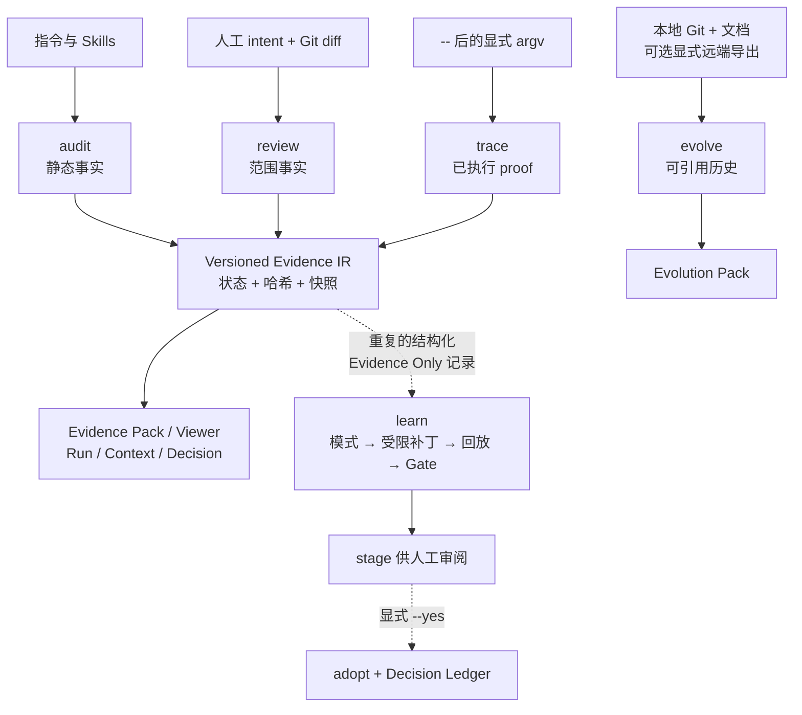

# Agent Engineering Toolkit（AET）

[](https://github.com/AdvancingTitans/agent-engineering-toolkit/actions/workflows/ci.yml)
[](https://github.com/AdvancingTitans/agent-engineering-toolkit/releases)
[](https://www.python.org/)
[](../LICENSE)
[](../README.md)

**[English](../README.md) · [简体中文](README.zh-CN.md)**

> AET 是 Coding Agent 的工作结果与“可以交付”这一结论之间的本地证据层。

**Agent Engineering Toolkit（AET）** 是面向 Agent 改造仓库的证据优先 CLI 与可移植
Agent Skill。它记录检查过什么、人工批准了什么、哪条命令真实运行过，以及还有什么
尚未验证。它还能把反复出现的**结构化**证据问题变成受限的 Skill 改进候选，经过独立
回放与门禁后，仅暂存给人审阅。

它不是 Agent runtime、信任评分器、托管遥测产品，也不是自动改写 prompt 的黑盒。

## 快速开始

```bash
uv tool install https://github.com/AdvancingTitans/agent-engineering-toolkit/releases/download/v1.6.0/agent_engineering_toolkit-1.6.0-py3-none-any.whl
aet --version

aet init --output aet.toml
aet audit . --strict --format json --output .aet/evidence/audit.json
```

即使发现真实问题，`aet audit` 也会先写出 JSON 再以非零退出码结束。非零表示“证据发现
问题”，不是“没有生成审计 JSON”；应先阅读该产物。

## 选择最小能力面

| 你要确认什么？ | 命令 | 产物 |
| --- | --- | --- |
| 指令、本地引用和 Skill 是否可用？ | `aet audit` | 含位置、证据与修复建议的 Markdown / JSON / SARIF。 |
| diff 是否在人工批准边界内？ | `aet review` | intent、路径预算与 proof 声明报告。 |
| 显式命令是否运行并生成已声明报告？ | `aet trace -- <argv>` | 脱敏执行记录与可选捕获产物。 |
| 如何随 handoff 或 release 交付证据？ | `aet evidence pack` | Portable Evidence Pack 与静态 Viewer。 |
| 审查/测试后工作区是否过期？ | `aet run` | 可选的 append-only 交付生命周期。 |
| 哪些 Context 与决策有本地来源？ | `aet context`、`aet decision` | 哈希绑定的 Context Manifest 与 Decision Ledger。 |
| 仓库为什么这样演进？ | `aet evolve` | 可引用的本地/显式远端演进报告。 |
| 现有 finding 应先修哪个？ | `aet triage` | 可解释排序；绝不改变 finding 原状态。 |
| 重复证据问题能否安全改进 Skill？ | `aet learn` | Evidence Only 经验集、受限候选、Gate 与 staged 副本。 |

## 架构



虚线是可选支路：并非每份证据都会进入学习集，Gate 通过也绝不会修改生产 Skill。

## 常规交付流程

```bash
# audit 与 review 不执行测试。
aet audit . --strict --format json --output .aet/evidence/audit.json
aet review . --base main --intent aet.intent.json --format json --output .aet/evidence/review.json

# 只有 Trace 可执行 -- 后的精确 argv。
aet trace --proof unit-tests --intent aet.intent.json \
  --artifact reports/junit.xml --output .aet/evidence/trace.json -- \
  python -m unittest discover -s tests -v

aet evidence pack --audit .aet/evidence/audit.json \
  --review .aet/evidence/review.json --trace .aet/evidence/trace.json \
  --output .aet/evidence/evidence-pack.json
aet evidence viewer --pack .aet/evidence/evidence-pack.json \
  --output .aet/evidence/evidence-viewer.html
```

proof 成功与 freshness 分开表达：命令可能确实成功，但之后工作区变化会让交付变为
STALE。`UNKNOWN` 是待验证缺口，绝不是打折后的通过。

## Evidence-Gated Evolution

v1.6 按以下闭环实现“基于证据的进化”：

```text
Evidence Only JSON → inspect → mine → bounded Patch IR → 隔离回放
→ core + validation + held-out Gate → stage → 人工 adopt 或 reject
```

| Phase | 已实现内容 |
| --- | --- |
| 0. Contract | immutable/editable 标记、Candidate 与任务 schema、硬语义门禁。 |
| 1. Experience Store | Evidence Only `harvest`、`inspect`/`summarize`、确定性统计与支持度。 |
| 2. Rules | 带哈希、diff、rationale、source manifest 的 editable-block Patch IR。 |
| 3. Replay / Gate | 临时副本回放、静态 Gate Viewer、候选自审计、core/validation/held-out。 |
| 4. Model | 显式本地 adapter、超时、受限 JSON 接口与 rejected-candidate 约束。 |
| 5. 跨项目本地经验 | `collect` 与 `--experience-store` 汇总脱敏包；不联网。 |
| 6. Sleep | 本地有界闭环、`SKILL_EVOLUTION` 事件历史、预算、目标变更检测、最终只 stage。 |

```bash
# Phase 1：只处理结构化 AET JSON。
aet learn harvest --evidence .aet/evidence --output .aet/learn/experiences.json
aet learn inspect --experiences .aet/learn/experiences.json --output .aet/learn/inspection.json
aet learn mine --experiences .aet/learn/experiences.json --output .aet/learn/patterns.json

# Phase 2–3：候选只能改带标记的 editable block。
aet learn propose --engine rules --patterns .aet/learn/patterns.json \
  --target skills/agent-engineering-toolkit/SKILL.md --output .aet/learn/candidates/CAND-001
aet learn replay --candidate .aet/learn/candidates/CAND-001 \
  --suite eval/core --suite eval/validation --suite eval/held-out \
  --output .aet/learn/replays/CAND-001.json
aet learn gate --candidate .aet/learn/candidates/CAND-001 --core eval/core \
  --validation eval/validation --held-out eval/held-out \
  --output .aet/learn/gates/CAND-001.json
aet learn viewer --gate .aet/learn/gates/CAND-001.json --output .aet/learn/CAND-001.html
aet learn stage --candidate .aet/learn/candidates/CAND-001 \
  --gate .aet/learn/gates/CAND-001.json --output .aet/learn/staged
```

Gate 会拒绝 immutable 字节变化、editable block 外修改、哈希异常、validation 与
held-out 重叠、候选自审计失败、回归、token/命令面预算超限和 workflow overuse 上升。
输出是指标向量，不是单一“信任分”。

`aet learn adopt --yes` 故意与 stage 分离：它会复核目标哈希，并写入本地 Decision
Ledger。`reject` 会留下拒绝理由；两者都不 commit 或 push。

### 跨项目本地经验与定时执行

```bash
# 只显式汇集本地、去标识的 Evidence Only 包。
aet learn collect --experiences .aet/learn/experiences.json --store ~/.aet/experience
aet learn harvest --experience-store ~/.aet/experience --output .aet/learn/merged.json

# scheduler 可以调用，但必须保留明确预算和 stage-only 终点。
aet learn sleep --evidence .aet/evidence --target skills/agent-engineering-toolkit/SKILL.md \
  --core eval/core --validation eval/validation --held-out eval/held-out \
  --max-candidates 1 --max-replays 2 --max-model-calls 1 --timeout-seconds 120 \
  --output .aet/learn/nightly
```

默认不会读取 transcript、shell output、环境变量、secret，也不会上传、自动 commit、
push 或 adopt。精确边界见 [evolution boundary](evolution-boundary.md)。

## Context、决策与历史

```bash
aet context discover . --output .aet/context/manifest.json
aet context record --manifest .aet/context/manifest.json --read AGENTS.md
aet context verify --manifest .aet/context/manifest.json

aet decision init --output .aet/decisions.json
aet decision add --ledger .aet/decisions.json --id DEC-0001 \
  --claim "Keep proof execution explicit." --evidence-state EVIDENCED \
  --source docs/evolution-boundary.md
aet decision verify --ledger .aet/decisions.json

aet evolve plan . --question "Why was this release made?" --output .aet/evolve/plan.json
aet evolve collect . --question "Why was this release made?" --output .aet/evolve/run
aet evolve build --manifest .aet/evolve/run/source-manifest.json --output .aet/evolve/run
aet evolve report --graph .aet/evolve/run/object-graph.json --output .aet/evolve/run
```

`context record --read` 只是 Agent/宿主“已读”的 attestation，不能证明模型理解或使用了
内容；`decision verify` 只验证记录的来源字节是否仍匹配，不宣称决策永远正确。
`evolve` 默认离线，只有显式 `--remote github` 才处理远端导出。

## 安装可移植 Skill 与 Hermes 迁移

请复制完整目录，而不是只复制 `SKILL.md`：

```bash
# 请从本仓库的 source checkout 执行（wheel 只包含 CLI，不携带 Skill 资源）：
git clone https://github.com/AdvancingTitans/agent-engineering-toolkit.git
cd agent-engineering-toolkit
cp -R skills/agent-engineering-toolkit ~/.codex/skills/
aet audit ~/.codex --format json --output ~/.aet/evidence/codex-audit.json
```

若 Hermes 的旧 Skill 路径已经被吸收到新的 `software-delivery-workflow`，AET 仍会把
旧引用保留为 `FAIL`，但在发现真实的 `.absorbed_into` 迁移元数据时，会给出本机替代
路径。这样既不掩盖失效指令，也不会只留下难以行动的路径错误。

## 验证与边界

在源码 checkout 中运行：

```bash
uv run --no-editable --reinstall-package agent-engineering-toolkit \
  python -m unittest discover -s tests -v
uv run --no-editable --reinstall-package agent-engineering-toolkit \
  aet audit . --strict --format json --output .aet/evidence/self-audit.json
uv build
```

AET 能验证记录的字节、显式命令退出码和声明产物处理；它不能证明模型理解指令、决策
永远正确、未 Trace 的命令运行过，也不能从缺失远端数据推断结论。使用前请阅读
[规则目录](rule-catalog.md)与[安全、隐私和保留边界](security-and-retention.md)。

## 贡献

见 [CONTRIBUTING.md](../CONTRIBUTING.md)。涉及证据语义的变更必须有测试、清晰的契约
更新与人工审阅的 intent 边界。
