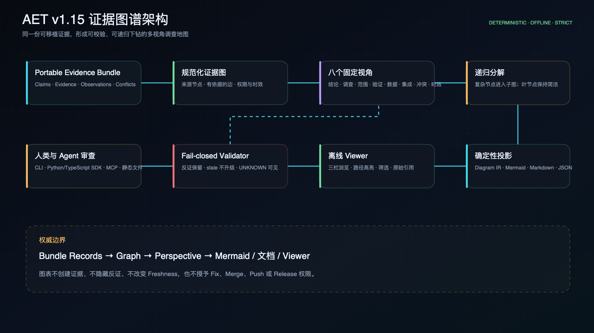
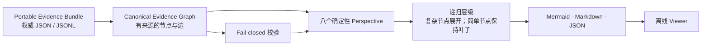
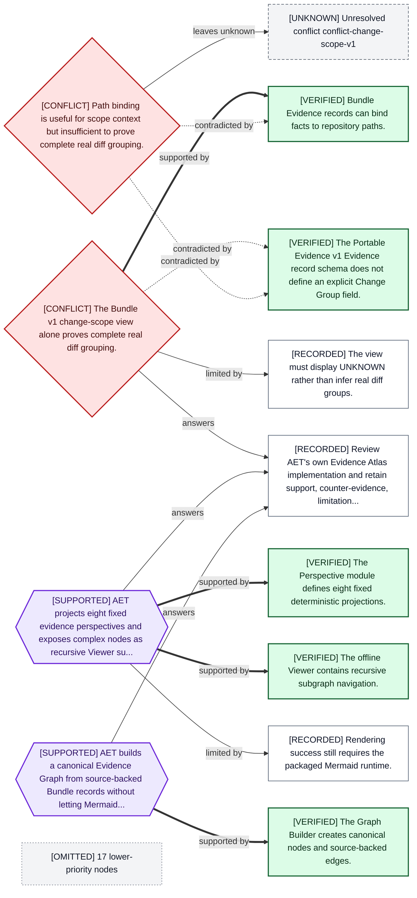
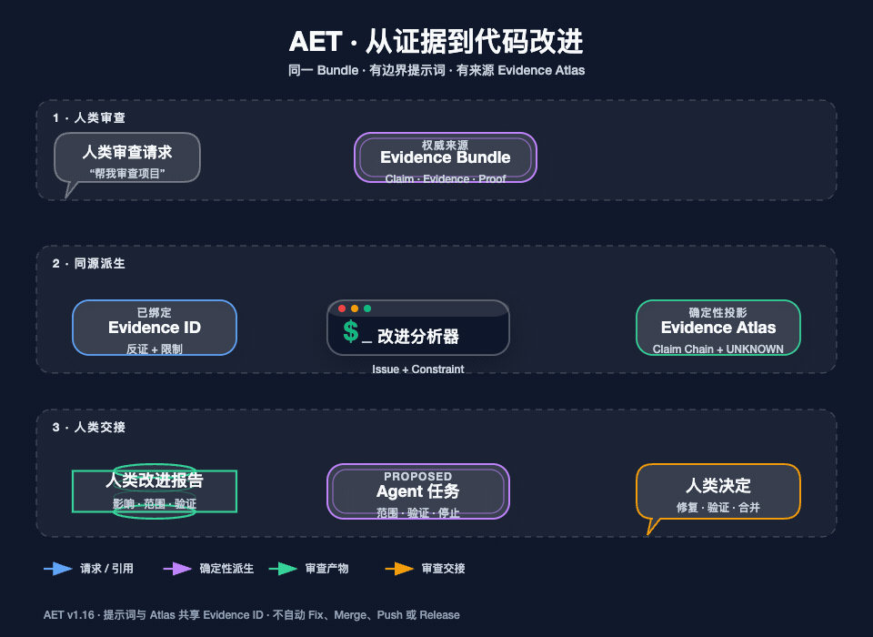
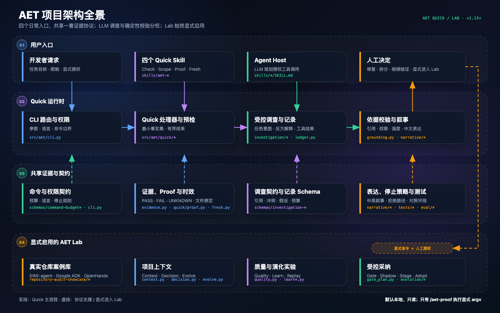

# Agent Engineering Toolkit（AET）

[](https://github.com/AdvancingTitans/agent-engineering-toolkit/actions/workflows/ci.yml)
[](https://github.com/AdvancingTitans/agent-engineering-toolkit/releases)
[](https://www.python.org/)
[](../LICENSE)
[](../README.md)

**[English](../README.md) · [简体中文](README.zh-CN.md)**

> **AET 把 AI 编码工作转成可移植、可检查的证据，再让人类和 Agent 在不允许模型编造事实的
> 前提下完成调查。**

AI 编码 Agent 说任务已经修好、测试已经通过。AET 帮你回答五个具体问题：

1. 本次改动是否与用户任务相关？
2. 声称的验证是否真的在当前工作区执行？
3. 这份验证记录现在是否仍能代表当前代码？
4. 另一个没有安装 AET 的 Agent 能否审查同一份证据？
5. 人类能否沿一张可读调查地图追踪结论、反证与 `UNKNOWN`？

工具产生可复现事实；宿主 LLM 可以理解任务意图、提出竞争假设、调用授权工具、检查反方解释，
并形成有条件的工程判断。AET 再用确定性代码检查引用、权限、结论强度和预算，并把结果导出为
可移植、自描述的证据交接。最终下一步由人决定。

```text
确定性事实 → 有边界的调查 → 依据校验
          → 可移植证据交接 → Evidence Atlas
          → 独立审查 → 人工决定
```

## 四个 Quick Skill

每个 Skill 只回答一个问题，输出一个有界结果，然后停止。

| Skill | 使用时机 | 主要结果 |
| --- | --- | --- |
| `/aet-check` | Agent 指令、Skill 或完成规则可能危险、矛盾或不可验证 | 最多五个有证据的问题 |
| `/aet-scope` | 需要判断代码差异是否符合任务，包括必要的跨模块改动 | 每组改动的范围结论和反方解释 |
| `/aet-proof` | 需要现在执行命令并与当前工作区绑定 | 一个最小 JSON 验证记录（Proof Receipt） |
| `/aet-fresh` | 需要判断旧验证记录是否仍然有效 | 精确匹配、相关文件、产物、环境变化或 `UNKNOWN` |

可移植宿主 Skill 位于：
[`skills/aet-check`](../skills/aet-check)、
[`skills/aet-scope`](../skills/aet-scope)、
[`skills/aet-proof`](../skills/aet-proof) 和
[`skills/aet-fresh`](../skills/aet-fresh)。确定性 CLI 用法：

```bash
aet quick check .
aet quick scope . --base main --intent aet.intent.json
aet quick proof --output .aet/proofs/auth.json \
  --relevant-path src/auth/session.py -- pytest tests/auth
aet quick fresh --proof .aet/proofs/auth.json
```

旧版 `aet audit`、`review`、`trace` 和 `evidence receipt` 在整个 1.x 周期保持兼容；
它们属于高级原生命令，不再是 Quick 默认产品入口。

## 跨 Agent 可移植证据交接

四个 Quick Skill 继续作为日常入口。v1.14.0 引入一条证据交接路径：审查者可以是
Codex、Claude Code、Hermes、本地模型或其他能读取 JSON 的 Agent，并且不能假定它已经安装 AET。

```text
原生 Agent Run
  → Run Normalizer
  → Run Record
  → Observation / Evidence Candidate
  → 只读 Investigator
  → 有边界的 Observation + 明确 UNKNOWN
  → Portable Evidence Bundle
  → 独立 Reviewer
```

各层权限有意分开：

| 层级 | 能证明什么 | 不能证明什么 |
| --- | --- | --- |
| Run Record | 规范化执行记录里包含什么 | 记录中的命令确实在当前工作区执行 |
| Observation | 带来源、`proves` 和 `does_not_prove` 的可追溯观察 | 已复现的工程证明 |
| Evidence Candidate | 某个命题值得继续验证 | 可以自行提升证据强度 |
| Verified Evidence | 绑定工作区的 Git、文件、Proof、Freshness、产物或授权事实 | 最终审查判断 |
| Portable Claim | 有边界的调查状态、证据、反证和限制 | 合并、发布或 Release 权限 |

首批自有 Normalizer 支持 Codex 和 Claude Code Run Record，包括稳定身份、内容哈希、
Tool Call/Result 关联、Diagnostics、局部输入和增量续传：

```bash
aet run normalize --source codex \
  --input session.jsonl --output .aet/runs/session

aet investigate --request investigation-request.json \
  --run .aet/runs/session --output .aet/investigations/review.json

# 可选：检查显式传入的确定性 Proof 与当前 Freshness。
aet investigate --request investigation-request.json \
  --run .aet/runs/session --workspace . --proof .aet/proof.json \
  --output .aet/investigations/verified-review.json

aet bundle create --investigation .aet/investigations/review.json \
  --output evidence-bundle
aet bundle validate evidence-bundle
```

Investigator 保持只读：不能执行任意命令、修改源码、自动修复、commit、push、merge 或
发布。Run Observation 始终只是历史记录；只有显式传入、与命令 Candidate 匹配的 AET
Proof，以及策略授权的 Freshness 检查，才能生成 Verified Evidence。调查必须保留主假设、
竞争假设、反证搜索、明确的工具与证据预算及有界停止条件。

Bundle 同时提供规范 JSON 元数据、JSONL Core Record、完整 Archive 引用、可选的内容寻址
Blob、确定性 Markdown 报告和消费指南：

```text
evidence-bundle/
├── manifest.json
├── index.json
├── core/{claims,evidence,observations}.jsonl
├── archive/{sources,diagnostics,conflicts,ledger}.jsonl
├── policy.json
├── consumer-guide.md
└── report.md
```

JSON 与 JSONL 是权威数据，Markdown 是确定性投影视图。Reviewer 可以直接读取这些文件，
不需要 Python Package、Node Package、SDK、MCP Server 或 AET 安装。Observation 与
Evidence 始终分离，反证不会被隐藏，过期证据保留历史结果但失去当前适用性，缺失信息继续
保持 `UNKNOWN`。

结构化 Reviewer 可以输出 `portable-review-result/1.0`，再选择调用引用校验器：

```bash
aet bundle validate-review \
  --bundle evidence-bundle --review review-result.json
```

Validator 检查 Bundle 身份、引用、反证保留、Freshness 和结论强度，但不代替 Reviewer
作判断。宿主集成可以选择便利层：

```bash
aet mcp serve
```

```ts
import {
  loadBundle,
  queryClaims,
  validateBundle,
} from "@aet/evidence-bundle";
```

```python
from aet_bundle import load_bundle, query_claims, validate_bundle
```

TypeScript 与 Python SDK 提供加载、查询、Blob 解析、Prompt Context 渲染和引用校验；
MCP 暴露相同的有界规范化、调查、Bundle 查询和校验操作。消费 Bundle 不依赖任何便利层。

## Evidence Atlas：可递归下钻的证据地图

v1.15.0 把 Evidence Atlas 作为 Portable Evidence Bundle 的内置确定性投影。它不会让
LLM 根据材料画一张“看起来合理”的图，而是先建立规范化 Evidence Graph，为每个权威节点和
边保留字段级来源引用，再投影出八个固定视角：

| 视角 | 回答的问题 |
| --- | --- |
| Claim Chain | 这个结论由什么支持、反驳或限制？ |
| Investigation Flow | 调查如何形成有边界的 Finding？ |
| Change Scope | 哪些改动属于范围、合理扩展或仍是未知？ |
| Verification Coverage | Proof 证明了什么，又明确没有证明什么？ |
| Evidence Data Flow | Record 如何成为 Observation、Evidence、Claim 与审查材料？ |
| Integration and Sources | 哪些系统、权限和信任边界提供了证据？ |
| Conflict and Unknown | 哪些事实仍冲突、不可用、过期或未解决？ |
| Freshness | 证据何时适用或失效，原因是什么？ |



权威方向始终是单向的：


```mermaid
flowchart LR
    B["Portable Evidence Bundle<br/>权威 JSON / JSONL"] --> G["Canonical Evidence Graph<br/>有来源的节点与边"]
    G --> P["八个确定性 Perspective"]
    P --> H["递归层级<br/>复杂节点展开；简单节点保持叶子"]
    H --> R["Mermaid · Markdown · JSON"]
    R --> V["离线 Viewer"]
    G --> X["Fail-closed 校验"]
    X --> P
```

Mermaid、Markdown 和 Viewer 都是可重建投影。它们不创建证据、不隐藏反证、不改变
Freshness，也不授予 Fix、Merge、Push 或 Release 权限。默认输出为同级 Sidecar
`<bundle>.atlas/`，因为 Bundle v1 Manifest 会精确哈希 Bundle 根目录的全部文件：

```text
evidence-bundle/          # 权威 Portable Evidence Bundle
evidence-bundle.atlas/
├── graph/
│   ├── graph.json
│   ├── nodes.jsonl
│   ├── edges.jsonl
│   ├── hierarchy.json
│   ├── diagnostics.jsonl
│   └── perspectives/{claim-chain,...}/
└── atlas/
    ├── index.html
    └── assets/           # 本地 Mermaid Runtime；无需网络
```

构建、校验、查询、比较和打开 Atlas：

```bash
aet atlas build evidence-bundle --no-llm
# 可选：只生成选定的固定 Perspective。
aet atlas build evidence-bundle --perspectives claim-chain,verification-coverage,conflicts
aet atlas validate evidence-bundle
aet atlas query evidence-bundle --perspective claim-chain \
  --root node:claim:CLM-0042 --format json
aet atlas explain evidence-bundle --node node:claim:CLM-0042
aet atlas diff previous-bundle current-bundle
aet atlas view evidence-bundle
```

每个节点都会接受确定性复杂度评估；复杂节点按类型生成子图，简单节点保持叶子。深度、单图节点、
单节点子元素及总图数都有硬预算。Canonical Node ID 防止复制整棵子树，循环在引用节点停止，
增量重建会直接复用未受影响的 Perspective 与递归子图。

### 来自 AET 自身的动态 Viewer 示例

这不是 Mockup。仓库会哈希并审查自己的 Graph Builder、Perspective 定义、Viewer 和
Bundle Schema，构建 `bundle-aet-atlas-self-review-v1`，再录制真实离线 Viewer 状态：


[观看 30 秒 Evidence Atlas 中文介绍（MP4）](assets/aet-evidence-atlas-intro-zh-CN.mp4)
· [媒体哈希与采集身份](assets/aet-evidence-atlas-media-manifest.json)

复现源 Bundle 与 Atlas：

```bash
uv run python examples/evidence-atlas/build_example.py --output /tmp/aet-atlas-bundle
uv run aet atlas build /tmp/aet-atlas-bundle --max-nodes 14 --max-depth 4 --no-llm
uv run aet atlas validate /tmp/aet-atlas-bundle
uv run aet atlas view /tmp/aet-atlas-bundle
```

这份真实自审产生的 Claim Chain 会刻意保留范围冲突、反证和未解决节点：

<!-- atlas-self-review-mermaid:start -->

```mermaid
flowchart LR
    %% Evidence Atlas
    N_0b51dce8fe915eda{"[CONFLICT] The Bundle v1 change-scope view alone proves complete real diff grouping."}
    N_6f91af1641ed1424{{"[SUPPORTED] AET projects eight fixed evidence perspectives and exposes complex nodes as recursive Viewer su..."}}
    N_8575658723b5d49d{{"[SUPPORTED] AET builds a canonical Evidence Graph from source-backed Bundle records without letting Mermaid..."}}
    N_5522d8dace1cb6e7{"[CONFLICT] Path binding is useful for scope context but insufficient to prove complete real diff grouping."}
    N_ac65699e766edc85["[UNKNOWN] Unresolved conflict conflict-change-scope-v1"]
    N_ef4722a060cacfda["[VERIFIED] Bundle Evidence records can bind facts to repository paths."]
    N_1ded0fae46344828["[VERIFIED] The Portable Evidence v1 Evidence record schema does not define an explicit Change Group field."]
    N_c075a66077dd6940["[VERIFIED] The Graph Builder creates canonical nodes and source-backed edges."]
    N_e824b2ad012b224e["[VERIFIED] The Perspective module defines eight fixed deterministic projections."]
    N_a42d56cfe9dff13d["[VERIFIED] The offline Viewer contains recursive subgraph navigation."]
    N_f797fb20a8448aa0["[RECORDED] Review AET's own Evidence Atlas implementation and retain support, counter-evidence, limitation..."]
    N_a17fb3165e6b0db5["[RECORDED] The view must display UNKNOWN rather than infer real diff groups."]
    N_6630b028247f1a08["[RECORDED] Rendering success still requires the packaged Mermaid runtime."]
    N_2eb930959384d64c["[OMITTED] 17 lower-priority nodes"]
    N_0b51dce8fe915eda -.->|"contradicted by"| N_1ded0fae46344828
    N_0b51dce8fe915eda -->|"limited by"| N_a17fb3165e6b0db5
    N_0b51dce8fe915eda ==>|"supported by"| N_ef4722a060cacfda
    N_5522d8dace1cb6e7 -.->|"contradicted by"| N_1ded0fae46344828
    N_5522d8dace1cb6e7 -->|"leaves unknown"| N_ac65699e766edc85
    N_5522d8dace1cb6e7 -.->|"contradicted by"| N_ef4722a060cacfda
    N_6f91af1641ed1424 -->|"limited by"| N_6630b028247f1a08
    N_6f91af1641ed1424 ==>|"supported by"| N_a42d56cfe9dff13d
    N_6f91af1641ed1424 ==>|"supported by"| N_e824b2ad012b224e
    N_8575658723b5d49d ==>|"supported by"| N_c075a66077dd6940
    N_0b51dce8fe915eda -->|"answers"| N_f797fb20a8448aa0
    N_6f91af1641ed1424 -->|"answers"| N_f797fb20a8448aa0
    N_8575658723b5d49d -->|"answers"| N_f797fb20a8448aa0
    classDef verified fill:#dcfce7,stroke:#166534,color:#052e16,stroke-width:2px
    classDef observation fill:#e0f2fe,stroke:#0369a1,color:#082f49
    classDef candidate fill:#fef3c7,stroke:#92400e,color:#451a03,stroke-dasharray:5 3
    classDef supported fill:#ede9fe,stroke:#6d28d9,color:#2e1065,stroke-width:2px
    classDef conflict fill:#fee2e2,stroke:#b91c1c,color:#450a0a,stroke-width:2px
    classDef unknown fill:#f3f4f6,stroke:#4b5563,color:#111827,stroke-dasharray:5 3
    classDef stale fill:#ffedd5,stroke:#c2410c,color:#431407,stroke-dasharray:3 3
    classDef authorization fill:#ecfccb,stroke:#3f6212,color:#1a2e05
    classDef omitted fill:#f3f4f6,stroke:#6b7280,color:#111827,stroke-dasharray:2 3
    classDef evidenceDefault fill:#ffffff,stroke:#475569,color:#0f172a
    class N_0b51dce8fe915eda conflict
    class N_6f91af1641ed1424 supported
    class N_8575658723b5d49d supported
    class N_5522d8dace1cb6e7 conflict
    class N_ac65699e766edc85 unknown
    class N_ef4722a060cacfda verified
    class N_1ded0fae46344828 verified
    class N_c075a66077dd6940 verified
    class N_e824b2ad012b224e verified
    class N_a42d56cfe9dff13d verified
    class N_f797fb20a8448aa0 evidenceDefault
    class N_a17fb3165e6b0db5 evidenceDefault
    class N_6630b028247f1a08 evidenceDefault
    class N_2eb930959384d64c omitted
```
<!-- atlas-self-review-mermaid:end -->

完整生成图保存在
[`examples/evidence-atlas/aet-self-review-claim-chain.mmd`](../examples/evidence-atlas/aet-self-review-claim-chain.mmd)。
Python 与 TypeScript SDK 提供 Graph 构建、加载、查询、追踪、校验及 Mermaid 渲染 API；
MCP 增加八个只读 `aet_graph_*` 工具，并对节点数和深度设限。Viewer 始终是静态离线消费者。

## 30 秒看懂

### 调查范围，但不把路径差异直接当成越界

```bash
aet quick scope . --base main --intent aet.intent.json --format json
```

如果修复登录问题时修改了支付文件，确定性预检只记录路径不匹配，**不会**直接判定越界。
宿主继续调查直接调用、共享接口、测试、后续授权和合理反方假设，然后选择：

```text
IN_SCOPE
JUSTIFIED_EXPANSION
POSSIBLE_SCOPE_EXPANSION
OUT_OF_SCOPE
INSUFFICIENT_INTENT
```

### 记录真实验证，然后发现代码漂移

```bash
aet quick proof --output .aet/proofs/auth.json \
  --relevant-path src/auth/session.py -- pytest tests/auth

# 修改 src/auth/session.py

aet quick fresh --proof .aet/proofs/auth.json
```

历史命令结果不会被改写，但当前适用性变为 `RELEVANT_FILES_CHANGED`。AET 建议只重跑受影响的
验证，而不是继续把旧绿色日志当成当前代码的证明。

仓库还提供可运行的[过期验证示例（Stale Proof Demo）](../examples/stale-proof-demo.sh)和
[中文完整案例](case-studies/stale-proof.zh-CN.md)。

## 一个日常 Coding 示例

以下为说明性示例，不是真实仓库测量结果。

你对 Agent 说：

> 修复偶发的登录超时，不要修改支付业务，也不要新增生产依赖。

Agent 实际修改：

```text
src/auth/session.py
src/cache/session_cache.py
src/payment/order.py
tests/auth/test_session.py
```

没有 AET 时，审查往往退化成两种简单判断：要么认为 `auth/` 外的文件都越界，要么直接相信
Agent 所说的“共享缓存和支付改动都是必要的”。Scope 调查会把每组改动作为待调查假设：

```text
src/auth/session.py          IN_SCOPE
src/cache/session_cache.py   JUSTIFIED_EXPANSION
src/payment/order.py         POSSIBLE_SCOPE_EXPANSION
tests/auth/test_session.py   IN_SCOPE
```

缓存结论引用登录调用路径和聚焦回归测试；支付结论会记录合理反方解释——例如共享接口是否要求
同步修改——以及已检查的引用为什么没有支持它。结果还会明确保留“其他会话可能追加过授权”
这一不确定性，并建议拆出支付整理或补充授权。随后调查停止，不会自行跑测试或改代码。

如果你决定验证修复，`/aet-proof` 会记录真实命令与工作区绑定。Agent 后续再修改
`session.py` 时，`/aet-fresh` 会把适用性改为 `RELEVANT_FILES_CHANGED`，但不会改写历史退出码。

## 引入 AET 后有什么不同

| 日常场景 | 没有 AET | 使用 AET Quick |
| --- | --- | --- |
| 修复跨出原目录 | 路径规则容易误判，或只能相信 Agent 的解释 | 调查共享改动的必要性，让无依据扩张保持可见 |
| “测试已经通过” | 一句话或旧日志很容易被重复引用 | 记录 argv、退出码、工作区、相关文件、产物和环境绑定 |
| 测试后代码继续变化 | 旧结果看起来仍是绿色 | 明确指出哪些变化让旧结果不再适用 |
| LLM 审查意见 | 事实、推断、反方解释和建议混在一起 | 分层输出，并引用已记录证据 |
| 调查不断扩大 | Agent 可能持续读取和调用工具 | 预算与停止条件返回有界结果 |

| AET Quick 能做 | AET Quick 不能做 |
| --- | --- |
| 记录可复现的 Git、命令、哈希和结果时效事实 | 证明所有代码绝对正确 |
| 调查改动是否是完成任务所必需 | 仅凭路径差异直接判定越界 |
| 执行并绑定用户明确要求的验证命令 | 把未执行测试写成通过 |
| 保留冲突、缺失事实与 `UNKNOWN` | 隐藏已记录反证或生成综合可信度评分 |
| 建议最小下一步 | 自动修复、合并、推送、发布或进入 AET Lab |

## 可量化的取舍，不是综合可信度评分

### v1.14.0 可移植消费检查

已追踪的
[v1.14.0 结果](../eval/bundle-consumption/results/v1.14.0.json)让三个 Prompt-only
消费者在不使用 AET SDK 的情况下读取相同的十个确定性合成 Bundle：

| 消费者 | Runtime 与模型 | 场景数 | 适用指标状态 | 不适用 |
| --- | --- | ---: | --- | ---: |
| Codex | Codex CLI 0.144.1 · `gpt-5.6-sol` | 10 | 62 `PASS` · 0 `FAIL` · 0 `UNKNOWN` | 38 |
| Hermes | Hermes Agent 0.17.0 · `kimi-k2.6` | 10 | 62 `PASS` · 0 `FAIL` · 0 `UNKNOWN` | 38 |
| 本地结构化消费者 | Ollama 0.32.3 · `qwen3:8b` | 10 | 62 `PASS` · 0 `FAIL` · 0 `UNKNOWN` | 38 |

十个场景分别覆盖：只有 Agent 自述而没有 Proof、工具输出过期、证据冲突、未找到授权、
输出截断、内容身份降级、存在无关证据、把旧 Bundle 用于新 Commit、Claim 为 `unknown`，
以及把缺失证据错误强化为结论。每份响应都是 Strict JSON，恰好覆盖全部场景一次，并按十项
独立指标评测。38 个 `NOT_APPLICABLE` 表示该场景没有对应分母，不是被隐藏的成功。

这是合成 Fixture 上的有界互操作检查，不是通用模型准确率声明。它不计算 Aggregate Score
或 Trust Score，也不授予合并、Release 或发布权限。完整
[评测脚本与限制](../eval/bundle-consumption/README.md)可独立检查。

### v1.13.0 Quick 调查取舍

可选的 [Quick 调查对照评测](../eval/quick-investigation/README.md)按设计要求，在八个合成 Scope
场景中比较四种审查模式。已追踪的
[v1.13.0 结果](../eval/quick-investigation/results/v1.13.0.json)固定使用
`gpt-5.6-sol`、`medium` Reasoning，每个场景重复 2 次，每组 16 个运行样本：

| 模式 | 有效召回 | 错误发现占比 | 平均工具调用 | 平均耗时 | 平均 Token |
| --- | ---: | ---: | ---: | ---: | ---: |
| 纯规则 | 60% | 50.0% | 0.00 | <0.001 秒 | 0 |
| 一次性 LLM | 80% | 38.5% | 0.00 | 7.33 秒 | 21,702 |
| 调查式 AET | 90% | 25.0% | 1.63 | 18.32 秒 | 64,147 |
| 带依据约束的调查 + 项目内校验器 | 90% | 25.0% | 0.75 | 14.84 秒 | 38,831 |

这组数据说明了三件不同的事：

1. 与一次性 LLM 审查相比，带依据约束的调查组有效召回高 10 个百分点，错误发现占比低
   13.5 个百分点；代价是平均多 0.75 次工具调用、约 7.51 秒和 17,129 Token。
2. 与普通调查式 AET 相比，带依据约束的调查组保持相同的 90% 有效召回和 25% 错误发现占比，
   但平均工具调用少约 54%、耗时少约 19%、Token 少约 39%。这表示“先要求结论绑定依据、反方
   解释和适用范围”的 Agent 配置在本次样本中更克制，不表示校验器单独带来了这些节省。
3. 项目内校验器是调查后的确定性门禁：它检查引用是否存在、测试是否真的成功、反方解释是否
   已检查、权限与预算是否越界。它在这 16 个样本中拒绝了 0 条待校验结论，所以本次表格没有
   展示准确率提升；伪造引用、漏掉反方解释等拒绝路径由单元测试单独证明。

因此，“带依据约束的调查”和“项目内校验器”不是同一件事：前者改变 LLM **怎样调查和组织
结论**，后者决定这些结论 **是否满足进入报告的最低工程约束**。两个调查组使用不同的 Agent
提示词和结构化输出要求，并非只开关校验器的成对消融实验，不能把成本差异单独归因于校验器。

由于没有实际计时的人工标注，人工复核时间与用户理解继续保持 `UNKNOWN`。这 64 个样本来自
8 个合成 Scope 场景，是一次有边界、可重复评分的 Lab 测量，不是通用准确率声明，也不授权
发布代码。已发布且经过隐私检查的规范化样本可以独立重新评分；私有 Codex JSONL 不会发布。

## 架构：一条工作流，两种权力



[查看 English GIF](assets/aet-quick-workflow-en.gif) ·
[查看可缩放 SVG](assets/aet-quick-workflow-zh-CN.svg) ·
[查看动画校验报告](assets/aet-quick-workflow-zh-CN.motion.json)

这张动态图展示当前可移植交接主链：

1. 执行 Agent 的原生运行记录进入 Source Adapter，形成带稳定 ID 和 Diagnostics 的规范 Run Record；
2. 记录中的行为先成为 Observation，默认不能被当作 Reproduced Evidence；
3. 只读 Investigator 在明确策略和预算内比较主假设与竞争假设；
4. Git、Proof、Freshness 和授权事实继续由确定性证据组件掌握；
5. Bundle Compiler 筛选、脱敏、哈希并连接 Claim、Evidence、Observation、Diagnostic 与 Blob；
6. 独立 Reviewer 无需安装 AET，直接消费 JSON、JSONL 或 Markdown；
7. Review 只提供判断依据，Fix、Merge、Push 和 Release 的最终权限仍由人掌握。

### 从当前代码库看，组件怎样组合



[查看 English panorama](assets/aet-project-panorama-en.png) ·
[查看可缩放 SVG](assets/aet-project-panorama-zh-CN.svg)

静态全景图回答“这些能力在当前仓库中怎样落地”。架构结论如下：

- **实线表示证据生产主链。** 原生记录依次经过标准化、Observation/Candidate 提取、有界调查、
  确定性验证、Bundle 编译和独立审查。
- **虚线表示产品入口与消费层。** 四个 Quick Skill、CLI/MCP/SDK 便利层、实测消费者和
  Human/Lab 边界复用相同契约，但不会因此获得证据权威。
- **Run Record、Observation 与 Verified Evidence 是不同类型。**
  `src/aet/run_normalization/*`、`src/aet/observations/*` 和
  `src/aet/evidence_core/*` 在编译前强制维持边界。
- **交换格式不依赖实现。** `schemas/evidence-bundle/v1/*` 定义 Index/Core/Archive、
  完整性、Freshness、冲突、Diagnostic 和 Review 引用；SDK 始终可选。
- **Quick 继续保持轻量日常入口。** `skills/aet-*` 与 `src/aet/quick/*` 仍只暴露 Check、
  Scope、Proof、Fresh；可移植路径增加的是交接能力，不是自动进入 Lab 的通道。
- **测试与真实消费者实测证明不同事项。** `tests/*` 覆盖确定性拒绝路径，
  `eval/bundle-consumption/*` 检查采样互操作性；二者都不生成 Trust Score 或行动权限。

### 30 秒产品介绍

[观看中文 MP4](assets/aet-product-intro-zh-CN.mp4) ·
[Watch the English MP4](assets/aet-product-intro-en.mp4)

六幕视频依次解释：为什么 Run Record 不是 Proof、四个 Quick Skill 继续承担什么职责、
Run Normalizer 怎样统一记录、Observation 与 Evidence 为什么必须分层、Reviewer 怎样无 SDK
消费 Bundle，以及 Codex、Hermes、Ollama/Qwen 的真实互操作实测。详细契约见
[可移植工作流](architecture/portable-evidence-workflow.md)。
[媒体清单](assets/aet-quick-media-manifest.json)用 SHA-256 绑定双语 GIF、静态全景图和 MP4，
并记录生成时测得的尺寸、帧数、帧率与时长。

只有 `/aet-proof` 会由 AET 自身执行命令并生成验证记录。其他本地或 MCP 工具结果由 Agent
Host 写入调查记录：规范化 Payload 的哈希可以发现后续篡改，但不能独立证明外部 Host 确实
执行过调用。Host 必须保留来源信息，并在渲染前调用
`aet.investigation.validate_investigated_finding`；否则结果只能保持为
`HYPOTHESIS`/`UNKNOWN`。

## 为什么约束 LLM，而不是禁用 LLM

纯路径规则无法判断共享缓存改动是否是修复登录问题所必需；完全自由的 LLM 又可能在没有依据时
写出很有说服力的结论。AET 同时使用两者，并严格分配权限：

| 能力 | 确定性运行时 | 宿主 LLM |
| --- | --- | --- |
| Git 代码差异、哈希、退出码、产物、结果时效事实 | 负责 | 不得改写 |
| 任务意图理解与竞争假设 | 提供来源 | 负责，但必须标注来源 |
| 工具选择 | 执行权限与预算校验 | 规划授权调用 |
| 工程判断 | 校验依据绑定 | 有条件负责 |
| 合并、发布、采纳权限 | 不授予 | 不授予 |

每条问题结论都明确标记来源：

- `DETERMINISTIC_FINDING`：由规则、命令或确定性比较直接产生；
- `INVESTIGATED_FINDING`：完成可追溯工具调查后形成；
- `HYPOTHESIS`：继续调查的方向，绝不能直接成为阻断结果。

证据的权威状态继续使用 `PASS`、`FAIL`、`UNKNOWN`、`NOT_APPLICABLE`。语义支持强度单独记录为
`CONFIRMED`、`SUPPORTED`、`SUPPORTED_WITH_LIMITS`、`CONFLICTED`、`UNSUPPORTED`、
`UNKNOWN` 或 `NOT_APPLICABLE`。自然语言叙事不能覆盖机器事实。

## 命令边界与预算

| Quick Skill | 默认边界 | 默认预算 |
| --- | --- | --- |
| `/aet-check` | 读取 Agent 资产和相关配置；不执行项目、不扫完整历史、不访问远端、不写文件 | 30 秒、3 轮、≤2 次 LLM、≤6 次工具、≤1 次高成本调用、≤5 个问题 |
| `/aet-scope` | 检查任务意图与当前代码差异；不写代码；最多一个能区分假设的低成本测试 | 45 秒、4 轮、≤2 次 LLM、≤8 次工具、≤2 次授权远端只读、≤1 次高成本调用 |
| `/aet-proof` | 只执行显式 argv；默认唯一写入是用户要求的 JSON Receipt | 取决于命令；仅在定位命令时最多 1 次 LLM |
| `/aet-fresh` | 比较指定验证记录；不执行、不联网、不写入 | 3 秒，默认 0 次 LLM |

已追踪的 [v1.13.0 本地性能证据](../eval/quick-performance/results/v1.13.0.json)
在当前 253 个已追踪文件的仓库中保留每个确定性命令 30 个原始样本：Check P95 0.622 秒、
Scope P95 0.059 秒、Fresh P95 0.037 秒。[评测脚本与限制](../eval/quick-performance/README.md)
使结果可在本地重算；它不是跨仓库或模型服务延迟声明。

当主导解释及合理反方解释已被检查、新证据不再改变动作、连续两次调用没有决策价值、预算耗尽、
需要新增授权、只有用户能补充事实或工具不可用时，调查停止。

预算耗尽时，AET 返回有界结果并说明未检查范围，不会静默升级为全仓库审计。

机器契约详见：
[命令边界](command-boundaries.md)、
[调查模型](investigation-model.md) 和
[Quick/Lab 边界](quick-vs-lab-boundary.md)。

## 语言行为

语言只改变面向人的叙事，不改变状态 Token、证据引用（`Evidence Reference`）、哈希或 Schema 字段。

- 用户输入斜杠式命令并使用中文提问时，宿主使用自然的简体中文解释，代码和必要技术词汇保留英文；
- 其他情况一律使用英文。

中英文叙事必须引用完全相同的事实和 `result_ref`。切换语言不能重新触发调查，也不能升级结论。

## 最小验证记录与结果时效

`/aet-proof` 记录：

- 精确脱敏 argv 及其摘要；
- cwd、起止时间、退出码和日志摘要；
- Git/Worktree Snapshot；
- 声明的相关文件哈希；
- Python/Platform 标识和依赖 Lockfile 哈希；
- 声明的产物哈希；
- 有界覆盖声明。

`/aet-fresh` 返回：

```text
EXACT_MATCH
RELEVANT_FILES_MATCH
HEAD_CHANGED_RELEVANT_FILES_MATCH
RELEVANT_FILES_CHANGED
ARTIFACT_CHANGED
ENVIRONMENT_CHANGED
UNKNOWN
```

旧 Trace 与规范证据报告继续可读。旧证据缺少相关文件或环境绑定时，AET 保留
`UNKNOWN`，不会伪造并不存在的精确度。

## 真实仓库审查案例库

Repository Audit Showcase 继续作为受支持的 **AET Lab** 案例库，但不属于 Quick 默认流程。
它包含三个公开 Agent 仓库的 commit 锁定、纯静态审查：

| 案例 | 有界审查范围 | 证据结果 | 报告 |
| --- | --- | --- | --- |
| SWE-agent | Agent 循环、工具交互、Trajectory、完成证据 | 4 个 `PASS`、1 个 `UNKNOWN` | [简体中文](../repository-audit-showcase/reports/swe-agent/audit-result/zh-CN/audit-report.md) · [English](../repository-audit-showcase/reports/swe-agent/audit-result/en/audit-report.md) |
| Google ADK | Agent 架构、工具治理、评估反馈 | 5 个 `PASS` | [简体中文](../repository-audit-showcase/reports/google-adk/audit-result/zh-CN/audit-report.md) · [English](../repository-audit-showcase/reports/google-adk/audit-result/en/audit-report.md) |
| OpenHands | 应用编排、运行隔离、外部 Agent-core 边界 | 4 个 `PASS`、1 个 `UNKNOWN` | [简体中文](../repository-audit-showcase/reports/openhands/audit-result/zh-CN/audit-report.md) · [English](../repository-audit-showcase/reports/openhands/audit-result/en/audit-report.md) |

```bash
aet audit swe-agent --repo /path/to/SWE-agent
aet audit google-adk --repo /path/to/adk-python
aet audit openhands --repo /path/to/OpenHands
```

每次运行只扫描锁定版本的本地代码，不执行上游代码或测试，不安装上游依赖，不复制源码正文，
也不允许 LLM 创建或修改案例库问题结论。每个案例写出两个共享机器产物，并为 `en/` 与
`zh-CN/` 各生成五项经过审核的人类可读产物。详见
[范围与发布边界](../repository-audit-showcase/docs/scope-and-publication.md)。
这些状态统计描述的是有边界的证据契约，不是对上游仓库的综合质量评分。

## AET Quick 与 AET Lab

| 层级 | 用户 | 能力 | 默认状态 |
| --- | --- | --- | --- |
| AET Quick | 日常使用 Coding Agent 的开发者 | Check、Scope、Proof、Fresh | 分别安装与调用 |
| 可选扩展 | 需要项目来源链的团队 | Context、Decision、Evolve | 显式请求 |
| AET Lab | Agent 工程师、Skill/平台作者 | Evidence Pack、Showcase、Quality、Learn、Replay、Gate、Tournament、Shadow、Stage、Adopt、统计分析 | 仅显式启用 |

现有 Lab 命令和规范的
[`agent-engineering-toolkit` 兼容 Skill](../skills/agent-engineering-toolkit)
继续保留。Quick 不会预加载其参考资料，不会执行真实宿主评测，不会生成大型 HTML/SVG
产物包，也不会采纳治理资产。

## 安全与权限

- 默认本地、只读；
- `/aet-proof` 只执行 `--` 后的显式 argv；
- 显式验证请求只授权写入对应 Receipt，不授权其他写入；
- Quick 不需要凭据，凭据不得进入持久证据；
- 禁止远端写入、`git push`、发布、关闭 Issue、破坏性 Shell、自动修复和自动采纳；
- 远端只读与项目执行必须符合当前 Skill 的策略和预算；
- 缺失证据保持 `UNKNOWN`，不生成综合可信度评分；
- 模型生成的判断绝不能成为唯一发布门禁。

详见[安全与保留策略](security-and-retention.md)和
[稳定性契约](stability.md)。

## 安装与开发

从当前源码目录安装 Quick Runtime：

```bash
uv tool install .
```

根据 Agent Host 的能力安装或复制需要的 Quick Skill 文件夹。没有原生 Skill Loader 的宿主，
可以把对应 `SKILL.md` 作为任务指令加载，并调用相同 CLI。

本地开发：

```bash
git clone https://github.com/AdvancingTitans/agent-engineering-toolkit.git
cd agent-engineering-toolkit
uv run --no-editable python -m unittest discover -s tests
```

AET 使用 Python 3.11+，确定性运行时保持轻依赖。贡献新规则时必须同时提供 clean/failing Fixture，
保留证据来源链，并且不能把 Quick 命令扩张为另一个问题。参见
[CONTRIBUTING](../CONTRIBUTING.md)。

## 高级文档

- [Evidence Atlas 架构](architecture/evidence-atlas.md)
- [Portable Evidence Bundle v1](protocols/portable-evidence-bundle-v1.md)
- [可移植证据工作流](architecture/portable-evidence-workflow.md)
- [通用 Agent 消费指南](guides/generic-agent-consumption.md)
- [Portable Review Result v1](protocols/review-result-v1.md)
- [Evidence Bundle 威胁模型](security/evidence-bundle-threat-model.md)
- [Rule Catalog](rule-catalog.md)
- [Evidence 与交付 Workflow](../skills/agent-engineering-toolkit/references/delivery-workflow.md)
- [Repository Audit Showcase](../skills/agent-engineering-toolkit/references/repository-audit-showcase.md)
- [Provenance Workflow](../skills/agent-engineering-toolkit/references/provenance-workflow.md)
- [Quality Workflow](../skills/agent-engineering-toolkit/references/quality-workflow.md)
- [Lab Evolution Workflow](../skills/agent-engineering-toolkit/references/evolution-workflow.md)
- [Changelog](../CHANGELOG.md)

## License

[MIT](../LICENSE)
