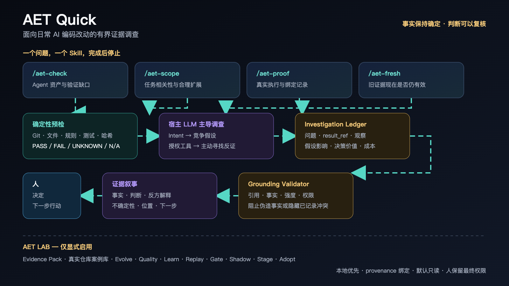

# Agent Engineering Toolkit（AET）

[](https://github.com/AdvancingTitans/agent-engineering-toolkit/actions/workflows/ci.yml)
[](https://github.com/AdvancingTitans/agent-engineering-toolkit/releases)
[](https://www.python.org/)
[](../LICENSE)
[](../README.md)

**[English](../README.md) · [简体中文](README.zh-CN.md)**

> **AET 让 AI 编码审查既有调查能力，也不允许模型编造证据。**

AI 编码 Agent 说任务已经修好、测试已经通过。AET 帮你回答三个具体问题：

1. 本次改动是否与用户任务相关？
2. 声称的验证是否真的在当前 Workspace 执行？
3. 这份 Proof 现在是否仍能代表当前代码？

工具产生可复现事实；宿主 LLM 可以恢复 Intent、提出竞争假设、调用授权工具、检查反方解释，
并形成有条件的工程判断。AET 校验证据引用、权限、结论强度和预算。最终下一步由人决定。

```text
确定性事实 → 有界 LLM 调查 → Grounding 校验 → 人工决定
```

## 四个 Quick Skill

每个 Skill 只回答一个问题，输出一个有界结果，然后停止。

| Skill | 使用时机 | 主要结果 |
| --- | --- | --- |
| `/aet-check` | Agent 指令、Skill 或完成规则可能危险、矛盾或不可验证 | 最多五个有证据的问题 |
| `/aet-scope` | 需要判断 Diff 是否符合任务，包括必要的跨模块改动 | 每组改动的范围结论和反方解释 |
| `/aet-proof` | 需要现在执行命令并与当前 Workspace 绑定 | 一个最小 JSON Proof Receipt |
| `/aet-fresh` | 需要判断旧 Proof 是否仍然有效 | 精确匹配、相关文件、Artifact、环境变化或 Unknown |

可移植宿主 Skill 位于：
[`skills/aet-check`](../skills/aet-check)、
[`skills/aet-scope`](../skills/aet-scope)、
[`skills/aet-proof`](../skills/aet-proof) 和
[`skills/aet-fresh`](../skills/aet-fresh)。确定性 CLI 用法：

```bash
aet quick check .
aet quick scope . --base main --intent aet.intent.json
aet quick proof --output .aet/proofs/auth.json \
  --relevant-path src/auth/session.py -- pytest tests/auth
aet quick fresh --proof .aet/proofs/auth.json
```

旧版 `aet audit`、`review`、`trace` 和 `evidence receipt` 在整个 1.x 周期保持兼容；
它们属于高级原生命令，不再是 Quick 默认产品入口。

## 30 秒看懂

### 调查范围，但不把路径差异直接当成越界

```bash
aet quick scope . --base main --intent aet.intent.json --format json
```

如果修复登录问题时修改了支付文件，确定性预检只记录路径不匹配，**不会**直接判定越界。
宿主继续调查直接调用、共享接口、测试、后续授权和合理反方假设，然后选择：

```text
IN_SCOPE
JUSTIFIED_EXPANSION
POSSIBLE_SCOPE_EXPANSION
OUT_OF_SCOPE
INSUFFICIENT_INTENT
```

### 记录 Proof，然后发现漂移

```bash
aet quick proof --output .aet/proofs/auth.json \
  --relevant-path src/auth/session.py -- pytest tests/auth

# 修改 src/auth/session.py

aet quick fresh --proof .aet/proofs/auth.json
```

历史命令结果不会被改写，但当前适用性变为 `RELEVANT_FILES_CHANGED`。AET 建议只重跑受影响的
Proof，而不是继续把旧绿色日志当成当前代码的证明。

仓库还提供可运行的 [Stale Proof Demo](../examples/stale-proof-demo.sh) 和
[中文完整案例](case-studies/stale-proof.zh-CN.md)。

## 一个日常 Coding 示例

以下为说明性示例，不是真实仓库测量结果。

你对 Agent 说：

> 修复偶发的登录超时，不要修改支付业务，也不要新增生产依赖。

Agent 实际修改：

```text
src/auth/session.py
src/cache/session_cache.py
src/payment/order.py
tests/auth/test_session.py
```

没有 AET 时，审查往往退化成两种简单判断：要么认为 `auth/` 外的文件都越界，要么直接相信
Agent 所说的“共享缓存和支付改动都是必要的”。`/aet-scope` 会把每组改动作为待调查假设：

```text
src/auth/session.py          IN_SCOPE
src/cache/session_cache.py   JUSTIFIED_EXPANSION
src/payment/order.py         POSSIBLE_SCOPE_EXPANSION
tests/auth/test_session.py   IN_SCOPE
```

缓存结论引用登录调用路径和聚焦回归测试；支付结论会记录合理反方解释——例如共享接口是否要求
同步修改——以及已检查的引用为什么没有支持它。结果还会明确保留“其他会话可能追加过授权”
这一不确定性，并建议拆出支付整理或补充授权。随后 `/aet-scope` 停止，不会自行跑测试或改代码。

如果你决定验证修复，`/aet-proof` 会记录真实命令与 Workspace 绑定。Agent 后续再修改
`session.py` 时，`/aet-fresh` 会把适用性改为 `RELEVANT_FILES_CHANGED`，但不会改写历史退出码。

## 引入 AET 后有什么不同

| 日常场景 | 没有 AET | 使用 AET Quick |
| --- | --- | --- |
| 修复跨出原目录 | 路径规则容易误判，或只能相信 Agent 的解释 | 调查共享改动的必要性，让无依据扩张保持可见 |
| “测试已经通过” | 一句话或旧日志很容易被重复引用 | 记录 argv、退出码、Workspace、相关文件、Artifact 和环境绑定 |
| 测试后代码继续变化 | 旧结果看起来仍是绿色 | 适用性变为精确的 Freshness 状态 |
| LLM 审查意见 | 事实、推断、反方解释和建议混在一起 | 分层输出，并引用已记录 Evidence |
| 调查不断扩大 | Agent 可能持续读取和调用工具 | 预算与停止条件返回有界结果 |

| AET Quick 能做 | AET Quick 不能做 |
| --- | --- |
| 记录可复现的 Git、命令、哈希和 Freshness 事实 | 证明所有代码绝对正确 |
| 调查改动是否是完成任务所必需 | 仅凭路径差异直接判定越界 |
| 执行并绑定用户明确要求的验证命令 | 把未执行测试写成通过 |
| 保留冲突、缺失事实与 `UNKNOWN` | 隐藏已记录反证或生成综合 Trust Score |
| 建议最小下一步 | 自动修复、Merge、Push、Publish 或进入 AET Lab |

## 可量化的取舍，不是 Trust Score

可选的 [Quick 调查对照评测](../eval/quick-investigation/README.md)按设计要求，在八个合成 Scope
场景中比较四种审查模式。已追踪的
[v1.13.0 结果](../eval/quick-investigation/results/v1.13.0.json)固定使用
`gpt-5.6-sol`、`medium` Reasoning，每个场景重复 2 次，每组 16 个 Run：

| 模式 | 有效召回 | 错误发现占比 | 平均工具调用 | 平均耗时 | 平均 Token |
| --- | ---: | ---: | ---: | ---: | ---: |
| 纯规则 | 60% | 50.0% | 0.00 | <0.001 秒 | 0 |
| 一次性 LLM | 80% | 38.5% | 0.00 | 7.33 秒 | 21,702 |
| 调查式 AET | 90% | 25.0% | 1.63 | 18.32 秒 | 64,147 |
| Grounding-aware 调查 + 项目内 Validator | 90% | 25.0% | 0.75 | 14.84 秒 | 38,831 |

结果把取舍直接展示出来：在这组小型场景中，有界调查找到了更多预期问题，错误 Claim 在全部
已输出 Claim 中的占比更低，但耗时和
Token 都高于一次性审查。Grounding 在本次样本中没有拒绝 Claim，因此没有改善上述比率；
它的拒绝路径由确定性单元测试单独证明。由于没有实际计时的人工标注，人工复核时间与用户理解
继续保持 `UNKNOWN`。这 64 个 Run 是由可重复 Harness 产生的一次有界 Lab 测量，不是通用
准确率声明，也不授权发布代码。两个调查组使用不同的 Agent 配置，因此不能把它们的成本差异
单独归因于 Validator。已发布、经过隐私检查的规范化 Run 可以独立重新评分；私有 Codex JSONL
不会发布。

## 架构



同一份已核对架构还提供[动态 SVG](assets/aet-quick-architecture-zh-CN.svg)。可以观看
[约 9 秒中文介绍视频](assets/aet-quick-intro-zh-CN.webm)或
[English introduction](assets/aet-quick-intro-en.webm)。[媒体清单](assets/aet-quick-media-manifest.json)
用内容哈希绑定双语架构图和视频，也记录视频生成时测得的 VP9 尺寸、帧数和时长；常规测试核对
文件字节与哈希，但不会重新解码视频。

这条链路刻意分离六种职责：

1. 四个 Quick Skill 限定问题，输出结果后停止；
2. CLI 记录确定性的 Git、文件、规则、命令、哈希和 Freshness 事实；
3. 宿主 LLM 恢复 Intent、提出竞争假设并选择授权工具；
4. Investigation Ledger 绑定问题、工具结果、观察、假设影响、决策价值和成本；
5. Grounding Validator 在渲染前校验已记录引用、事实、结论强度、权限和声明的预算用量；
6. 叙事层分开呈现已确认事实、工程判断、反方解释、不确定性、位置和最小下一步。

`AET Lab` 位于独立的显式启用边界之后。Quick 不会自动进入 Lab。

只有 `/aet-proof` 会由 AET 自身执行命令并生成 Receipt。其他本地或 MCP 工具结果由 Agent
Host 写入 Ledger：规范化 Payload 的哈希可以发现后续篡改，但不能独立证明外部 Host 确实
执行过调用。Host 必须保留该 Provenance，并在渲染前调用
`aet.investigation.validate_investigated_finding`；否则结果只能保持为
`HYPOTHESIS`/`UNKNOWN`。

## 为什么约束 LLM，而不是禁用 LLM

纯路径规则无法判断共享缓存改动是否是修复登录问题所必需；完全自由的 LLM 又可能在没有依据时
写出很有说服力的结论。AET 同时使用两者，并严格分配权限：

| 能力 | 确定性运行时 | 宿主 LLM |
| --- | --- | --- |
| Git Diff、哈希、退出码、Artifact、Freshness 事实 | 负责 | 不得改写 |
| Intent 恢复与竞争假设 | 提供来源 | 负责，但必须标注来源 |
| 工具选择 | 执行权限与预算校验 | 规划授权调用 |
| 工程判断 | 校验 Grounding | 有条件负责 |
| Merge、Publish、Adopt、Release 权限 | 不授予 | 不授予 |

Finding 来源保持显式：

- `DETERMINISTIC_FINDING`：由规则、命令或确定性比较直接产生；
- `INVESTIGATED_FINDING`：完成可追溯工具调查后形成；
- `HYPOTHESIS`：继续调查的方向，绝不能直接成为阻断结果。

Evidence 权威状态继续使用 `PASS`、`FAIL`、`UNKNOWN`、`NOT_APPLICABLE`。语义支持强度单独记录为
`CONFIRMED`、`SUPPORTED`、`SUPPORTED_WITH_LIMITS`、`CONFLICTED`、`UNSUPPORTED`、
`UNKNOWN` 或 `NOT_APPLICABLE`。自然语言叙事不能覆盖机器事实。

## 命令边界与预算

| Quick Skill | 默认边界 | 默认预算 |
| --- | --- | --- |
| `/aet-check` | 读取 Agent 资产和相关配置；不执行项目、不扫完整历史、不访问远端、不写文件 | 30 秒、3 轮、≤2 次 LLM、≤6 次工具、≤1 次高成本调用、≤5 个问题 |
| `/aet-scope` | 检查 Intent 与当前 Diff；不写代码；最多一个能区分假设的低成本测试 | 45 秒、4 轮、≤2 次 LLM、≤8 次工具、≤2 次授权远端只读、≤1 次高成本调用 |
| `/aet-proof` | 只执行显式 argv；默认唯一写入是用户要求的 JSON Receipt | 取决于命令；仅在定位命令时最多 1 次 LLM |
| `/aet-fresh` | 比较指定 Proof；不执行、不联网、不写入 | 3 秒，默认 0 次 LLM |

已追踪的 [v1.13.0 本地性能证据](../eval/quick-performance/results/v1.13.0.json)
在当前 253 个已追踪文件的仓库中保留每个确定性命令 30 个原始样本：Check P95 0.622 秒、
Scope P95 0.059 秒、Fresh P95 0.037 秒。[Harness 与限制](../eval/quick-performance/README.md)
使结果可在本地重算；它不是跨仓库或模型服务延迟声明。

当主导解释及合理反方解释已被检查、新证据不再改变动作、连续两次调用没有决策价值、预算耗尽、
需要新增授权、只有用户能补充事实或工具不可用时，调查停止。

预算耗尽时，AET 返回有界结果并说明未检查范围，不会静默升级为全仓库审计。

机器合同详见：
[命令边界](command-boundaries.md)、
[调查模型](investigation-model.md) 和
[Quick/Lab 边界](quick-vs-lab-boundary.md)。

## 语言行为

语言只改变面向人的叙事，不改变状态 Token、Evidence Reference、哈希或 Schema 字段。

- 用户输入斜杠式命令并使用中文提问时，宿主使用自然的简体中文解释，代码和必要技术词汇保留英文；
- 其他情况一律使用英文。

中英文叙事必须引用完全相同的事实和 `result_ref`。切换语言不能重新触发调查，也不能升级结论。

## 最小 Proof 与 Freshness

`/aet-proof` 记录：

- 精确脱敏 argv 及其摘要；
- cwd、起止时间、退出码和日志摘要；
- Git/Worktree Snapshot；
- 声明的相关文件哈希；
- Python/Platform 标识和依赖 Lockfile 哈希；
- 声明的 Artifact 哈希；
- 有界覆盖声明。

`/aet-fresh` 返回：

```text
EXACT_MATCH
RELEVANT_FILES_MATCH
HEAD_CHANGED_RELEVANT_FILES_MATCH
RELEVANT_FILES_CHANGED
ARTIFACT_CHANGED
ENVIRONMENT_CHANGED
UNKNOWN
```

旧 Trace 与 Canonical Evidence Report 继续可读。旧证据缺少相关文件或环境绑定时，AET 保留
Unknown，不会伪造并不存在的精确度。

## 真实仓库审查案例库

Repository Audit Showcase 继续作为受支持的 **AET Lab** 案例库，但不属于 Quick 默认流程。
它包含三个公开 Agent 仓库的 commit 锁定、纯静态审查：

| 案例 | 有界审查范围 | Evidence 结果 | 报告 |
| --- | --- | --- | --- |
| SWE-agent | Agent 循环、工具交互、Trajectory、完成证据 | 4 个 `PASS`、1 个 `UNKNOWN` | [简体中文](../repository-audit-showcase/reports/swe-agent/audit-result/zh-CN/audit-report.md) · [English](../repository-audit-showcase/reports/swe-agent/audit-result/en/audit-report.md) |
| Google ADK | Agent 架构、工具治理、评估反馈 | 5 个 `PASS` | [简体中文](../repository-audit-showcase/reports/google-adk/audit-result/zh-CN/audit-report.md) · [English](../repository-audit-showcase/reports/google-adk/audit-result/en/audit-report.md) |
| OpenHands | 应用编排、运行隔离、外部 Agent-core 边界 | 4 个 `PASS`、1 个 `UNKNOWN` | [简体中文](../repository-audit-showcase/reports/openhands/audit-result/zh-CN/audit-report.md) · [English](../repository-audit-showcase/reports/openhands/audit-result/en/audit-report.md) |

```bash
aet audit swe-agent --repo /path/to/SWE-agent
aet audit google-adk --repo /path/to/adk-python
aet audit openhands --repo /path/to/OpenHands
```

每次运行只扫描锁定的本地 Checkout，不执行上游代码或测试，不安装上游依赖，不复制源码正文，
也不允许 LLM 创建或修改 Showcase Finding。每个案例写出两个共享机器产物，并为 `en/` 与
`zh-CN/` 各生成五项经过审核的人类可读产物。详见
[范围与发布边界](../repository-audit-showcase/docs/scope-and-publication.md)。
这些状态统计描述的是有界 Evidence Contract，不是对上游仓库的综合质量评分。

## AET Quick 与 AET Lab

| 层级 | 用户 | 能力 | 默认状态 |
| --- | --- | --- | --- |
| AET Quick | 日常使用 Coding Agent 的开发者 | Check、Scope、Proof、Fresh | 分别安装与调用 |
| 可选扩展 | 需要项目 Provenance 的团队 | Context、Decision、Evolve | 显式请求 |
| AET Lab | Agent 工程师、Skill/平台作者 | Evidence Pack、Showcase、Quality、Learn、Replay、Gate、Tournament、Shadow、Stage、Adopt、统计分析 | 仅显式启用 |

现有 Lab 命令和 canonical
[`agent-engineering-toolkit` 兼容 Skill](../skills/agent-engineering-toolkit)
继续保留。Quick 不会预加载其 Reference，不会执行真实宿主 Rollout，不会生成大型 HTML/SVG
Bundle，也不会执行治理资产 Adoption。

## 安全与权限

- 默认本地、只读；
- `/aet-proof` 只执行 `--` 后的显式 argv；
- 显式 Proof 请求只授权写入对应 Receipt，不授权其他写入；
- Quick 不需要 Credential，凭据不得进入持久 Evidence；
- 禁止远端写入、`git push`、发布、关闭 Issue、破坏性 Shell、自动修复和自动 Adoption；
- 远端只读与项目执行必须符合当前 Skill 的策略和预算；
- 缺失证据保持 `UNKNOWN`，不生成综合 Trust Score；
- 模型生成的判断绝不能成为唯一 Release Gate。

详见[安全与保留策略](security-and-retention.md)和
[稳定性契约](stability.md)。

## 安装与开发

从当前源码 Checkout 安装 Quick Runtime：

```bash
uv tool install .
```

根据 Agent Host 的能力安装或复制需要的 Quick Skill 文件夹。没有原生 Skill Loader 的宿主，
可以把对应 `SKILL.md` 作为任务指令加载，并调用相同 CLI。

本地开发：

```bash
git clone https://github.com/AdvancingTitans/agent-engineering-toolkit.git
cd agent-engineering-toolkit
uv run --no-editable python -m unittest discover -s tests
```

AET 使用 Python 3.11+，确定性运行时保持轻依赖。贡献新规则时必须同时提供 clean/failing Fixture，
保留 Evidence Provenance，并且不能把 Quick 命令扩张为另一个问题。参见
[CONTRIBUTING](../CONTRIBUTING.md)。

## 高级文档

- [Rule Catalog](rule-catalog.md)
- [Evidence 与交付 Workflow](../skills/agent-engineering-toolkit/references/delivery-workflow.md)
- [Repository Audit Showcase](../skills/agent-engineering-toolkit/references/repository-audit-showcase.md)
- [Provenance Workflow](../skills/agent-engineering-toolkit/references/provenance-workflow.md)
- [Quality Workflow](../skills/agent-engineering-toolkit/references/quality-workflow.md)
- [Lab Evolution Workflow](../skills/agent-engineering-toolkit/references/evolution-workflow.md)
- [Changelog](../CHANGELOG.md)

## License

[MIT](../LICENSE)
