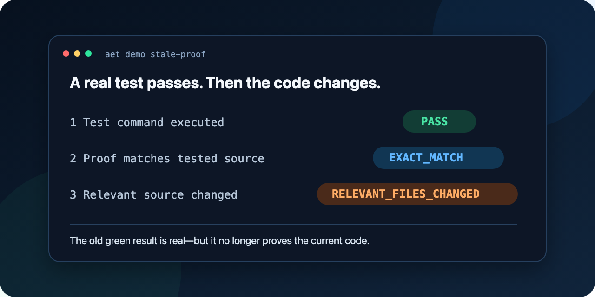

# Agent Engineering Toolkit

[English](../README.md) · [五分钟入门](start-here.md) · [完整产品参考](reference/full-product-overview.md)

> **AI 编程 Agent 说“测试通过”时，AET 会告诉你它测的究竟是不是现在这份代码。**

**面向 AI 编程 Agent 的可携证工作流。** AET 将测试执行、变更文件、产物与
Agent 声明绑定为可移交证据，并在证据不再适用于当前代码时明确报告。

```bash
uvx --from agent-engineering-toolkit aet demo stale-proof
```

> PyPI 当前仍是 v1.11.1。上面的命令是 v1.18.0 目标接口；在该版本实际发布
> 前，不得用于对外发布。候选版本应安装 CI 生成的精确 wheel。

```text
AET stale-proof demo

1. Test command executed                    PASS
2. Proof matches the tested source          EXACT_MATCH
3. Source changed without rerunning tests   RELEVANT_FILES_CHANGED

The test really passed, but that proof no longer applies to the current code.
Demo result: PASS
```



AET 不是另一个编程 Agent，也不替代测试或 CI。它不会把缺失证据改写成
`PASS`，不会自动编辑、提交、推送、合并或发布。

## 这个演示实际证明了什么

安装后的 demo 会在临时 Git 仓库中真实运行标准库 `unittest`，用 Quick
Proof 把测试结果绑定到 fixture 源码，确认 `EXACT_MATCH`，然后在不重新
测试的情况下修改一个已声明的相关文件。AET 随后报告
`RELEVANT_FILES_CHANGED`。

这说明测试确实运行并通过，但旧证据已经不再适用于变更后的代码。它不证明
所有测试都通过、不证明 Agent 实现一定正确，也不授予合并或发布权限。
Git、fixture 或文件系统不可用时，结果会保持 `UNAVAILABLE`、`UNKNOWN`
或非零退出，不会伪造成功。

## 四个 Quick Skill

| 需要回答的问题 | Skill | CLI |
| --- | --- | --- |
| Agent 指令是否可用、可验证？ | `/aet-check` | `aet quick check .` |
| diff 是否仍在授权任务内？ | `/aet-scope` | `aet quick scope . --base main --intent aet.intent.json` |
| 这条命令是否在这些文件上运行？ | `/aet-proof` | `aet quick proof --output proof.json --relevant-path src/app.py -- python -m unittest` |
| 旧 proof 是否仍适用？ | `/aet-fresh` | `aet quick fresh --proof proof.json` |
| 在不编辑代码前，哪里应该改？ | `/aet-plan` | `aet plan context ...` |

前四个是日常 Quick 入口。`/aet-plan` 是独立的只读 `PROPOSED` 规划交接；
它不执行修改，也不授予验证权限。

## 安装

```bash
uv tool install agent-engineering-toolkit
```

Agent Skills：

```bash
npx skills add AdvancingTitans/agent-engineering-toolkit
```

skills.sh CLI 会统计匿名安装量；可通过下面的方式退出：

```bash
DISABLE_TELEMETRY=1 npx skills add AdvancingTitans/agent-engineering-toolkit
```

该统计属于 skills.sh CLI，AET 本身不增加遥测、账号、API Key、模型调用
或云服务。

## 从这里继续

- [stale proof 深度案例](use-cases/stale-proof.md)
- [scope drift](use-cases/scope-drift.md)
- [跨 Agent 证据交接](use-cases/cross-agent-handoff.md)
- [Codex](integrations/codex.md)、[Claude Code](integrations/claude-code.md)、
  [Cursor](integrations/cursor.md)、[GitHub Actions](integrations/github-actions.md)
- [状态与 authority](reference/status-and-authority.md)
- [完整技术总览](reference/full-product-overview.md)

Portable Evidence Bundle、Evidence Atlas、Improvement、Evidence-Guided
Planner、评测、Schema、Release Gate 和 Repository Evolution 都继续保留，
只是不会同时挤在首屏。

Freshness 状态保持明确：`EXACT_MATCH`、`RELEVANT_FILES_MATCH`、
`HEAD_CHANGED_RELEVANT_FILES_MATCH`、`RELEVANT_FILES_CHANGED`、
`ARTIFACT_CHANGED`、`ENVIRONMENT_CHANGED` 或 `UNKNOWN`。

## Evidence-Guided Planner

v1.17 Planner 是建立在 v1.16 Evidence 上、独立且只读的 `PROPOSED`
表面。它执行 bounded localization，保留 `NEEDS_EVIDENCE` 和 `UNKNOWN`，
不实施编辑，也不保证找到了所有修改点。在一个有边界的真实案例里，生产路径
决策精度从 44.44% 提升到 100%（+55.56 个百分点）；这不是通用模型质量结论。

## 真实仓库审查案例库

固定 commit 的静态案例仍保留在[完整技术总览](reference/full-product-overview.md)。

<!-- atlas-self-review-mermaid:start -->

```mermaid
flowchart LR
    %% Evidence Atlas
    N_0b51dce8fe915eda{"[CONFLICT] The Bundle v1 change-scope view alone proves complete real diff grouping."}
    N_6f91af1641ed1424{{"[SUPPORTED] AET projects ten fixed evidence perspectives and exposes complex nodes as recursive Viewer subg..."}}
    N_8575658723b5d49d{{"[SUPPORTED] AET builds a canonical Evidence Graph from source-backed Bundle records without letting Mermaid..."}}
    N_5522d8dace1cb6e7{"[CONFLICT] Path binding is useful for scope context but insufficient to prove complete real diff grouping."}
    N_ac65699e766edc85["[UNKNOWN] Unresolved conflict conflict-change-scope-v1"]
    N_ef4722a060cacfda["[VERIFIED] Bundle Evidence records can bind facts to repository paths."]
    N_1ded0fae46344828["[VERIFIED] The Portable Evidence v1 Evidence record schema does not define an explicit Change Group field."]
    N_c075a66077dd6940["[VERIFIED] The Graph Builder creates canonical nodes and source-backed edges."]
    N_e824b2ad012b224e["[VERIFIED] The Perspective module defines ten fixed deterministic projections."]
    N_a42d56cfe9dff13d["[VERIFIED] The offline Viewer contains recursive subgraph navigation."]
    N_f797fb20a8448aa0["[RECORDED] Review AET's own Evidence Atlas implementation and retain support, counter-evidence, limitation..."]
    N_a17fb3165e6b0db5["[RECORDED] The view must display UNKNOWN rather than infer real diff groups."]
    N_6630b028247f1a08["[RECORDED] Rendering success still requires the packaged Mermaid runtime."]
    N_2eb930959384d64c["[OMITTED] 17 lower-priority nodes"]
    N_0b51dce8fe915eda -.->|"contradicted by"| N_1ded0fae46344828
    N_0b51dce8fe915eda -->|"limited by"| N_a17fb3165e6b0db5
    N_0b51dce8fe915eda ==>|"supported by"| N_ef4722a060cacfda
    N_5522d8dace1cb6e7 -.->|"contradicted by"| N_1ded0fae46344828
    N_5522d8dace1cb6e7 -->|"leaves unknown"| N_ac65699e766edc85
    N_5522d8dace1cb6e7 -.->|"contradicted by"| N_ef4722a060cacfda
    N_6f91af1641ed1424 -->|"limited by"| N_6630b028247f1a08
    N_6f91af1641ed1424 ==>|"supported by"| N_a42d56cfe9dff13d
    N_6f91af1641ed1424 ==>|"supported by"| N_e824b2ad012b224e
    N_8575658723b5d49d ==>|"supported by"| N_c075a66077dd6940
    N_0b51dce8fe915eda -->|"answers"| N_f797fb20a8448aa0
    N_6f91af1641ed1424 -->|"answers"| N_f797fb20a8448aa0
    N_8575658723b5d49d -->|"answers"| N_f797fb20a8448aa0
    classDef verified fill:#dcfce7,stroke:#166534,color:#052e16,stroke-width:2px
    classDef observation fill:#e0f2fe,stroke:#0369a1,color:#082f49
    classDef candidate fill:#fef3c7,stroke:#92400e,color:#451a03,stroke-dasharray:5 3
    classDef supported fill:#ede9fe,stroke:#6d28d9,color:#2e1065,stroke-width:2px
    classDef unsupported fill:#fee2e2,stroke:#b91c1c,color:#450a0a,stroke-width:2px,stroke-dasharray:5 3
    classDef conflict fill:#fee2e2,stroke:#b91c1c,color:#450a0a,stroke-width:2px
    classDef unknown fill:#f3f4f6,stroke:#4b5563,color:#111827,stroke-dasharray:5 3
    classDef stale fill:#ffedd5,stroke:#c2410c,color:#431407,stroke-dasharray:3 3
    classDef authorization fill:#ecfccb,stroke:#3f6212,color:#1a2e05
    classDef omitted fill:#f3f4f6,stroke:#6b7280,color:#111827,stroke-dasharray:2 3
    classDef evidenceDefault fill:#ffffff,stroke:#475569,color:#0f172a
    class N_0b51dce8fe915eda conflict
    class N_6f91af1641ed1424 supported
    class N_8575658723b5d49d supported
    class N_5522d8dace1cb6e7 conflict
    class N_ac65699e766edc85 unknown
    class N_ef4722a060cacfda verified
    class N_1ded0fae46344828 verified
    class N_c075a66077dd6940 verified
    class N_e824b2ad012b224e verified
    class N_a42d56cfe9dff13d verified
    class N_f797fb20a8448aa0 evidenceDefault
    class N_a17fb3165e6b0db5 evidenceDefault
    class N_6630b028247f1a08 evidenceDefault
    class N_2eb930959384d64c omitted
```
<!-- atlas-self-review-mermaid:end -->

如需报告安全问题，请先阅读 [SECURITY](../SECURITY.md)；其他问题按
[SUPPORT](../SUPPORT.md) 分流。项目采用 MIT License。
