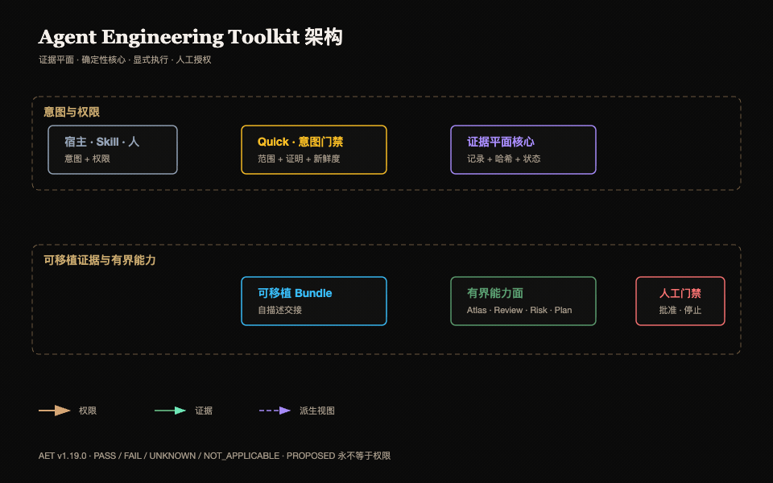
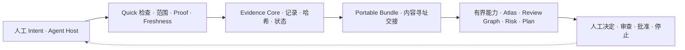
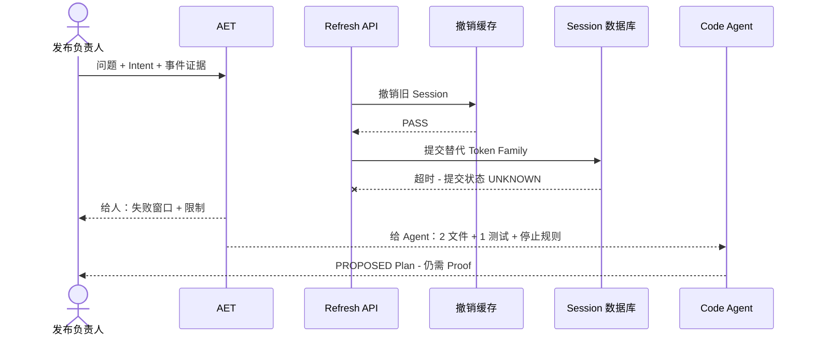

# Agent Engineering Toolkit

[English](../README.md) · [五分钟入门](start-here.md) · [完整技术参考](reference/full-product-overview.md) · [v1.19.1 Release](https://github.com/AdvancingTitans/agent-engineering-toolkit/releases/tag/v1.19.1)

> **编程 Agent 可以说“完成了”；AET 负责说明真实发生了什么、证明了什么、哪里已经变化，以及什么必须保持 `UNKNOWN`。**

**AET 是面向编程 Agent 的本地证据平面（Evidence Plane）。** 它把指令、
Git 状态、命令执行、产物、Agent 运行轨迹和审查约束编译成哈希绑定、可验证、
可裁剪、可移交的工程证据。

AET 不是另一个编程 Agent，也不替代测试或 CI。它不会补全缺失事实，不会自动
编辑、提交、推送、合并、发布、撤权或执行干预。

```bash
uvx --from https://github.com/AdvancingTitans/agent-engineering-toolkit/releases/download/v1.19.1/agent_engineering_toolkit-1.19.1-py3-none-any.whl aet demo stale-proof
```

```text
1. Test command executed                    PASS
2. Proof matches the tested source          EXACT_MATCH
3. Source changed without rerunning tests   RELEVANT_FILES_CHANGED

测试确实通过，但这份 proof 已不再适用于当前代码。
Demo result: PASS
```

## 安装前先看懂 AET



[静态 SVG](assets/aet-architecture-dark-luxury-zh-cn.svg) ·
[高清 PNG](assets/aet-architecture-dark-luxury-zh-cn.png) ·
[30 秒中文介绍](assets/aet-product-intro-zh-CN.mp4) ·
[English video](assets/aet-product-intro-en.mp4)

动态图是产品结构说明，不是运行时遥测。全部图片和视频都存放在仓库内，不含
追踪脚本或外部资源。

## AET 的最新定义


```mermaid
flowchart LR
    U["人工 Intent · Agent Host"]
    Q["Quick 检查 · 范围 · Proof · Freshness"]
    E["Evidence Core · 记录 · 哈希 · 状态"]
    B["Portable Bundle · 内容寻址交接"]
    S["有界能力 · Atlas · Review Graph · Risk · Plan"]
    H["人工决定 · 审查 · 批准 · 停止"]
    U --> Q
    Q --> E
    E --> B
    B --> S
    S --> H
    H -.-> U
```

权威状态始终是 `PASS`、`FAIL`、`UNKNOWN`、`NOT_APPLICABLE`；建议始终
保持 `PROPOSED`。Freshness 独立报告为 `EXACT_MATCH`、
`RELEVANT_FILES_MATCH`、`HEAD_CHANGED_RELEVANT_FILES_MATCH`、
`RELEVANT_FILES_CHANGED`、`ARTIFACT_CHANGED`、`ENVIRONMENT_CHANGED`
或 `UNKNOWN`。

## 四个 Quick Skill

| 需要回答的问题 | Skill | CLI |
| --- | --- | --- |
| 指令和 Skill 是否可用？ | `/aet-check` | `aet quick check .` |
| diff 是否仍在授权 Intent 内？ | `/aet-scope` | `aet quick scope . --base main --intent aet.intent.json` |
| 这条 argv 是否在这些文件上真实运行？ | `/aet-proof` | `aet quick proof --output proof.json --relevant-path src/app.py -- python -m unittest` |
| 已有 proof 是否仍适用？ | `/aet-fresh` | `aet quick fresh --proof proof.json` |

一次只用一个入口回答一个问题。`/aet-plan` 是第五个、独立且只读的规划
Skill；它不授予编辑或验证权限。

## 从证据走向行动，但不混淆权威

| 能力 | 交付物 | 明确不声称什么 |
| --- | --- | --- |
| Quick + Intent Gate | 预检、范围事实、Proof、Freshness | 退出码代表完整正确性 |
| Portable Evidence Bundle | 跨 Agent JSON/JSONL + Markdown | 渲染时创造新事实 |
| Evidence Atlas | Canonical Graph + 11 个确定性 Perspective | 整体可信度分数 |
| Improvement + Planner | 有界 Issue 与 `PROPOSED` 编辑计划 | 已实施、已验证 |
| Review Graph | 含代码、证据、范围、测试和停止规则的根切片 | 快照漂移后继续使用旧上下文 |
| Behavioural Risk Diagnosis | 三项可观察因子与 `PROPOSED` 干预 | 内部动机、整体风险分或已验证预测 |
| Learn + Repo Archaeologist | 有门禁的本地演进与带引用的仓库历史 | 自动采纳或模型训练 |

## v1.19：图优先审查与行为风险诊断

Review Graph 借鉴
[`code-review-graph`](https://github.com/tirth8205/code-review-graph) 的图优先
思想，但解决的是 AET 自己的问题：不仅回答“哪些代码相连”，还要让证据、授权
范围、保护路径、验证命令、限制和停止条件一起进入审查上下文。

| 冻结的 AET 审查案例 | 首次读取字节 | 边界 |
| --- | ---: | --- |
| Bundle + Improvement + 源码的等价最小原始材料 | 8,468 | 内容完整，但输入形态无界 |
| 旧 Agent Task + 两张 Mermaid | 6,522 | 易读，快照绑定较弱 |
| v1.19 Review Graph 根切片 | 6,505 | 12 节点、13 边、哈希绑定、按需展开一跳 |

根切片比等价原始材料减少 **23.2%**，并比旧投影少 17 字节，同时补入代码关系
和 Freshness 停止条件。这只是一个冻结 Python 案例，不是普适 Token 节省或模型
质量结论。`code-review-graph` 在多语言、增量结构索引上更广；AET Review
Graph 以证据与 authority 为先，目前索引 Python AST。详见
[方法与边界](review-graph.md)和[事实对比](comparisons/aet-vs-code-review-graph.md)。

`aet risk diagnose` 新增本地、确定性的 Lab 诊断：相对显式 Intent 的目标偏离、
当前部署中已证明的危害实现能力、针对声明监控面的可观察抵抗行为。结果带原始
记录引用，缺失覆盖保持 `UNKNOWN`，干预始终是 `PROPOSED`，不会自动执行。
本 Release 将 Forecast 硬性锁定为研究态。详见
[行为风险诊断](behavioural-risk-diagnosis.md)。

## Evidence-Guided Planner

v1.17 Planner 仍是建立在 v1.16 Evidence 上、独立且只读的 `PROPOSED`
能力。它执行 bounded localization，保留 `NEEDS_EVIDENCE` 和 `UNKNOWN`，
不保证找到了所有修改点。在一个有边界的真实案例里——不是通用模型质量结论——
生产路径判断精确率从 44.44% 提升到 100%（+55.56 个百分点）。详见
[Planner 契约](evidence-guided-planner.md)。

## 案例库

### 现实生产形态：认证刷新发布审查

真实痛点很直接：事件工单、日志、diff 和测试结果彼此分散。人只能看到 Agent
自信的文字总结，却看不见失败窗口；Agent 需要重新吞入大段仓库上下文，还可能
误改签名或配置。AET 实现一个与当前快照绑定的 Review Package，再按读者分流：

| 人问什么 | AET 实现什么 | 现实结果 |
| --- | --- | --- |
| “为什么 Refresh 仍返回 401、允许改哪里、现在能上线吗？” | 绑定 Intent + 事件 Evidence + 代码关系 + 保护范围 + Proof Freshness | 人看见为何上线仍是 `UNKNOWN`；Agent 只收到 2 个文件、1 条测试、Evidence ID 与停止规则 |


```mermaid
sequenceDiagram
    actor H as 发布负责人
    participant A as AET
    participant R as Refresh API
    participant C as 撤销缓存
    participant D as Session 数据库
    participant G as Code Agent
    H->>A: 问题 + Intent + 事件证据
    R->>C: 撤销旧 Session
    C-->>R: PASS
    R->>D: 提交替代 Token Family
    D--xR: 超时 - 提交状态 UNKNOWN
    A-->>H: 给人：失败窗口 + 限制
    A-->>G: 给 Agent：2 文件 + 1 测试 + 停止规则
    G-->>H: PROPOSED Plan - 仍需 Proof
```

这就是 AET 解决的事：人不再审批一段不透明叙述，Agent 也不必再次读取完整
上下文；两种输出绑定同一 Evidence 与 Git 快照，漂移就停止。这是冻结的现实
生产形态案例，不冒充客户事故。详见
[完整的人类/Agent 输出](use-cases/production-auth-refresh-review.zh-CN.md)。

| 案例 | 复现或阅读 | 证明边界 |
| --- | --- | --- |
| 过时测试 Proof | [60 秒案例](use-cases/stale-proof.md) | 历史 PASS 可能已不适用 |
| Scope drift | [Intent 绑定案例](use-cases/scope-drift.md) | 相关的多文件改动不等于越界 |
| 跨 Agent 交接 | [Portable Bundle](use-cases/cross-agent-handoff.md) | 消费方无需安装 AET |
| 证据引导改进 | [可执行示例](../examples/evidence-grounded-improvement/README.md) | 建议不能提升自己的证据强度 |
| Review Graph | [根切片与 fail-closed](review-graph.md) | 过期或篡改的包会停止 |
| 行为诊断 | [Fixture 与 Policy](../examples/risk/README.md) | 诊断不等于预测 |
| Planner | [三个有界场景](../examples/evidence-guided-planner/README.md) | Plan 始终是 `PROPOSED` |
| 认证刷新发布 | [人类视图与 Agent 切片](use-cases/production-auth-refresh-review.zh-CN.md) | 动态解释不等于编辑或上线权限 |

## 真实仓库审查案例库

固定 commit 的静态报告包括
[SWE-agent](../repository-audit-showcase/reports/swe-agent/audit-result/zh-CN/audit-report.md)、
[OpenHands](../repository-audit-showcase/reports/openhands/audit-result/zh-CN/audit-report.md)
和 [Google ADK](../repository-audit-showcase/reports/google-adk/audit-result/zh-CN/audit-report.md)。
它们是带引用的仓库考古，不是背书或实时健康结论。

## 安装与接入

| 路径 | 命令 | 当前状态 |
| --- | --- | --- |
| 精确 GitHub Release | `uv tool install https://github.com/AdvancingTitans/agent-engineering-toolkit/releases/download/v1.19.1/agent_engineering_toolkit-1.19.1-py3-none-any.whl` | v1.19.1 |
| 公共 PyPI | `uv tool install agent-engineering-toolkit` | v1.18.0；不含 v1.19 Review Graph/Risk |
| Agent Skills | `DISABLE_TELEMETRY=1 npx skills add AdvancingTitans/agent-engineering-toolkit` | 外部 skills.sh CLI |

AET 本身不增加产品遥测、账号、API Key、模型调用或云服务。Git 绑定工作流需要
Python 3.11+ 与 Git。

接入：[Codex](integrations/codex.md) · [Claude Code](integrations/claude-code.md) ·
[Cursor](integrations/cursor.md) · [GitHub Actions](integrations/github-actions.md) ·
[MCP](integrations/mcp.md) ·
[Python/TypeScript 消费](protocols/portable-evidence-bundle-v1.md)

## 安全、限制与信任

- 先读[状态与 authority](reference/status-and-authority.md)、
  [命令边界](command-boundaries.md)和[安全策略](../SECURITY.md)。
- AET 默认本地、只读；`trace`、Quick Proof 和显式 observed gate 是命名的
  执行边界。
- Secret 脱敏是纵深防御，不代表允许保留原始私密 transcript。证据缺失、篡改、
  过期或 actor 不明确时一律 fail closed。
- 项目协作入口：[Support](../SUPPORT.md)、[Contributing](../CONTRIBUTING.md)、
  [Roadmap](../ROADMAP.md)、[Governance](../GOVERNANCE.md)。

MIT License。
