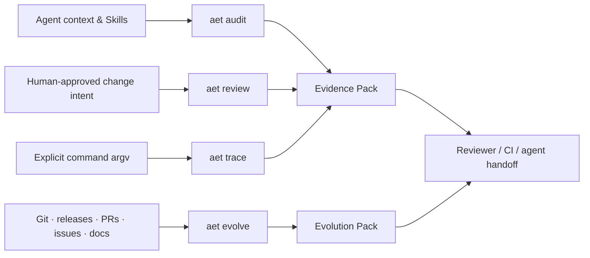
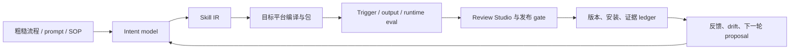
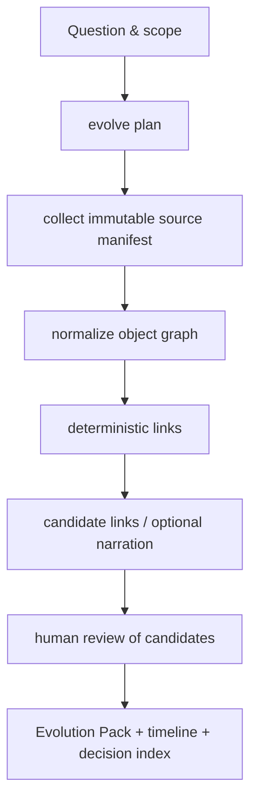

# Agent Engineering Toolkit 产品化实施方案

**状态：** 已在 `v1.0.0` 实现并以本仓库作为 release candidate 验证；后续以兼容性与真实 dogfood 为主。  
**基线：** `v0.3.0` / `93d5a56`（2026-07-11）  
**调研对象：** `yaojingang/yao-meta-skill` @ `4eb11f923dc71173736ebf541a7eebfff942d10e`（2026-07-06）

## 一页决策

`aet` 不应演化成一个泛化的 “Skill OS”，而应成为 Coding Agent 的
**Evidence Plane（证据平面）**：将上下文、变更意图、实际执行和仓库演进
分别转为可复核、可携带、可拒绝过度结论的证据。

产品由四个相互独立但可组合的面组成：

| 产品面 | 用户问题 | 现状 | 最终产物 |
| --- | --- | --- | --- |
| Context & Skill Hygiene | Agent 读取的规则和 Skill 还可信吗？ | `audit` 已实现基础规则 | Audit report / SARIF |
| Intent Change Control | 此次 Agent diff 是否在批准范围内，证明是否充分？ | `review` 已实现基础路径与证据存在性 | Review report |
| Execution Evidence | 哪个命令实际运行了、输出能否安全地随交付携带？ | `trace` 与 `evidence pack` 已实现 | Trace / Evidence Pack |
| Repository Evolution | 陌生仓库为何演变至今，决策由什么证据驱动？ | 未实现 | Evolution Pack / Timeline / Decision Index |

第四项以 `aet evolve` 落地；它就是 **Repo Archaeologist**，不是独立项目，
也绝不成为前三项的运行前置条件。前三区可完全离线、确定性运行；`evolve`
可选地使用本地 Git、GitHub API、用户提供的 Issue/PR 导出与模型辅助叙述。



## 原方案完成度审计

原始设计锁定的策略是“先做可确定性验证的工程门禁，延后 Repo
Archaeologist、Prompt Diff、Memory Optimizer 与自动改写”。这个取舍仍然正确。
活跃工作区而非归档工作区已到 `v0.3.0`，因此不能把 v0.2/v0.3 误报为未完成。

| 原承诺 | 状态 | 已有证据 | 尚缺的产品化部分 |
| --- | --- | --- | --- |
| Phase 0：三仓 dogfood、版本回退、项目记忆 | 完成 | `docs/dogfood/`、`phase-0-dogfood` | 需要把 dogfood 扩展为回归样本与用户可理解的案例库。 |
| v0.1 Context/Skill Audit | 完成（最小集） | `audit`、JSON/Markdown/SARIF、4 类 fixture 测试 | 尚未覆盖原规则目录中的指令冲突、过期命令/依赖、MCP 声明一致性、按需加载路由质量、权限/副作用契约。 |
| v0.2 Intent Gate | 完成（最小集） | `review`、路径预算、allowed paths、proof 文件存在性 | 仅 JSON；proof 未与实际 Trace 绑定；未建模依赖、配置、迁移、权限、公共 API 等影响面；没有 PR/交付摘要视图。 |
| v0.3 Trace + Evidence Pack | 完成（最小集） | 显式 argv、日志脱敏、内容哈希、原子写、可缺失组件 | Evidence Pack 只有 JSON；trace 尚未映射到某一 required proof；没有 run manifest、可读交付摘要、签名/保留策略或跨 pack 一致性检查。 |
| 跨 Agent Skill | 完成（基础版） | 可移植 `SKILL.md`、cross-agent contract | 缺少意图收集模板、场景化路由、示例、安装/升级验证矩阵及 `evolve` 路由。 |
| Repo Archaeologist / `aet evolve` | 未开始 | 仅产品记忆中的保留决策 | 本方案的核心新增场景；需要本地 Git 与 GitHub 数据模型、来源适配器、关联规则、叙事证据合同及 fixture。 |
| 发布治理 | 部分完成 | 本地 wheel 验证、Git tag、项目记忆 | 尚未看到远端发布、CI release、兼容性矩阵、变更日志、安装遥测或升级检查。 |

### 当前必须先处理的卫生问题

1. README 末尾仍写着“Evidence Pack 和 Trace planned / not implemented”，与
   `v0.3.0` 及项目记忆冲突，应在 `v0.3.1` 修正。
2. 对仓库根目录执行 `aet audit . --strict` 会发现 `tests/fixtures/broken_project`
   的故意失败样本，并返回 `FAIL 3 / UNKNOWN 1`。这不是产品本身失效，但表明
   `audit` 还没有排除/配置边界，不能充当自己的根目录 CI gate。
3. 目前 `aet.intent.json` 是一次性 release 合同，会被下一次变更覆盖。意图合同
   应当版本化放在 `.aet/intents/`（或可追踪的 `docs/intents/`），并在 Evidence
   Pack 中记录其精确哈希。

这些问题均为产品化缺口，不能通过文档解释为“已经验证”。

## 对 yao-meta-skill 的深度分析

### 方法论与工作流

Yao 的核心不是单一 `SKILL.md`，而是将一个复用工作流视作长期维护的产品资产：



它最值得借鉴的五点是：

1. **语义先于文件。** Skill IR 先定义触发、输入、输出、边界、资源和证据；平台
   文件只是编译目标。这样可以避免不同 Agent 的同一工作流逐渐分叉。
2. **轻入口、重按需资源。** 入口保持短，把稳定理论放入 references、可执行检查
   放入 scripts、审查结果放入 reports。这与 AET 的 Evidence Pack 非常契合。
3. **Gate 由成熟度选择。** `scaffold → production → library → governed` 不要求每个
   Skill 都承担同样的审计、测试和维护成本。
4. **证据分层，而不是完成幻觉。** 它把本地可验证、需要人工、需要外部系统的缺口
   分开记录；`world-class` 结论不能由计划或模型输出替代。
5. **报告即审查接口。** Trigger scorecard、output eval、install simulation、trust
   report、waiver、evidence ledger 被汇总进 Review Studio，审查者可从一个 gate
   追到原始证据。

### 其输出产物与建模

Yao 的产物可归为六类：

| 类别 | 代表产物 | 对 AET 的启示 |
| --- | --- | --- |
| 语义契约 | Skill IR、intent dialogue、manifest | AET 需要较小的 `Evidence IR`，而不是复制完整 Skill IR。 |
| 结构/可移植性 | 编译目标、conformance matrix、install simulation | 保留跨 Agent Skill 与包安装验证，勿过早维护多个 target compiler。 |
| 行为质量 | trigger case、route confusion、with-skill vs baseline、failure taxonomy | 为 AET 的规则与 `evolve` 建立正/负 fixture、golden report、失败库。 |
| 治理 | owner、maturity、review cadence、promotion、waiver | 为发布物设置明确 owner/周期与 waiver，特别适合团队使用的 AET。 |
| 证据呈现 | Review Studio、scorecard、ledger、operator runbook | AET 应提供静态 HTML/Markdown evidence viewer，但 JSON 保持 canonical。 |
| 运营反馈 | metadata-only telemetry、adoption drift、proposal queue | 先保留接口；只有真实使用样本后再做，并且所有写入仍须审批。 |

### 加权分析：应学习边界，不能照搬分数

Yao 的 README 给出公开的 100 分加权 benchmark：Method Depth 15、Context
Discipline 10、Toolchain 15、Eval/Test 20、Governance 15、Portability 10、
Onboarding/Review 5、Local Reliability 10；公式为
`sum(dimension_score / 10 * weight)`。它还将治理拆为 metadata integrity、
ownership/review、boundary/eval、operational assets、maintenance evidence 等
可见分项，并在路由中使用带负向概念惩罚的语义阈值与 margin。

这很适合作为 **设计复盘框架**，但不应成为 AET 的通行证，原因是：

- 加权是价值取向，权重必然主观；它不能证明一个远端服务可达，也不能证明一次
  测试的语义正确。
- Yao 自身也明确把本地工程评分、人工盲评和外部/原生运行证据区分开；单一人类
  reviewer 的 5/5 盲评不是普遍性能证明。
- AET 的品牌承诺正是“不把风险压成一个不透明分数”。若把分数当 PASS，会破坏
  Evidence First 的边界。

**采用策略：** 允许带公式的分数只用于排序待办或建议人工复核；每个分数显示输入、
权重、版本和缺失项，且不得改变 PASS/FAIL/UNKNOWN。发布是否放行仍由明确的硬 gate
决定。

### 迁移矩阵

| Yao 能力 | AET 决策 | 原因 |
| --- | --- | --- |
| 语义 IR、资产边界 | 采用精简版 Evidence IR | 可统一 audit/review/trace/evolve，避免 JSON 漂移。 |
| 成熟度与 gate selection | 采用 | 让个人离线仓库不背负 governed 级成本。 |
| eval 分层、failure library、golden artifacts | 采用 | 直接提升规则与考古叙事的可回归性。 |
| Review Studio / ledger | 适配 | 生成静态 viewer，不引入 SaaS 或 dashboard runtime。 |
| target compiler / registry | 延后 | AET 当前只有一个可移植 Skill；没有足够用户需求证明多目标编译器的维护成本。 |
| 自动 telemetry / adaptive patch | 延后且审批 | 没有真实使用信号前只会制造假精确；永不自动写源文件。 |
| LLM/Judge 作为硬 gate | 拒绝 | 模型只能生成带引用的候选解释，不能单独宣布成功或失败。 |
| “91.5/100”型总评 | 拒绝作为 gate | 可以作为可解释的产品自评，不可覆盖原子 finding。 |

## 目标产品与使用场景

### 用户承诺

> AET 让 Coding Agent 的输入约束、改动边界、执行事实与仓库历史都带着可定位的
> 证据离开当前对话；没有证据的部分明确是 UNKNOWN。

| 场景 | 用户触发 | AET 行为 | 交付 |
| --- | --- | --- | --- |
| Agent 开工前 | “审查这个 Agent 项目 / Skill” | `audit` 检查可发现资产、边界、引用、权限与路由 | Audit report + remediation |
| Agent 改动前/后 | “审查这次 Agent diff” | `review` 比较可审查 intent、变更预算、影响声明、proof | Review report |
| 交付与 CI | “附上可验证证据” | 显式 trace、绑定 proof、编译 pack | Evidence Pack + 人类摘要 |
| 陌生仓库上手 | “为什么这里有这套设计？” | `evolve` 收集并关联本地 Git/GitHub 历史，回答问题 | Evolution Pack + citations |
| 回归/发布 | “本次规则、Skill、考古模型是否退化？” | fixture、golden、schema、安装和可选外部 contract 测试 | Release decision |

### Skill 路由

`SKILL.md` 的描述应显式包含四个动词：**audit / review / evidence / evolve**。
它的询问流程只问一个最高价值问题：用户是要检查当前配置、约束一次改动、收集交付
证据，还是理解仓库历史？不确定时默认只执行无副作用的 `audit` 或 `evolve plan`。

`evolve` 的示例必须包含 Repo Archaeologist：

```text
“分析这个仓库为什么从单体改成插件架构；把关键 release、PR、Issue、commit
和 README 变更关联起来，区分直接证据与推断。”
```

## Evidence IR 与证据等级

所有报告统一使用版本化 envelope；它是 AET 的内部合同，不是用户必须手写的格式。

```json
{
  "schema_version": "1.x",
  "report_kind": "audit|review|trace|evidence_pack|evolution",
  "run_id": "uuid-or-deterministic-id",
  "tool": {"name": "aet", "version": "1.x"},
  "generated_at": "ISO-8601",
  "scope": {"root": "…", "revision": "…", "config_sha256": "…"},
  "claims": [],
  "sources": [],
  "summary": {"PASS": 0, "FAIL": 0, "UNKNOWN": 0, "NOT_APPLICABLE": 0}
}
```

每个 `claim` 至少拥有 stable ID、状态、severity、断言、remediation、规则/模型
版本和 `evidence[]`。每个 evidence item 具有 URI/path、line/range 或 remote
object ID、内容 hash、取得时间、来源类型与 verification level。

| 级别 | 含义 | 可作为什么证据 |
| --- | --- | --- |
| L0 Declared | 人声明的 intent、proof、范围 | 只能证明“已声明”。 |
| L1 Static local | 文件、配置、路径、schema、可复现 Git diff | 可支持静态 PASS/FAIL。 |
| L2 Executed | Trace 记录的显式 argv 与退出码 | 可证明命令被运行及 exit status，不自动证明业务正确。 |
| L3 Git linked | 本地 Git commit/tag/merge 关联 | 可证明历史对象与关系。 |
| L4 Remote retrieved | 带 request manifest/hash 的 GitHub API 数据 | 可证明某时刻取得的远端对象。 |
| L5 Human attested | 带身份/时间/范围的人工审阅 | 可证明人工批准的范围，不伪造独立实验。 |

不存在 “L6：模型认为正确”。模型输出只能是 `inference`，必须列出来源 ID、提示
版本、模型标识，默认 `UNKNOWN` 直到人工接受；它不能改变原始 source 的等级。

## 评分与放行规则

### 不使用健康总分

主界面首先显示 status matrix：每一条检查的 PASS/FAIL/UNKNOWN 和证据等级。
`UNKNOWN` 是待验证工作，不是低分的通过项。默认 release blocking policy：

- 任一 release-critical `FAIL` 阻断；
- 任一 release-critical `UNKNOWN` 阻断，除非有带到期日的 waiver；
- 非关键 `WARN` 可放行，但必须出现在 Evidence Pack 的摘要；
- 只有符合 `proof_id` 的成功 L2 Trace，才能把“proof 已执行”标为 PASS。

### 可解释的排序分数

允许两个严格受限的分数：

1. **Finding priority（0–100）**：只排序修复队列。`severity 40 + evidence
   directness 25 + impact radius 20 + recency/ownership 15`；每项原始值和模型版本
   必须显示。它不改变 finding status。
2. **Evolution linkage confidence（0–100）**：只排序“值得人工确认的关联”。直接
   PR merge commit、Issue/PR 编号引用、release tag 和 commit 的链接可以得高分；
   纯文本相似度或模型建议最高只能标 `candidate`，不能写入“原因”。

权重与阈值放在 versioned config，任何变化都需要 regression fixture。这样吸收 Yao
的可解释加权，而不违背 AET 的无黑箱结论原则。

## `aet evolve`：Repo Archaeologist 设计

### 边界

`evolve` 回答 “what changed / when / which evidence links it / what remains unknown”，
而非宣称作者心理意图。它不修改仓库、Issue、PR、release；不在默认流程联网；不采集
私有对话；不因缺少 GitHub token 而用猜测补全。

### 数据源与适配器

| Adapter | 默认 | 数据 | 可靠性边界 |
| --- | --- | --- | --- |
| `git-local` | 启用 | commit、tree、tag、diff stat、merge | 离线确定性；shallow history 必须报告缺口。 |
| `docs-local` | 启用 | README、ADR、CHANGELOG、决策文档 | 只提取显式引用与版本化内容。 |
| `github-export` | 启用（用户提供文件） | Issue/PR/release JSON | 无网络、可重放；记录 export hash。 |
| `github-api` | 显式 `--remote github` | GitHub Issues、PR、releases、commit metadata | 记录 endpoint、ETag/时间、权限和分页截断；遵守 rate limit。 |
| `llm-narrator` | 显式、后置 | 已归档 source 的候选摘要 | 不新增事实；每句要可回链，默认是 inference。 |

### 工作流



1. **Plan。** 用户选择仓库、revision window、问题、是否联网、是否允许模型。输出
   source budget 和访问风险，尚不抓取远端数据。
2. **Collect。** 产生 `source-manifest.json`：每个对象的 adapter、identifier、取得
   时间、hash、分页状态、权限错误、redaction 与范围。远端请求失败是 `UNKNOWN`。
3. **Normalize。** 将 `Commit`、`PullRequest`、`Issue`、`Release`、`Document`、
   `Decision` 表示为带 source reference 的对象图。
4. **Link。** 先执行可解释规则：merge commit、`#123`、`Fixes #123`、release
   tag、PR head SHA、CHANGELOG/version reference。文本主题相似只能建立 candidate edge。
5. **Review。** 任何 “因为 X 所以做 Y” 至少需要一个 direct link 或两条独立的
   corroborating sources；否则写成 “推测/证据不足”。
6. **Report。** 回答用户问题，而不是生成无穷的 Git 日志；用户可以 drill down 到
   object ID 和具体 line/hunk。

### 输出产物

```text
.aet/evolve/<run-id>/
  source-manifest.json          # 完整来源、hash、失败和权限边界
  object-graph.json             # 规范化对象与关联
  linkage-report.json           # direct/corroborated/candidate/unknown
  evolution-pack.json           # portable Evidence IR
  evolution-report.md           # 人类叙事 + 引用
  timeline.mmd                  # 可渲染 timeline，不是唯一事实载体
  decision-index.json           # 设计决策、证据、替代案和缺口
  unanswered-questions.md       # 无法证明的地方
```

`evolution-report.md` 对每个结论标记 `DIRECT`、`CORROBORATED`、`CANDIDATE` 或
`UNKNOWN`，并链接到 manifest source ID。LLM 叙述以单独区块标记，审阅后才可提升为
`human-attested`；原始模型文本不进入公开 pack，除非用户显式选择保留。

### Repo Archaeologist 的成功标准

- 在一个含 release/PR/Issue 的 fixture repo 中，timeline 的每个事件都可由至少一条
  source 复现；
- 直接关系与候选关系不得混淆；缺失/截断/权限不足全部可见；
- 离线模式在断网环境可完成本地 Git + 文档分析；
- 远端 adapter 用录制的 API fixture 测试分页、rate limit、403、404、删除对象和
  partial history；不让常规 CI 访问公网；
- 同一 manifest 的无模型运行产生稳定 object graph；
- 所有模型产生的叙事 claim 都具备 source IDs，缺 source ID 即测试失败。

## 分阶段实施路线图

### v0.3.1 — 基线修复与可配置范围

目标是让当前承诺可安全地成为自己的 CI gate，不添加大功能。

- 增加版本化 `.aet/config.json`：discovery include/exclude、fixture roots、默认
  criticality、redaction policy；CLI 提供 `--config` 与 `--exclude`。
- 将故意失败 fixture 与真实待审资产隔离或在默认 config 中精确排除，新增“排除项
  必须有理由”的审计 finding，避免静默掩盖真实问题。
- 删除 README 中已过期的 v0.3 planned 文案；把 v0.3 实现与范围表放到同一位置。
- 把 intent 合同改为历史不可覆盖的路径，并把 contract hash 放入 review/pack。
- 增加 `aet audit . --strict` 自检、schema compatibility、README command smoke tests。

**放行条件：** 根目录严格审计仅扫描真实资产且结果可解释；11+ 测试、wheel、fresh
install、README 命令 smoke 均通过；tag `v0.3.1`。

### v0.4 — Evidence IR 与 Proof Binding

- 提取 `schemas/`、统一 report envelope、run ID、input/config/intent hashes 与
  backward-compatible schema migration。
- `required_proofs` 引入 `proof_id`；`aet trace --proof <id>`（或同等 manifest）将
  执行结果绑定到 intent，而不是仅并列保存三份 JSON。
- Evidence Pack 增加组件关系图、missing/waived reason、可读 Markdown summary，仍以
  JSON 为 canonical；加入 pack consistency validator。
- 影响面声明扩展为 `dependency/configuration/migration/permission/public-api/docs`，
  只能验证存在性/差异，无法确定时保留 UNKNOWN。

**放行条件：** 负 fixture 能证明“声明了 proof 但 trace 不匹配”不能通过；pack 可
离线验证 hash/schema；旧 v0.3 JSON 仍可读取或给出明确迁移错误。

### v0.5 — Skill 产品体验与治理最小集

- 将 `SKILL.md` 重构为四场景入口、最少问题的 intake、操作前风险提示和统一交付
  模板；添加 Codex/Claude/Cursor/Copilot 的安装与降级矩阵。
- 提供 `aet init` **仅生成候选 config/intent，绝不覆盖文件**；写入前交由 host 或
  用户确认。
- 增加 rule catalog、fixture contract、failure library、release checklist、owner 与
  review cadence；生成静态 `evidence-viewer.html`，不引入服务端。

**放行条件：** 每个主要使用场景有一个失败与一个成功示例；所有生成文件都在用户确认
后写入；viewer 的事实与 JSON pack consistency test 一致。

### v0.6 — `evolve` 离线 MVP

- 实现 `evolve plan`、`collect --local`、`build`、`report`、`query` 五个明确步骤；
  只使用 `git-local` 与 `docs-local`。
- 落地 object graph、direct link rules、candidate 限制、Evolution Pack、timeline 与
  decision index；全量使用合成 Git fixture 与 golden artifacts。
- 将 `evolve` 作为 Skill 的首级使用场景，但不耦合 audit/review/trace。

**放行条件：** 历史重写、rename、merge、missing tag、shallow clone、无 Git 仓库均有
确定性输出；任何 “原因” 结论均可点回 source。

### v0.7 — GitHub 远端证据 Adapter

- 实现 export-first、API-second 的 GitHub adapter：授权范围最小化、可配置 host、
  page cap、ETag、rate-limit backoff、存档 manifest、PII/secret redaction。
- 接入 PR/Issue/release 与本地 SHA 的 direct linkage；外部 API contract 使用录制
  fixture，真实网络仅显式 integration marker。
- 提供 `--offline`、`--remote github`、`--source-export` 三种互斥路径；无 token 不
  降级为猜测。

**放行条件：** 远端对象的 every claim 带 endpoint/object ID/manifest hash；403/404
和分页截断产生 UNKNOWN 而不是 FAIL 或虚构数据。

### v0.8 — 审查、叙事与发布候选

- 加入静态 Evolution Viewer；将 Audit、Review、Trace、Evolution 的 gate 摘要统一
  到一张 evidence matrix，保留每个组件独立 status。
- 可选 `llm-narrator` 只读取冻结的 object graph；输出引用覆盖率、未引用 claim、
  需人工批准队列与 prompt/model provenance。
- 形成 changelog、CI workflow、包发布、跨版本 migration、dogfood case study 与
  security disclosure。

**放行条件：** narrator 不可用不会影响 deterministic pack；无引用叙事不能进入
release report；人工 waiver 有 scope、理由、owner、expiry。

### v1.0 — 只在真实需求证明后

v1.0 不是功能清单，而是稳定性结论：至少三种真实仓库（小 Skill、活跃应用、
历史复杂仓库）完成可复现 dogfood；公开 API 的兼容承诺、迁移策略、性能预算和
安全边界已文档化；每个 v0.x 的关键 failure 都有回归测试。组合/portfolio telemetry
与自动改进必须等待真实、同意采集的 metadata-only 信号，不预先建设。

## 代码与目录蓝图

```text
src/aet/
  cli.py                 # 仅命令路由
  config.py              # include/exclude、policy、schema-version
  contracts.py           # Evidence IR、intent、proof、waiver 类型
  discovery.py           # context/skill discovery（尊重 config）
  rules/                 # 按领域拆分并带 rule metadata
  review.py              # intent + impact declaration + proof binding
  evidence.py            # trace、pack、hash、redaction
  evolve/
    plan.py
    sources.py           # local Git/docs/GitHub export/API adapters
    model.py             # object graph，非 LLM model
    links.py             # deterministic and candidate edges
    report.py
    narrator.py          # optional and provenance-bound
  reporters/             # JSON canonical，Markdown/SARIF/HTML derived
schemas/
  evidence-ir-1.json
  evolution-pack-1.json
  config-1.json
docs/
  productization-plan.md
  rule-catalog.md
  evolve-contract.md
  security-and-retention.md
  case-studies/
tests/
  fixtures/{audit,review,evidence,evolve}/
  golden/
  integration/           # explicit network marker only
```

新模块先通过 fixture，再进入 CLI；避免为单一新命令复制第二套 finding/reporting
逻辑。所有 source adapter 都返回同一 `SourceRecord`；所有 report renderer 消费同一
Evidence IR。

## 测试、隐私与运维纪律

| 层 | 必测内容 |
| --- | --- |
| Unit | path matching、schema migration、hash、redaction、score factors、link rule。 |
| Fixture | clean/broken context、intent scope、proof mismatch、Git history、PR/Issue/release export。 |
| Golden | JSON canonical、Markdown/HTML derived view、timeline 与 decision index。 |
| Contract | CLI exit codes、old schema、wheel install、Skill structure、API payload parsing。 |
| Integration | 显式 marker 的 GitHub API / install；普通 CI 永不依赖公网。 |
| Human | 对 candidate evolution links、LLM narration、waiver、release decision 的可记录复核。 |

隐私默认值：不上传 repo 内容；Trace 只保存脱敏日志和 digest；远端 source manifest
记录最小必要元数据；任何 telemetry 仅 metadata-only、显式同意、可删除、不能用于
自动 patch。保留期、共享范围与公开导出由 config 明确声明。

## 成功指标与拒绝指标

用事实而非 Star 数衡量：

- 自检仓库能以严格 audit 通过，且因配置排除的资产数与理由可见；
- 100% release-critical proof 能找到对应 Trace 或明确 UNKNOWN/waiver；
- Evolution Pack 的 direct/corroborated claim 100% 有 source reference；
- 新增规则/链接规则 100% 有 clean、failing、regression fixture；
- 在三类 dogfood repo 中，用户能在一次审查中定位到来源而非阅读整段 Git log；
- 每个正式 release 都有 tag、pack、安装验证、更新项目记忆和本地 Skill 版本。

以下不是成功：更大的 `SKILL.md`、更多 report 文件、单个“健康分数”、没有来源的
模型故事、或未经批准的自动修复。

## v1.3 决策：局部上下文来源与决策账本（2026-07-12）

在 v1.1 的 workspace snapshot 和 v1.2 的 Run Manifest 之后，下一项有明确价值、且不
改变 AET 产品边界的能力是：把“本任务有哪些本地上下文”和“项目为何保留某个工程决策”
变成可复核的本地数据，而不是让它们留在对话或 Markdown 叙事中。

采用两个独立 JSON 产物：

| 产物 | 解决的问题 | 可证明的事实 | 明确不能证明 |
| --- | --- | --- | --- |
| Context Manifest | 任务可用的指令、Skill 和本地参考是否发生漂移？ | 发现到的文件、路径、SHA-256、快照；宿主/Agent 的读取声明 | 模型看见、理解或使用过内容 |
| Decision Ledger | 一条长期工程结论有什么本地来源、是否已被替代？ | 本地来源哈希、evidence state、决策状态和 supersession 链 | 决策永远正确或作者的私人意图 |

`context record --read` 仅为 L5 `agent_attestation`；发现与哈希是 L1。Decision Ledger
的 `EVIDENCED`/`INFERRED` 记录必须有至少一个本地来源，`ATTESTED`/`UNKNOWN` 直接保留
其弱认知状态。`verify` 只报告来源字节或上下文快照是否仍匹配，不能把 `PASS` 扩张为语义
正确性。

不采用 LangGraph、XState、工作流引擎、embedding、向量数据库、RAG、后台记忆 Agent 或
宿主控制器。状态机文章提供的是白名单迁移和显式状态的表达法；这里以小型命令和 JSON
ledger 吸收该思想，绝不将 AET 变成 Runtime。
