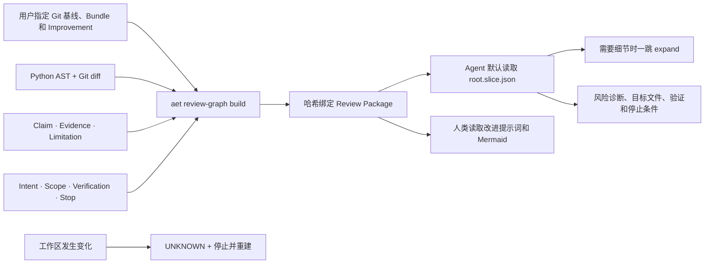

# Review Graph：给代码审查 Agent 的最小、可追溯输入

Review Graph 把三类原本分散的信息合成一个受限图切片：

- 当前 Git 变更涉及哪些文件、函数和测试；
- 哪些 Claim、Evidence 和 Limitation 支撑诊断；
- 人类 Intent、允许范围、保护范围、验证命令和停止条件。

默认给审查 Agent 的入口是 `review/root.slice.json`。Mermaid 继续保留，
但只作为人类可视化投影；完整 `review/graph.json` 是可展开的数据源，不是默认
上下文。`agent-context.json` 和 `agent-task.md` 不再默认生成，只有旧宿主明确
需要时才通过 `export-compat` 导出。

## 用户输入与最终输出

用户准备四项输入：当前 Git 工作区、对比基线、Portable Evidence Bundle 和
Improvement 目录。AET 不训练或调用模型，也不修改源码。



Agent 得到的不是“整个仓库说明书”，而是一张可验证的导航卡：

1. `intent` 告诉它用户究竟问什么；
2. `review_issue` 告诉它要干预的问题、必需行为及原始 Finding/Evidence ID；
3. `allowed_scope` 和 `protected_scope` 决定能改、不能改什么；
4. `claim`、`verified_evidence` 和紧凑 Limitation 解释为什么；
5. `file`、`function`、`test` 和 `TESTS`/`CALLS` 等关系指出从哪里开始读；
6. `verification_requirement` 与 `stop_condition` 决定怎样验收、何时必须停下。

## 构建与使用

```bash
PYTHONPATH=src uv run --no-editable aet review-graph build \
  --workspace . \
  --base main \
  --bundle .aet/evidence/review-bundle \
  --improvements .aet/improvements \
  --issue IMP-001 \
  --output .aet/reviews/IMP-001

PYTHONPATH=src uv run --no-editable aet review-graph validate \
  .aet/reviews/IMP-001

PYTHONPATH=src uv run --no-editable aet review-graph open \
  .aet/reviews/IMP-001 --workspace .

PYTHONPATH=src uv run --no-editable aet review-graph expand \
  .aet/reviews/IMP-001 --workspace . \
  --node node:verified_evidence:EV-001 \
  --relation PRODUCED_BY
```

MCP 宿主使用两个只读工具：

- `aet_review_open`：返回安全信息完整、大小受限的根切片；
- `aet_review_expand`：从一个已知节点按可选关系扩展一跳。

Agent 应先 `open`，只有在回答具体问题需要时才 `expand`。它不应先读取完整图，
也不应默认读取兼容文件。

## Review Package 目录

```text
review-package/
├── manifest.json
├── code/
│   ├── index-manifest.json
│   ├── nodes.jsonl
│   ├── edges.jsonl
│   └── diagnostics.jsonl
├── evidence/bundle-ref.json
├── review/
│   ├── graph.json
│   ├── root.slice.json
│   └── diagnostics.jsonl
├── projections/
│   ├── human-improvements.md
│   └── diagrams/
│       ├── review-overview.mmd
│       ├── impact-radius.mmd
│       └── evidence-chain.mmd
└── consumer-guide.md
```

`manifest.json` 绑定 Bundle、Improvement、Git 快照和每个文件的 SHA-256。
包不允许覆盖已有目录，不接受额外文件或符号链接。默认 Agent 输入以规范化紧凑
JSON 落盘，避免为显示缩进占用上下文。

## Mermaid、JSON 与 Markdown 的关系

| 产物 | 主要读者 | 是否权威 | 默认给 Agent |
| --- | --- | --- | --- |
| `review/root.slice.json` | 审查 Agent | 当前包中的规范输入 | 是 |
| `review/graph.json` | 有界展开器、调试者 | 完整组合图 | 否 |
| `code/*.jsonl` | 图工具、审计者 | 静态结构记录 | 否 |
| `human-improvements.md` | 人类 | 非权威投影 | 否 |
| `*.mmd` | 人类 | 非权威投影 | 否 |
| `agent-context.json` / `agent-task.md` | 旧宿主 | 兼容投影 | 不生成 |

因此，Mermaid 没有被取消。它从“让 Agent 自己解析的主要输入”调整为人类理解
关系的可视化；Agent 使用同一底层图的紧凑结构化切片，避免 Mermaid 样式、重复
标签和全图噪声占据上下文。

## Fail-closed 条件

以下情况不会被降级成可以继续实施的 `PASS`：

- Bundle 或 Improvement 引用了不存在的 Claim/Evidence；
- Intent、允许范围、保护范围或验证要求缺失；
- 改动触及允许范围之外或保护路径；
- Python 无法解析、动态调用目标不确定或索引预算耗尽；
- 必需安全节点或关系超过调用方预算；
- Package 文件缺失、多出、被篡改或包含符号链接；
- 当前 Git 快照与构建时不一致。

快照不一致时，`open`/`expand` 只返回一个 `UNKNOWN` 的 `stop_condition`，要求
重建 Package；不会把旧图继续当作当前事实。动态属性调用只生成 `UNKNOWN`
的 `MAY_CALL`，不会伪造确定依赖。

## 与普通 code review 的关系

普通 code review 负责判断实现是否正确、是否可维护、是否引入 bug。Review
Graph 不替代这项判断，它负责在审查开始前回答：任务是什么、哪些证据可信、
允许改哪里、哪些测试关联、证据是否仍适用。

纯代码结构图擅长回答“谁调用谁”，但不能单独授权修改，也不能证明某条风险结论。
Evidence Atlas 擅长回答“为什么这样判断”，但不完整描述当前 diff 的函数和测试
影响半径。Review Graph 把两者与 Improvement Constraint 连接起来，仍将代码
文本视为数据，只有人类 Intent 和 Constraint 能授权工作。

## 当前业务观察及限制

在 AET 自带的空工具结果案例上，最终根切片包含 12 个节点、13 条关系，实际
落盘 6,505 字节；旧的 `agent-task.md + claim-chain.mmd +
improvement-chain.mmd` 为 6,522 字节。根切片还额外提供函数、测试、关系、快照
和可展开节点。若按旧方式完成同等诊断所需的原始 Bundle/Improvement/源码最小
材料计算，输入从 8,468 字节降到 6,505 字节，减少 23.2%。

一次隔离、只读的 Codex `gpt-5.6-sol` 初步观察使用同一案例和同一输出契约：

| 输入 | 业务准则满足 | 主要结果 |
| --- | ---: | --- |
| 旧 Agent Task + Mermaid | 7/8 | 诊断正确，但扩大了保护范围并漏掉禁止行为 |
| 纯代码结构图 | 1/8 | 找到 bug，但缺权威证据、授权范围和精确验证 |
| Review Graph 根切片 | 8/8 | 精确目标、范围、证据、限制、验证和停止条件 |

这是一个案例、每组一次的产品观察，只能证明当前案例中输入辅助更完整；它不证明
对所有仓库、Agent 或模型都更优。正式推广前仍需在更多公开、冻结案例上复算，
并按仓库、语言和宿主隔离 holdout。

## 旧宿主兼容

只有旧宿主无法读取根切片时才显式导出：

```bash
PYTHONPATH=src uv run --no-editable aet review-graph export-compat \
  .aet/reviews/IMP-001 --workspace . --output .aet/reviews/IMP-001-legacy
```

该命令生成 `agent-context.json` 和 `agent-task.md`，并明确标记它们不是默认
输入。快照过期时兼容导出会拒绝执行。
