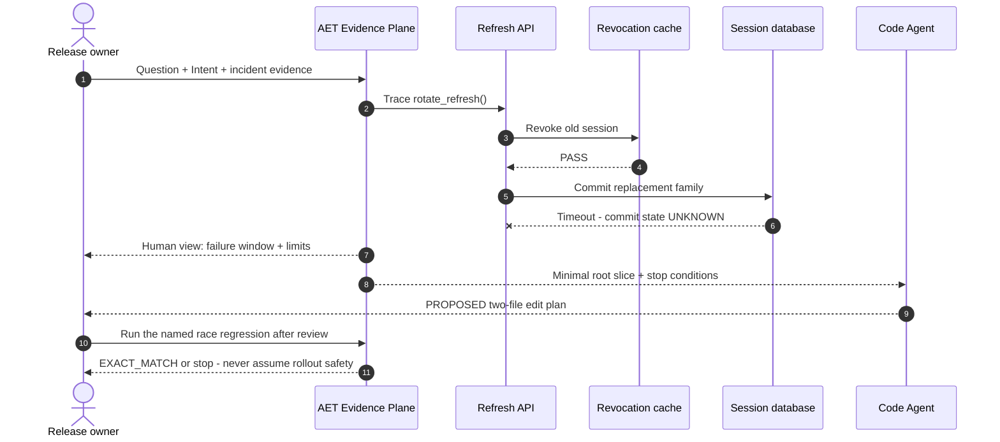

# Production-shaped case: refresh-token rotation race

[简体中文](production-auth-refresh-review.zh-CN.md)

This is a frozen, representative production release case—not a claimed
customer incident. It uses a common authentication boundary: one request must
revoke an old refresh session and commit its replacement across two stores.

## The production pain AET solves

Without AET, four things live in different places: an incident ticket says
“intermittent 401,” logs show a timeout, Git shows several changed files, and a
test report says `PASS`. The release owner receives a persuasive paragraph but
cannot tell which source the proof covered, whether it is still fresh, or why
the Agent wants to touch a security-sensitive file. The next Agent often reads
the same broad context again.

AET implements one hash-bound Review Package over the human Intent, incident
Evidence, current code graph, allowed and protected scope, verification argv,
and stop conditions. From that one package it derives a sequence view for the
human and a compact root slice for the Agent. If the repository changes, both
views stop being current instead of silently drifting apart.

The business result is concrete: the owner can see why rollout is still
`UNKNOWN`; the Agent knows the two allowed files, the single regression test,
the Evidence IDs behind the task, and the conditions that require escalation.

## The human's question

> During a storage timeout, some `POST /auth/refresh` requests return 401 after
> the old session is revoked but before the replacement token family is known
> to be committed. Find the smallest safe fix. Do not weaken rotation, change
> signing, edit deployment configuration, or invent successful verification.
> What must be proved before rollout?

The owner supplies the current Git snapshot, the incident trace, Intent, and
the protected paths. AET binds those inputs; it does not infer production
frequency or customer impact from the frozen case.

## What the human receives: a dynamic business and review view



The diagram is a deterministic projection for the reviewer, not live
telemetry. It makes the order of the observed failure visible while retaining
the important unknown: a timeout does not prove whether the database commit
completed.

The human summary remains compact:

| Field | Human-facing result |
| --- | --- |
| Current release conclusion | `UNKNOWN`; the existing proof does not cover the timeout race |
| Evidence-backed failure window | old session revoked before replacement commit is known |
| Allowed production scope | `src/auth/session.py`, `src/auth/redis_store.py` |
| Protected scope | signing, secrets, migrations, deployment, and policy |
| Smallest next decision | review the bounded plan, then run the named race regression |

## What the Agent receives: a compact structured slice

The actual Review Package carries hashes, IDs, relations, diagnostics, and
budgets. This abridged excerpt shows the decision-bearing content:

```json
{
  "intent": "Close the refresh race without weakening token rotation",
  "issue": {
    "evidence": ["EV-REVOKE-PASS", "EV-COMMIT-TIMEOUT"],
    "required_behavior": "A retry cannot leave the old session revoked without a known replacement"
  },
  "allowed_scope": ["src/auth/session.py", "src/auth/redis_store.py"],
  "protected_scope": ["src/auth/signing.py", "migrations/**", "infra/**", ".env*"],
  "verification": ["pytest tests/auth/test_refresh_race.py -q"],
  "stop_if": [
    "the Git snapshot changes",
    "the commit state cannot be resolved from evidence",
    "a protected path must change"
  ]
}
```

The Agent receives no permission to edit tests, signing, configuration, or
infrastructure. Its output is still `PROPOSED`; only a separately executed,
source-bound Proof can establish the named regression result, and that proof
still does not by itself authorize production rollout.

## Why the two outputs differ

The human needs sequence, consequence, unresolved state, and a decision point.
The Agent needs exact paths, evidence IDs, required behavior, verification
argv, and stop conditions. Both are projections of one evidence package, but
the Mermaid view is not parsed as machine authority and the Agent slice is not
presented as a human rollout approval.
