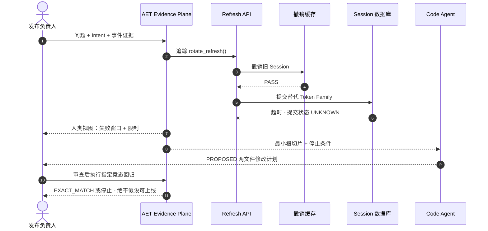

# 现实生产形态案例：Refresh Token 轮换竞态

[English](production-auth-refresh-review.md)

这是一个冻结、具有现实生产形态的发布案例，不冒充真实客户事故。场景采用常见
认证边界：一次请求需要撤销旧 Refresh Session，并跨两个存储提交替代 Session。

## AET 解决的生产痛点

没有 AET 时，四类材料散落在不同位置：事件工单写着“间歇性 401”，日志记录
超时，Git 里有多个改动文件，测试报告则显示 `PASS`。发布负责人只能得到一段
听起来很确定的总结，却不知道 Proof 覆盖了哪些源码、是否仍新鲜，也不知道
Agent 为什么要碰安全敏感文件；下一个 Agent 往往还要重新读取同一批大上下文。

AET 把人工 Intent、事件 Evidence、当前 Code Graph、允许/保护范围、验证 argv
和停止条件编译成一个哈希绑定的 Review Package，再从同一个包为人生成动态
时序视图、为 Agent 生成紧凑根切片。仓库发生变化时，两种输出一起停止适用，
不会静默分叉。

现实结果很具体：负责人能看见为什么上线仍是 `UNKNOWN`；Agent 只需要两个
允许文件、一条回归测试、任务背后的 Evidence ID，以及必须升级给人的停止条件。

## 人提出的问题

> 存储超时时，部分 `POST /auth/refresh` 请求会在旧 Session 已撤销、替代 Token
> Family 是否提交仍未知的窗口返回 401。请找到最小安全修复；不得削弱轮换、
> 修改签名逻辑、部署配置，也不得虚构测试成功。上线前必须证明什么？

负责人提供当前 Git 快照、事件 Trace、Intent 和保护路径。AET 绑定这些输入；
不会从冻结案例推断真实生产频率或客户影响。

## 给人的输出：动态业务与审查视图



这张图是给审查者的确定性投影，不是实时遥测。它展示已观察失败的顺序，同时
保留关键未知：超时不能证明数据库提交究竟完成还是未完成。

| 字段 | 给人的结果 |
| --- | --- |
| 当前发布结论 | `UNKNOWN`；已有 Proof 未覆盖超时竞态 |
| 有证据的失败窗口 | 旧 Session 已撤销，但替代 Session 的提交仍未知 |
| 允许的生产代码范围 | `src/auth/session.py`、`src/auth/redis_store.py` |
| 保护范围 | 签名、Secret、Migration、部署和 Policy |
| 最小下一步 | 审查有界 Plan，再执行指定竞态回归 |

## 给 Agent 的输出：紧凑结构化切片

实际 Review Package 还包含哈希、ID、关系、Diagnostics 与预算。以下是决策字段
的缩略展示：

```json
{
  "intent": "在不削弱 Token Rotation 的前提下关闭 Refresh 竞态",
  "issue": {
    "evidence": ["EV-REVOKE-PASS", "EV-COMMIT-TIMEOUT"],
    "required_behavior": "重试不能造成旧 Session 已撤销而替代 Session 状态未知"
  },
  "allowed_scope": ["src/auth/session.py", "src/auth/redis_store.py"],
  "protected_scope": ["src/auth/signing.py", "migrations/**", "infra/**", ".env*"],
  "verification": ["pytest tests/auth/test_refresh_race.py -q"],
  "stop_if": [
    "Git 快照发生变化",
    "证据无法解析提交状态",
    "修复必须修改保护路径"
  ]
}
```

Agent 没有权限修改测试、签名、配置或基础设施；它的输出仍是 `PROPOSED`。
只有独立执行、与源码绑定的 Proof 才能证明指定回归结果，而该 Proof 本身仍不
等于生产上线授权。

## 为什么两种输出不同

人需要看顺序、后果、未知状态与决策点；Agent 需要精确路径、Evidence ID、
必需行为、验证 argv 与停止条件。它们来自同一证据包，但 Mermaid 不会变成
机器权限，Agent 切片也不会被包装成人工上线批准。
