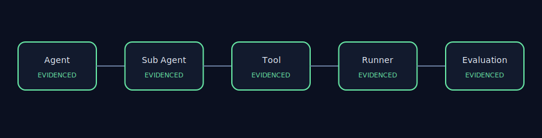
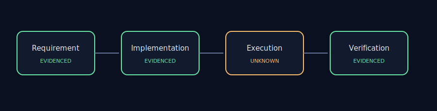

# AET Repository Audit — Google Agent Development Kit

## Executive Summary

- Repository: `https://github.com/google/adk-python`
- Commit: `67ab27f2547db48f7248b1689aab4c18502aee17`
- Audit scope: 9 include patterns, 3 exclusions
- Evidence collected: 474 files
- Runtime: 1.177s
- Maintainer review: `APPROVED`

This is a static engineering observation, not a defect or security-vulnerability report.

## Architecture View

## Evidence Map

## Findings

### AET-REPO-001 — Repository revision is reproducibly locked

- Status: `PASS`
- Severity: `INFO`
- Impact: `high` — A mismatched or dirty checkout makes line-level evidence non-reproducible.
- Evidence:
  - `.git` — HEAD=67ab27f2547db48f7248b1689aab4c18502aee17
- Recommendation: Checkout the locked commit and remove local repository changes.

### AET-REPO-002 — License and prohibited-path boundary is enforced

- Status: `PASS`
- Severity: `INFO`
- Impact: `high` — A license mismatch or prohibited path in the evidence set invalidates publication.
- Evidence:
  - `LICENSE:1` — git_blob=d645695673349e3947e8e5ae42332d0ac3164cd7; expected=d645695673349e3947e8e5ae42332d0ac3164cd7
- Recommendation: Restore the locked license file and keep prohibited paths outside every include pattern.

### AET-REPO-003 — Agent architecture boundaries are visible

- Status: `PASS`
- Severity: `INFO`
- Impact: `high` — Static Agent, tool, and runner evidence is present in the bounded SDK scope.
- Evidence:
  - `src/google/adk/agents/__init__.py:1` — category=agent; sha256=626fc6c0db72db435f82c29cea3d45c138df8e5a9cbc53edc16bc26e3433e06a
  - `src/google/adk/agents/_managed_agent.py:1` — category=agent; sha256=d76c7774db14ed7d6efbb5c247e27521d13ad6d7c51d37da1b4988e17c4201fa
  - `src/google/adk/agents/active_streaming_tool.py:1` — category=tool; sha256=dfcb71a29e88bce149bae373f114e189101e95e16d1c62925f82b3e524aa7c93
  - `src/google/adk/agents/llm/task/_finish_task_tool.py:1` — category=tool; sha256=1f433dfb9e7086a75f1a19d10e512e3c7b66abf7c2b11ae25ab0242ad58b8c83
  - `src/google/adk/runners.py:1` — category=runtime; sha256=94b3b3212def203b5b9d653ca09a1181f3afe40cdd68667a5ae2d862f3f61e0c
  - `src/google/adk/tools/environment/__init__.py:1` — category=runtime; sha256=439a003dc763bca8deec242087bc2c0fb29b7667fca9ebc13bc23da22f53152b
- Recommendation: Keep Agent, sub-Agent, tool, and runner responsibilities explicit and independently testable.

### AET-REPO-004 — Tool governance evidence is inspectable

- Status: `PASS`
- Severity: `INFO`
- Impact: `high` — The bounded SDK scope contains static tool, permission, and failure-handling evidence.
- Evidence:
  - `src/google/adk/agents/active_streaming_tool.py:1` — category=tool; sha256=dfcb71a29e88bce149bae373f114e189101e95e16d1c62925f82b3e524aa7c93
  - `src/google/adk/agents/llm/task/_finish_task_tool.py:1` — category=tool; sha256=1f433dfb9e7086a75f1a19d10e512e3c7b66abf7c2b11ae25ab0242ad58b8c83
  - `src/google/adk/agents/config_agent_utils.py:89` — category=permission; sha256=9c39ecfc30ceb4d06727a55e23bcc9188e2a3f425ed682ddc2ce8442d0c1d295
  - `src/google/adk/agents/context.py:268` — category=permission; sha256=62ccf7a555a1f2b5dbaec8e0dec79f1b60ef655d3430c2b67237d8a8bc72e1eb
  - `src/google/adk/agents/_managed_agent.py:84` — category=recovery; sha256=d76c7774db14ed7d6efbb5c247e27521d13ad6d7c51d37da1b4988e17c4201fa
  - `src/google/adk/agents/base_agent.py:602` — category=recovery; sha256=2fe42c15e89cffe1233554487da26fc670a6adba1dfdbbee4152df1fd076edfb
- Recommendation: Bind each tool registration to explicit authorization and failure evidence.

### AET-REPO-005 — Evaluation feedback paths are present

- Status: `PASS`
- Severity: `INFO`
- Impact: `medium` — Evaluation and feedback evidence is present in the bounded SDK scope.
- Evidence:
  - `src/google/adk/evaluation/__init__.py:1` — category=verification; sha256=1083ca2c59140e45eaaf471a4a5a0dada4cb63e3df30a9acff762cc1594d4632
  - `src/google/adk/evaluation/_eval_set_results_manager_utils.py:1` — category=verification; sha256=4720d76ecb6a5eb048bda9f4a1a3c86a3359c4fe727cd2729e31077456964e6e
  - `src/google/adk/evaluation/__init__.py:1` — category=feedback; sha256=1083ca2c59140e45eaaf471a4a5a0dada4cb63e3df30a9acff762cc1594d4632
  - `src/google/adk/evaluation/_eval_set_results_manager_utils.py:1` — category=feedback; sha256=4720d76ecb6a5eb048bda9f4a1a3c86a3359c4fe727cd2729e31077456964e6e
- Recommendation: Expose a traceable link from evaluation results to the Agent path being assessed.

## Publication Boundary

Static analysis of a public upstream repository. No source code is redistributed, and no affiliation or upstream endorsement is implied.
