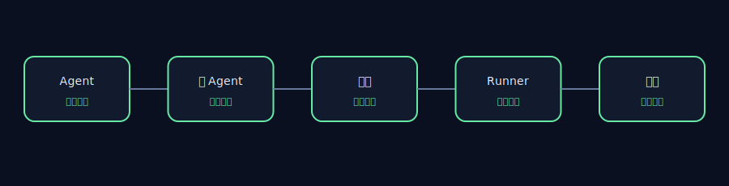
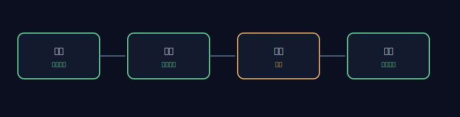

# AET 仓库审查 — Google Agent Development Kit

## 执行摘要

- 仓库：`https://github.com/google/adk-python`
- Commit：`67ab27f2547db48f7248b1689aab4c18502aee17`
- 审查范围：9 项包含规则，3 项排除规则
- 已采集证据：474 个文件
- 运行时间：1.177s
- 维护者审核：`APPROVED`

本报告记录的是静态工程观察，不构成缺陷认定或安全漏洞报告。

## 架构视图

## 证据链

## 工程观察

### AET-REPO-001 — 仓库版本已进行可复现锁定

- 状态：`PASS`
- 严重程度：`INFO`
- 影响：`高` — 若检出版本不匹配或工作树不干净，行级证据将无法复现。
- 证据：
  - `.git` — HEAD=67ab27f2547db48f7248b1689aab4c18502aee17
- 建议： 切换到锁定 commit，并清理本地仓库改动后重新审查。

### AET-REPO-002 — 许可证及禁止路径边界已落实

- 状态：`PASS`
- 严重程度：`INFO`
- 影响：`高` — 若 License 不匹配或证据集包含禁止路径，当前报告将不满足发布条件。
- 证据：
  - `LICENSE:1` — git_blob=d645695673349e3947e8e5ae42332d0ac3164cd7; expected=d645695673349e3947e8e5ae42332d0ac3164cd7
- 建议： 恢复锁定的 License 文件，并确保所有包含规则排除禁止路径。

### AET-REPO-003 — Agent 架构边界可识别

- 状态：`PASS`
- 严重程度：`INFO`
- 影响：`高` — 有界 SDK 范围内存在可定位的 Agent、工具与 Runner 静态证据。
- 证据：
  - `src/google/adk/agents/__init__.py:1` — category=agent; sha256=626fc6c0db72db435f82c29cea3d45c138df8e5a9cbc53edc16bc26e3433e06a
  - `src/google/adk/agents/_managed_agent.py:1` — category=agent; sha256=d76c7774db14ed7d6efbb5c247e27521d13ad6d7c51d37da1b4988e17c4201fa
  - `src/google/adk/agents/active_streaming_tool.py:1` — category=tool; sha256=dfcb71a29e88bce149bae373f114e189101e95e16d1c62925f82b3e524aa7c93
  - `src/google/adk/agents/llm/task/_finish_task_tool.py:1` — category=tool; sha256=1f433dfb9e7086a75f1a19d10e512e3c7b66abf7c2b11ae25ab0242ad58b8c83
  - `src/google/adk/runners.py:1` — category=runtime; sha256=94b3b3212def203b5b9d653ca09a1181f3afe40cdd68667a5ae2d862f3f61e0c
  - `src/google/adk/tools/environment/__init__.py:1` — category=runtime; sha256=439a003dc763bca8deec242087bc2c0fb29b7667fca9ebc13bc23da22f53152b
- 建议： 保持 Agent、子 Agent、工具与 Runner 职责清晰，并确保各自可独立验证。

### AET-REPO-004 — 工具治理证据可核查

- 状态：`PASS`
- 严重程度：`INFO`
- 影响：`高` — 有界 SDK 范围内存在可定位的工具、权限与失败处理证据。
- 证据：
  - `src/google/adk/agents/active_streaming_tool.py:1` — category=tool; sha256=dfcb71a29e88bce149bae373f114e189101e95e16d1c62925f82b3e524aa7c93
  - `src/google/adk/agents/llm/task/_finish_task_tool.py:1` — category=tool; sha256=1f433dfb9e7086a75f1a19d10e512e3c7b66abf7c2b11ae25ab0242ad58b8c83
  - `src/google/adk/agents/config_agent_utils.py:89` — category=permission; sha256=9c39ecfc30ceb4d06727a55e23bcc9188e2a3f425ed682ddc2ce8442d0c1d295
  - `src/google/adk/agents/context.py:268` — category=permission; sha256=62ccf7a555a1f2b5dbaec8e0dec79f1b60ef655d3430c2b67237d8a8bc72e1eb
  - `src/google/adk/agents/_managed_agent.py:84` — category=recovery; sha256=d76c7774db14ed7d6efbb5c247e27521d13ad6d7c51d37da1b4988e17c4201fa
  - `src/google/adk/agents/base_agent.py:602` — category=recovery; sha256=2fe42c15e89cffe1233554487da26fc670a6adba1dfdbbee4152df1fd076edfb
- 建议： 将每项工具注册与明确的授权依据和失败处理证据关联。

### AET-REPO-005 — 评估反馈路径可识别

- 状态：`PASS`
- 严重程度：`INFO`
- 影响：`中` — 有界 SDK 范围内存在可定位的评估与反馈证据。
- 证据：
  - `src/google/adk/evaluation/__init__.py:1` — category=verification; sha256=1083ca2c59140e45eaaf471a4a5a0dada4cb63e3df30a9acff762cc1594d4632
  - `src/google/adk/evaluation/_eval_set_results_manager_utils.py:1` — category=verification; sha256=4720d76ecb6a5eb048bda9f4a1a3c86a3359c4fe727cd2729e31077456964e6e
  - `src/google/adk/evaluation/__init__.py:1` — category=feedback; sha256=1083ca2c59140e45eaaf471a4a5a0dada4cb63e3df30a9acff762cc1594d4632
  - `src/google/adk/evaluation/_eval_set_results_manager_utils.py:1` — category=feedback; sha256=4720d76ecb6a5eb048bda9f4a1a3c86a3359c4fe727cd2729e31077456964e6e
- 建议： 为评估结果与其所对应的 Agent 路径建立可追溯关联。

## 发布边界

本报告对公开上游仓库进行静态分析，不重新发布源码，也不代表与上游项目存在隶属、合作或认可关系。
