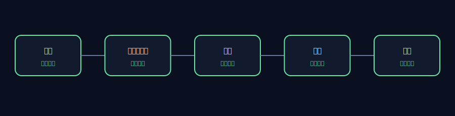
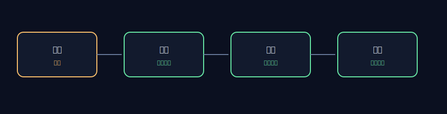

# AET 仓库审查 — OpenHands

## 执行摘要

- 仓库：`https://github.com/OpenHands/OpenHands`
- Commit：`96f902a9ac14bf5edfb2e47d759d75c91e4faf28`
- 审查范围：5 项包含规则，5 项排除规则
- 已采集证据：107 个文件
- 运行时间：0.519s
- 维护者审核：`APPROVED`

本报告记录的是静态工程观察，不构成缺陷认定或安全漏洞报告。

## 架构视图

## 证据链

## 工程观察

### AET-REPO-001 — 仓库版本已进行可复现锁定

- 状态：`PASS`
- 严重程度：`INFO`
- 影响：`高` — 若检出版本不匹配或工作树不干净，行级证据将无法复现。
- 证据：
  - `.git` — HEAD=96f902a9ac14bf5edfb2e47d759d75c91e4faf28
- 建议： 切换到锁定 commit，并清理本地仓库改动后重新审查。

### AET-REPO-002 — 许可证及禁止路径边界已落实

- 状态：`PASS`
- 严重程度：`INFO`
- 影响：`高` — 若 License 不匹配或证据集包含禁止路径，当前报告将不满足发布条件。
- 证据：
  - `LICENSE:1` — git_blob=572bb259491e4e2adafee0c03db0d4ed419e6b9a; expected=572bb259491e4e2adafee0c03db0d4ed419e6b9a
- 建议： 恢复锁定的 License 文件，并确保所有包含规则排除禁止路径。

### AET-REPO-003 — 应用编排证据可识别

- 状态：`PASS`
- 严重程度：`INFO`
- 影响：`高` — 应用服务器范围内存在可定位的会话编排、运行、事件与验证证据。
- 证据：
  - `openhands/app_server/app_conversation/README.md:1` — category=agent; sha256=a8db9c739e703bfb7a03d0d6c73249498580cf6721b64293bb3aa7032ab18ce1
  - `openhands/app_server/app_conversation/app_conversation_info_service.py:1` — category=agent; sha256=26fade1d9d62e1decaa42e7a60f436ee9d08b550ff59e58a1528229e32bed7a1
  - `openhands/app_server/app_conversation/README.md:1` — category=runtime; sha256=a8db9c739e703bfb7a03d0d6c73249498580cf6721b64293bb3aa7032ab18ce1
  - `openhands/app_server/app_conversation/app_conversation_info_service.py:1` — category=runtime; sha256=26fade1d9d62e1decaa42e7a60f436ee9d08b550ff59e58a1528229e32bed7a1
  - `openhands/app_server/event/README.md:1` — category=trajectory; sha256=4a0222a86861bf22fea46fd3f0d32109ce36481f42ac121a84b233439695be39
  - `openhands/app_server/event/aws_event_service.py:1` — category=trajectory; sha256=5ed340b11987c4004767bd0fd0ec2ed8497c41a2d19edff4a8fca4d29ab9c0fb
  - `tests/unit/app_server/file_store/test_file_store.py:1` — category=verification; sha256=6a89be0e5ed3a4c51909f2d8366e911e861eefb49ab3cc716aff9992567064b1
  - `tests/unit/app_server/test_agent_server_env_override.py:1` — category=verification; sha256=8ab4be7e7217b6cf2b6604c7a1f5e28c7c14ad675d4b36c90a4b1b44f2a2a364
- 建议： 将跨包的 Agent 执行声明明确关联到具体 SDK 版本和验证证据。

### AET-REPO-004 — 运行隔离与恢复证据可核查

- 状态：`PASS`
- 严重程度：`INFO`
- 影响：`高` — 有界审查范围内存在可定位的运行、隔离与失败处理证据。
- 证据：
  - `openhands/app_server/app_conversation/README.md:1` — category=runtime; sha256=a8db9c739e703bfb7a03d0d6c73249498580cf6721b64293bb3aa7032ab18ce1
  - `openhands/app_server/app_conversation/app_conversation_info_service.py:1` — category=runtime; sha256=26fade1d9d62e1decaa42e7a60f436ee9d08b550ff59e58a1528229e32bed7a1
  - `openhands/app_server/app_conversation/app_conversation_info_service.py:88` — category=isolation; sha256=26fade1d9d62e1decaa42e7a60f436ee9d08b550ff59e58a1528229e32bed7a1
  - `openhands/app_server/app_conversation/app_conversation_models.py:116` — category=isolation; sha256=7c8cf495789001a5925774f23a678b2d6da122942f9555fcf520abe3b2b7e69a
  - `openhands/app_server/app_conversation/app_conversation_models.py:170` — category=recovery; sha256=7c8cf495789001a5925774f23a678b2d6da122942f9555fcf520abe3b2b7e69a
  - `openhands/app_server/app_conversation/app_conversation_router.py:379` — category=recovery; sha256=864bff55884872eac7de6b2ce6f89a19df3d9db99e9ade993d096f308f051259
- 建议： 将沙箱操作和恢复路径与明确、可核查的结果证据关联。

### AET-REPO-005 — 外部 Agent 核心不在当前检出版本中

- 状态：`UNKNOWN`
- 严重程度：`WARN`
- 影响：`中` — 当前检出版本证明了外部 Agent 依赖，但未证明存在本地 Agent 核心实现。缺失证据类别：本地 Agent 核心定义。
- 证据：
  - `pyproject.toml:1` — category=external; sha256=81c65766ba4b3c41fc3cc1007c6274de1cbdf4ae2b298fd782ee790fc9172b0b
- 建议： 在作出端到端执行声明前，应单独审查具有独立版本的 Agent SDK。

## 发布边界

本报告对公开上游仓库进行静态分析，不重新发布源码，也不代表与上游项目存在隶属、合作或认可关系。
