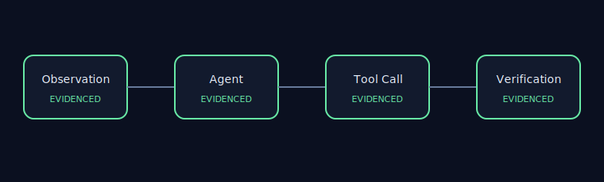
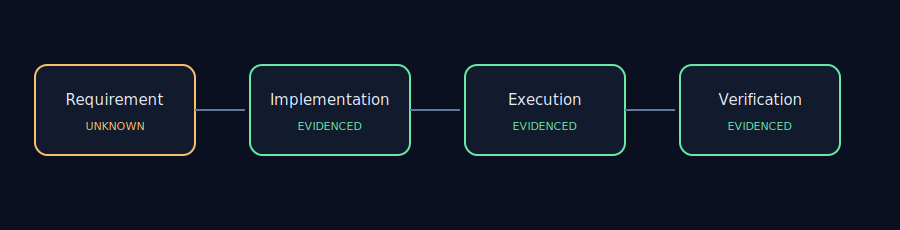

# AET Repository Audit — SWE-agent

## Executive Summary

- Repository: `https://github.com/SWE-agent/SWE-agent`
- Commit: `3ea751c087f32b16e039a2233dd6eefecef325d5`
- Audit scope: 7 include patterns, 3 exclusions
- Evidence collected: 52 files
- Runtime: 0.138s
- Maintainer review: `APPROVED`

This is a static engineering observation, not a defect or security-vulnerability report.

## Architecture View

## Evidence Map

## Findings

### AET-REPO-001 — Repository revision is reproducibly locked

- Status: `PASS`
- Severity: `INFO`
- Impact: `high` — A mismatched or dirty checkout makes line-level evidence non-reproducible.
- Evidence:
  - `.git` — HEAD=3ea751c087f32b16e039a2233dd6eefecef325d5
- Recommendation: Checkout the locked commit and remove local repository changes.

### AET-REPO-002 — License and prohibited-path boundary is enforced

- Status: `PASS`
- Severity: `INFO`
- Impact: `high` — A license mismatch or prohibited path in the evidence set invalidates publication.
- Evidence:
  - `LICENSE:1` — git_blob=e702436e21844c5c519de31ab68277a6d3b427d9; expected=e702436e21844c5c519de31ab68277a6d3b427d9
- Recommendation: Restore the locked license file and keep prohibited paths outside every include pattern.

### AET-REPO-003 — Agent loop evidence is traceable

- Status: `PASS`
- Severity: `INFO`
- Impact: `high` — The scoped checkout contains static Agent, tool, trajectory, and verification evidence.
- Evidence:
  - `sweagent/agent/action_sampler.py:1` — category=agent; sha256=63ae3f8dbb1a5c38518b0e4b89fb7b8b1178f5c5df951ca2da1c1f92ade372bd
  - `sweagent/agent/agents.py:1` — category=agent; sha256=d6cdf7ac66a6509ceba08e3541b856f0734acf79f9a485ed8a6e2c72f0d211a8
  - `sweagent/tools/bundle.py:1` — category=tool; sha256=13d6d79fa4f6be7604eb580c5b59c5c1538e49f1f6a414810b4d7b944e47df2e
  - `sweagent/tools/commands.py:1` — category=tool; sha256=f4267d069350a78eaf83e2556a01923b76ea3724cd0016f9317db663b5f524af
  - `tests/test_data/trajectories/gpt4__swe-agent-test-repo__default_from_url__t-0.00__p-0.95__c-3.00__install-1/6e44b9__sweagenttestrepo-1c2844.traj:1` — category=trajectory; sha256=dd79a193908492a51f532269ee126f3600da98b84551e2bdc1adacc7bf29ad67
  - `tests/test_data/trajectories/gpt4__swe-agent-test-repo__default_from_url__t-0.00__p-0.95__c-3.00__install-1/solution_missing_colon.py:1` — category=trajectory; sha256=964996408c99e48aa2503f87029f252a28593bf2570a9ee02ba502cd77529032
  - `tests/test_agent.py:1` — category=verification; sha256=ccb00ddbff2cb5e9937e39dbff0ddbf1afbedb5d9a7e5ad1b9cea8977b97502d
  - `tests/test_data/trajectories/gpt4__swe-agent-test-repo__default_from_url__t-0.00__p-0.95__c-3.00__install-1/6e44b9__sweagenttestrepo-1c2844.traj:1` — category=verification; sha256=dd79a193908492a51f532269ee126f3600da98b84551e2bdc1adacc7bf29ad67
- Recommendation: Bind completion claims to an explicit trajectory and verification artifact.

### AET-REPO-004 — Tool interaction controls are visible

- Status: `UNKNOWN`
- Severity: `WARN`
- Impact: `high` — The scoped checkout does not statically prove all tool-governance controls. Missing categories: permission.
- Evidence:
  - `sweagent/tools/bundle.py:1` — category=tool; sha256=13d6d79fa4f6be7604eb580c5b59c5c1538e49f1f6a414810b4d7b944e47df2e
  - `sweagent/tools/commands.py:1` — category=tool; sha256=f4267d069350a78eaf83e2556a01923b76ea3724cd0016f9317db663b5f524af
  - `sweagent/agent/action_sampler.py:59` — category=recovery; sha256=63ae3f8dbb1a5c38518b0e4b89fb7b8b1178f5c5df951ca2da1c1f92ade372bd
  - `sweagent/agent/agents.py:340` — category=recovery; sha256=d6cdf7ac66a6509ceba08e3541b856f0734acf79f9a485ed8a6e2c72f0d211a8
- Recommendation: Keep permission, feedback, and failure behavior explicit at each tool boundary.

### AET-REPO-005 — Completion evidence is inspectable

- Status: `PASS`
- Severity: `INFO`
- Impact: `medium` — Trajectory, verification, and result-feedback evidence are present in the bounded scope.
- Evidence:
  - `tests/test_data/trajectories/gpt4__swe-agent-test-repo__default_from_url__t-0.00__p-0.95__c-3.00__install-1/6e44b9__sweagenttestrepo-1c2844.traj:1` — category=trajectory; sha256=dd79a193908492a51f532269ee126f3600da98b84551e2bdc1adacc7bf29ad67
  - `tests/test_data/trajectories/gpt4__swe-agent-test-repo__default_from_url__t-0.00__p-0.95__c-3.00__install-1/solution_missing_colon.py:1` — category=trajectory; sha256=964996408c99e48aa2503f87029f252a28593bf2570a9ee02ba502cd77529032
  - `tests/test_agent.py:1` — category=verification; sha256=ccb00ddbff2cb5e9937e39dbff0ddbf1afbedb5d9a7e5ad1b9cea8977b97502d
  - `tests/test_data/trajectories/gpt4__swe-agent-test-repo__default_from_url__t-0.00__p-0.95__c-3.00__install-1/6e44b9__sweagenttestrepo-1c2844.traj:1` — category=verification; sha256=dd79a193908492a51f532269ee126f3600da98b84551e2bdc1adacc7bf29ad67
  - `sweagent/agent/reviewer.py:164` — category=feedback; sha256=881580a98eef5942d9e3be759fa6a7901c162b9fe1279d9beb334e969688ad10
- Recommendation: Record a stable link from each completion claim to its verification result.

## Publication Boundary

Static analysis of a public upstream repository. No source code is redistributed, and no affiliation or upstream endorsement is implied.
