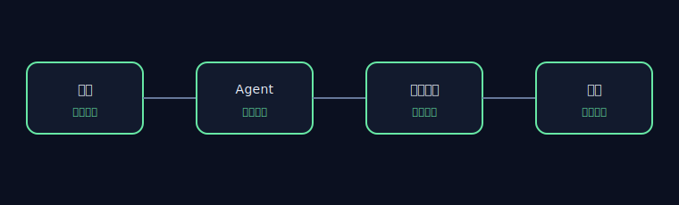

# AET 仓库审查 — SWE-agent

## 执行摘要

- 仓库：`https://github.com/SWE-agent/SWE-agent`
- Commit：`3ea751c087f32b16e039a2233dd6eefecef325d5`
- 审查范围：7 项包含规则，3 项排除规则
- 已采集证据：52 个文件
- 运行时间：0.138s
- 维护者审核：`APPROVED`

本报告记录的是静态工程观察，不构成缺陷认定或安全漏洞报告。

## 架构视图

## 证据链

## 工程观察

### AET-REPO-001 — 仓库版本已进行可复现锁定

- 状态：`PASS`
- 严重程度：`INFO`
- 影响：`高` — 若检出版本不匹配或工作树不干净，行级证据将无法复现。
- 证据：
  - `.git` — HEAD=3ea751c087f32b16e039a2233dd6eefecef325d5
- 建议： 切换到锁定 commit，并清理本地仓库改动后重新审查。

### AET-REPO-002 — 许可证及禁止路径边界已落实

- 状态：`PASS`
- 严重程度：`INFO`
- 影响：`高` — 若 License 不匹配或证据集包含禁止路径，当前报告将不满足发布条件。
- 证据：
  - `LICENSE:1` — git_blob=e702436e21844c5c519de31ab68277a6d3b427d9; expected=e702436e21844c5c519de31ab68277a6d3b427d9
- 建议： 恢复锁定的 License 文件，并确保所有包含规则排除禁止路径。

### AET-REPO-003 — Agent 循环证据可追溯

- 状态：`PASS`
- 严重程度：`INFO`
- 影响：`高` — 有界审查范围内存在可定位的 Agent、工具、执行轨迹与验证证据。
- 证据：
  - `sweagent/agent/action_sampler.py:1` — category=agent; sha256=63ae3f8dbb1a5c38518b0e4b89fb7b8b1178f5c5df951ca2da1c1f92ade372bd
  - `sweagent/agent/agents.py:1` — category=agent; sha256=d6cdf7ac66a6509ceba08e3541b856f0734acf79f9a485ed8a6e2c72f0d211a8
  - `sweagent/tools/bundle.py:1` — category=tool; sha256=13d6d79fa4f6be7604eb580c5b59c5c1538e49f1f6a414810b4d7b944e47df2e
  - `sweagent/tools/commands.py:1` — category=tool; sha256=f4267d069350a78eaf83e2556a01923b76ea3724cd0016f9317db663b5f524af
  - `tests/test_data/trajectories/gpt4__swe-agent-test-repo__default_from_url__t-0.00__p-0.95__c-3.00__install-1/6e44b9__sweagenttestrepo-1c2844.traj:1` — category=trajectory; sha256=dd79a193908492a51f532269ee126f3600da98b84551e2bdc1adacc7bf29ad67
  - `tests/test_data/trajectories/gpt4__swe-agent-test-repo__default_from_url__t-0.00__p-0.95__c-3.00__install-1/solution_missing_colon.py:1` — category=trajectory; sha256=964996408c99e48aa2503f87029f252a28593bf2570a9ee02ba502cd77529032
  - `tests/test_agent.py:1` — category=verification; sha256=ccb00ddbff2cb5e9937e39dbff0ddbf1afbedb5d9a7e5ad1b9cea8977b97502d
  - `tests/test_data/trajectories/gpt4__swe-agent-test-repo__default_from_url__t-0.00__p-0.95__c-3.00__install-1/6e44b9__sweagenttestrepo-1c2844.traj:1` — category=verification; sha256=dd79a193908492a51f532269ee126f3600da98b84551e2bdc1adacc7bf29ad67
- 建议： 将每项完成声明明确关联到对应的执行轨迹和验证产物。

### AET-REPO-004 — 工具交互控制可核查

- 状态：`UNKNOWN`
- 严重程度：`WARN`
- 影响：`高` — 有界审查范围不足以静态证明所有工具治理控制。缺失证据类别：权限。
- 证据：
  - `sweagent/tools/bundle.py:1` — category=tool; sha256=13d6d79fa4f6be7604eb580c5b59c5c1538e49f1f6a414810b4d7b944e47df2e
  - `sweagent/tools/commands.py:1` — category=tool; sha256=f4267d069350a78eaf83e2556a01923b76ea3724cd0016f9317db663b5f524af
  - `sweagent/agent/action_sampler.py:59` — category=recovery; sha256=63ae3f8dbb1a5c38518b0e4b89fb7b8b1178f5c5df951ca2da1c1f92ade372bd
  - `sweagent/agent/agents.py:340` — category=recovery; sha256=d6cdf7ac66a6509ceba08e3541b856f0734acf79f9a485ed8a6e2c72f0d211a8
- 建议： 在每个工具边界明确记录权限、反馈与失败处理行为。

### AET-REPO-005 — 完成证据可核查

- 状态：`PASS`
- 严重程度：`INFO`
- 影响：`中` — 有界审查范围内存在执行轨迹、验证与结果反馈证据。
- 证据：
  - `tests/test_data/trajectories/gpt4__swe-agent-test-repo__default_from_url__t-0.00__p-0.95__c-3.00__install-1/6e44b9__sweagenttestrepo-1c2844.traj:1` — category=trajectory; sha256=dd79a193908492a51f532269ee126f3600da98b84551e2bdc1adacc7bf29ad67
  - `tests/test_data/trajectories/gpt4__swe-agent-test-repo__default_from_url__t-0.00__p-0.95__c-3.00__install-1/solution_missing_colon.py:1` — category=trajectory; sha256=964996408c99e48aa2503f87029f252a28593bf2570a9ee02ba502cd77529032
  - `tests/test_agent.py:1` — category=verification; sha256=ccb00ddbff2cb5e9937e39dbff0ddbf1afbedb5d9a7e5ad1b9cea8977b97502d
  - `tests/test_data/trajectories/gpt4__swe-agent-test-repo__default_from_url__t-0.00__p-0.95__c-3.00__install-1/6e44b9__sweagenttestrepo-1c2844.traj:1` — category=verification; sha256=dd79a193908492a51f532269ee126f3600da98b84551e2bdc1adacc7bf29ad67
  - `sweagent/agent/reviewer.py:164` — category=feedback; sha256=881580a98eef5942d9e3be759fa6a7901c162b9fe1279d9beb334e969688ad10
- 建议： 为每项完成声明建立指向验证结果的稳定关联。

## 发布边界

本报告对公开上游仓库进行静态分析，不重新发布源码，也不代表与上游项目存在隶属、合作或认可关系。
